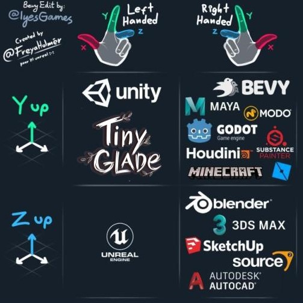

# Mesh Rendering

In **Tiny Glade**, meshes are the **3D representations** of all objects in the game, including decorations, clutter, and other elements.  

## Mesh Storage and Format  
Meshes are stored as **JSON** files, containing arrays of points and various properties defining their shape and behavior.  
These files can be found in the **`assets/meshes`** folder.

## Managing Meshes with RON  
A special file, **`nani_meshes.ron`**, lists all available meshes and provides instructions on how they are loaded into the game.  
This file contains properties to control whether a mesh should be **loaded** or **unloaded**.  

!!! info
    The **RON** format is a human-readable serialization format, making it easy to edit with any **text editor**. You can learn more about RON [here](https://github.com/ron-rs/ron).

### Structure of a Mesh File
 Meshes in **Tiny Glade** are stored as **JSON files**, each defining a 3D object. Below is the general structure of a mesh file


- **`attributes`**: An array that defines all attributes present in the file. These attributes are required and loaded by the game.
- Attribute Values defined using the following format:

```yaml
"type": [
   "int", # (1)!
   1 # (2)!
  ],
"buffer": [ .... ] # (3)!
```  

1. The type of the buffer, it's often `int` or `float`
2. The size of the vector, vector can sort data in sevral dimentions 
3. The array of values


## Anatomy of a JSON mesh

``` yaml
{"attributes": [
    "Vertex_Position", # (1)!
    "Vertex_Normal", # (2)!
    "Vertex_Color", # (3)!
    "Vertex_UV" # (4)!
    ],
    "indices": { # (5)!
        "type": [ # (6)!
            "int",
            1
        ],
        "buffer": [
            7,
            6,
            5,
            ...
        ]
    },
    "Vertex_Position": {
        "type": [
            "float",
            3
        ],
        "buffer": [
            [
                0.33000001311302185,
                0.0,
                0.0
            ]
            ...
        ]
    },
    "Vertex_Normal": {
        "type": [
            "float",
            3
        ],
        "buffer": [
            [
                0.0,
                1.0,
                0.0
            ]
            ...
        ]
    },
    "Vertex_Color": {
        "type": [
            "float",
            3
        ],
        "buffer": [
            [
                0.1463320553302765,
                0.2409999966621399,
                0.12218699604272842
            ]
            ...
        ]
    },
    "Vertex_UV": {
        "type": [
            "float",
            2
        ],
        "buffer": [
            [
                0.5,
                0.5
            ]...
        ]
    }
}
```

1. `Vertex_Position` represents the position of each vertex in 3D space. It is a **Vector3** composed of float values.  
2. `Vertex_Normal` defines the normal orientation of each vertex.  
3. `Vertex_Color` represents the RGB color of each vertex. It is a **Vector3** where each component is a float between **0 and 1**, corresponding to the red, green, and blue color channels.  
4. `Vertex_UV` is the **2D representation** of the vertex, used by some meshes for texture mapping.  
   **Unfortunately, textures are not yet well understood.**  
5. `Indices` define the faces of the mesh. Each number represents a vertex index, and they work in groups of three.  
   Each group of three numbers forms a **triangle**. Unlike `Vertex_Position`, `Indices` are stored as an **array of integers**, not as a **Vector3**.  

### About Vectors  
Vectors in **Tiny Glade** follow the same coordinate system as **Unity**, where:  
- **Y** goes **up**  
- **X** goes **left**  

<figure markdown="span">  
  { width="500" }  
  <figcaption>Coordinate system comparison across different software</figcaption>  
</figure>

