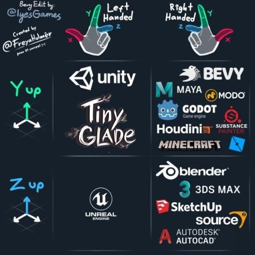

# Mesh Rendering

*By Rapunzilla*

In **Tiny Glade**, meshes are the **3D models** that make up many built-in assets in the game, including decorations, clutter, plants, trees, stones, and other objects.

Exceptions include buildings, roofs, and some other objects that are generated procedurally.

## Mesh Storage and Format

Many of Tiny Glade's built-in meshes are stored as **JSON** files containing arrays of points and other attributes that define their shape and behaviour. These meshes can be found in the `assets/meshes` folder.

!!! info "Built-in meshes vs modded clutter"

    This page describes Tiny Glade's **built-in JSON mesh format** and the vertex-colour system used by many existing clutter and decoration meshes.

    Tiny Glade's newer **clutter modding support** uses `.glb` files for additional clutter items distributed through the Steam Workshop. These modded clutter meshes use a different asset and material workflow, so the JSON structure, `nani_meshes.ron` registration, and vertex-colour details described on this page do **not** apply to clutter added through the official modding system.

    This page remains relevant when inspecting or replacing the game's existing JSON meshes.

## Managing Meshes with RON

A special file, `nani_meshes.ron`, lists available meshes and provides instructions for how they are loaded into the game.

This file contains attributes that control whether a mesh should be **loaded** or **unloaded**.

!!! info
    **RON** is a human-readable serialization format that can be edited using any text editor. You can learn more about RON [here](https://github.com/ron-rs/ron).

### Different Kinds of Meshes

The `nani_meshes.ron` file registers meshes together with their attributes. Meshes are grouped into subsets containing meshes that share the same attribute structure.

Subsets can also add or remove attributes. Below is an example of the `SolidVertexColor` subset, one of the most common subsets used for basic decorations and clutter.

```yaml
subset: SolidVertexColor, # (1)!

    attribs: (
        remove: ["soft_normal", "Vertex_UV"], # (2)!
        add: [
            (name: "flags", ty: I32), # (3)!
        ],
    ),

    meshes: [ # (4)!
        (name: "clutter/plant_pot_v1"),
        ...
    ]
```

1. The name of the subset.
2. Attributes that are removed. Even if these attributes are present in the mesh JSON file, their values are ignored when the mesh is loaded.
3. Attributes added to the mesh. The purpose of some added attributes is not yet fully understood.
4. The list of mesh files in the subset, without their file extensions.

!!! danger
    When modifying a mesh, make sure it retains all required attributes. If a required attribute is missing when the game loads the mesh, the game may crash.

Some meshes, such as tree meshes, are not included in this list because they are loaded through **prefabs**.

## Anatomy of a JSON Mesh

### Structure of a Mesh File

Built-in meshes using Tiny Glade's legacy/internal mesh format are stored as **JSON files**, with each file defining a 3D object.

JSON files are plain text and can be opened in editors such as Visual Studio Code or Notepad++.

The `attributes` array lists the attributes contained in the mesh file.

Each attribute generally contains a `type` and a `buffer`:

```yaml
"type": [
    "int", # (1)!
    1 # (2)!
],
"buffer": [ # (3)!
    ...
]
```

1. The data type stored in the buffer, commonly `int` or `float`.
2. The number of components in each value. For example, a value of `3` indicates a three-component vector.
3. The actual values are stored in the `buffer` property.

A simplified mesh file looks like this:

``` yaml
{"attributes": [
    "Vertex_Position", # (1)!
    "Vertex_Normal", # (2)!
    "Vertex_Color", # (3)!
    "Vertex_UV" # (4)!
    ],
    "indices": { # (5)!
        "type": [
            "int",
            1
        ],
        "buffer": [
            7,
            6,
            5,
            ...
        ]
    },
    "Vertex_Position": { # (1)!
        "type": [
            "float",
            3
        ],
        "buffer": [
            [
                0.33000001311302185,
                0.0,
                0.0
            ]
            ...
        ]
    },
    "Vertex_Normal": { # (2)!
        "type": [
            "float",
            3
        ],
        "buffer": [
            [
                0.0,
                1.0,
                0.0
            ]
            ...
        ]
    },
    "Vertex_Color": { # (3)!
        "type": [
            "float",
            3
        ],
        "buffer": [
            [
                0.1463320553302765,
                0.2409999966621399,
                0.12218699604272842
            ]
            ...
        ]
    },
    "Vertex_UV": { # (4)!
        "type": [
            "float",
            2
        ],
        "buffer": [
            [
                0.5,
                0.5
            ]...
        ]
    }
}
```

The main components are:

1. `Vertex_Position` stores the position of each vertex in 3D space. Each position is a **three-component vector** containing floating-point values.

2. `Vertex_Normal` stores the normal direction of each vertex.

3. `Vertex_Color` stores the RGB colour associated with each vertex.

4. `Vertex_UV` stores the **2D texture coordinates** associated with each vertex and is used by some meshes for texture mapping.

5. `indices` defines the faces of the mesh. Each integer refers to a vertex index, and the values are interpreted in groups of three. Each group of three indices defines one **triangle**.

   Unlike `Vertex_Position`, indices are stored as an **array of integers**, rather than as three-component vectors.

   

### About Vectors

Vectors in **Tiny Glade** use a coordinate system in which:

* **Y** points upward.
* **X** runs horizontally.

<figure style="width: 500px;">
  
  <figcaption>Coordinate system comparison across different software.</figcaption>
</figure>

## Vertex Colours

Many built-in JSON meshes do not use conventional image textures. Instead, colour information is stored directly on each vertex.

Each entry in the `Vertex_Color` array corresponds to a vertex at the same position in the `Vertex_Position` array.

Colours are represented as three floating-point components ranging from **0.0 to 1.0**, corresponding to the **red**, **green**, and **blue** channels.

For example:

```text
[0.2, 0.2, 0.18039216101169586]
```

Each vertex **must** have a corresponding colour entry. The `Vertex_Color` array must therefore contain the same number of entries as the `Vertex_Position` array. If these sizes differ, the game may crash during loading.

!!! note
    The specific error message can be documented here once confirmed.

### RGB Colour Basics

RGB stands for **red**, **green**, and **blue**.

In conventional 8-bit RGB notation, each channel has a value from `0` to `255`:

* `0` means no intensity for that channel.
* `255` means full intensity.

Hexadecimal colours are commonly written as `#RRGGBB`, where:

* `RR` represents red.
* `GG` represents green.
* `BB` represents blue.

Examples:

* `#FF0000` = red `(255, 0, 0)`
* `#00FF00` = green `(0, 255, 0)`
* `#0000FF` = blue `(0, 0, 255)`
* `#FFFFFF` = white `(255, 255, 255)`
* `#000000` = black `(0, 0, 0)`
* `#FFFF00` = yellow `(255, 255, 0)`

### Tiny Glade Colour Format

Tiny Glade uses the same RGB concept, but stores colour components as **floating-point values between 0 and 1** rather than integers between 0 and 255.

For example:

* `[1.0, 0.0, 0.0]` = red
* `[0.0, 1.0, 0.0]` = green
* `[0.0, 0.0, 1.0]` = blue

!!! tip
    [ColorHexa](https://www.colorhexa.com/) can be used to convert between hexadecimal colours and RGB values.

    [Color.js sRGB Linear](https://apps.colorjs.io/picker/srgb-linear) can be used to obtain linear-sRGB values that may more closely match in-game colours.

## Importing JSON Meshes into Blender

Reading large arrays of vectors directly from a JSON file can be difficult.

A [Blender](https://www.blender.org/) add-on has been created to import and export Tiny Glade's built-in JSON mesh format.

You can download the add-on from the [TinyGlade Blender Add-On releases page](https://github.com/Hbeau/TinyGlade-Blender-AddOn/releases).

For usage instructions, see [Editing Meshes with Blender](../modding-tools/mesh-edit-with-blender.md).

!!! note

    This add-on is intended for the JSON mesh format described on this page. New clutter created through Tiny Glade's official modding support uses `.glb` files and follows a separate workflow.
