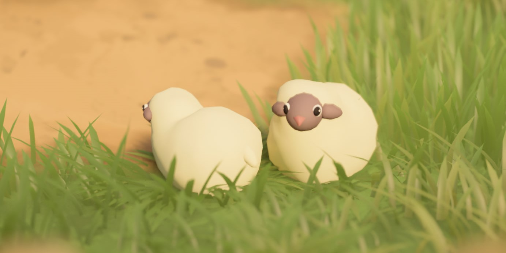
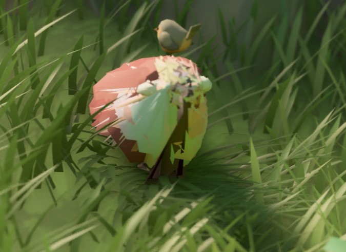

# Sheep

Sheep are the most iconic and adorable creatures in *Tiny Glade*. They wander peacefully around your buildings and love being petted.  
Under the hood, their behavior and animation system are implemented in a very unique way.

---

## Meshes

The sheep's 3D models (meshes) are located in the `meshes/sheep_animation` folder. There are **31 separate mesh files** used for animations:

- **30** files for the **walking animation**, named `1.json` through `30.json`
- **1** file for the **petting animation**, named `delighted.json`

!!! info  
    The `1.json` mesh is also used for the **idle** animation.

Each mesh file contains a standard set of [meshes attributes](/game-knowledge/meshes):  
- `Vertex_Position`: the 3D coordinates of each vertex  
- `Vertex_Normal`: the direction each vertex is facing 
- `Vertex_Color`: the color of each vertex

---

## Animation

The sheep animation system works by **switching between mesh frames**:

- **Idle state**: The sheep remains on the `1.json` mesh.
- **Walking state**: The sheep cycles through the 30 walking frames (`1.json` to `30.json`) in a loop, creating the illusion of movement.
- **Petting state**: When the player pets a sheep, its mesh switches to `delighted.json`, showing a happy reaction.

### 🔧 Technical Constraints

For the animation to work properly, all meshes must meet **strict structural requirements**:

- They must have **the exact same number of vertices**.
- The vertices must be listed **in the same order across all meshes**.

This is crucial because the animation system interpolates between vertex positions over time. If the vertex count or order differs between frames, the animation will break or cause visual artifacts.

!!! danger 
    If you're exporting or modifying sheep meshes in Blender:
    Make sure the export script does **not reorder the vertex list**.  

---

### Version Notes

- **Versions ≤ 1.13**: Each mesh must contain **exactly 860 vertices**.  
- **Version ≥ 1.14**: This limitation has been lifted. Meshes can have any vertex count, as long as it's consistent across all animation frames.

