# Windows

There are 3 main kinds of windows, each with several variants:
- **Arrow Slit**: small square hole in the wall
- **Cottage Window**: square window in a rustic style
- **Gothic Window**: pointed arch window

Each type comes in 3 sizes and can be placed in a **building**, a **wall**, or a **roof**.  
Each window has simple, dormer, and half-dormer versions, which are considered different kinds of windows.

Each window is made up of several meshes that define its appearance and behavior in the environment. Not all windows use these meshes in the same way:
- The **collision mesh** defines a bounding box around the window. This is used to prevent overlapping. For **cottage windows only**, the collision mesh also creates a square hole in the wall. For other window types, the hole in the wall is hardcoded and cannot be modified.

Below are side-by-side images showing the collision results for different window types:

    { width="200" }  
    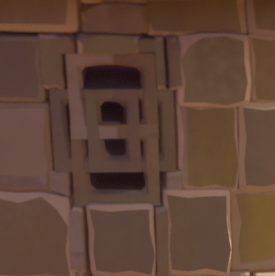{ width="200" }  
    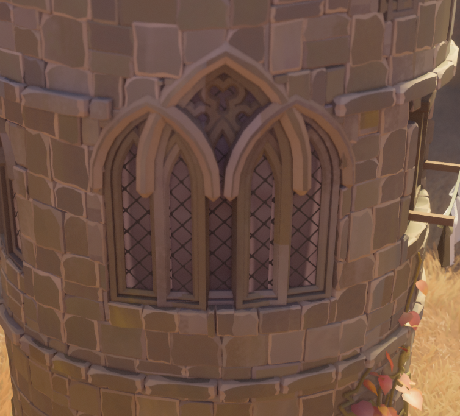{ width="200" }  

 

---

## Window Meshes Table

| Window & Image                                                                                                       | Related Meshes                                                                                                                                                                             |
|----------------------------------------------------------------------------------------------------------------------|--------------------------------------------------------------------------------------------------------------------------------------------------------------------------------------------|
| **Arrow Slit 1x1**                                                | - arrow_slit_1x1.json - arrow_slit_1x1_collision.json - arrow_slit_1x1_interaction.json - arrow_slit_1x1_glass.json - arrow_slit_1x1_outline.json                              |
| **Arrow Slit 1x2** 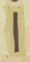                                               | - arrow_slit_1x2.json - arrow_slit_1x2_collision.json - arrow_slit_1x2_interaction.json - arrow_slit_1x2_glass.json - arrow_slit_1x2_hat.json - arrow_slit_1x2_outline.json |
| **Arrow Slit 1x3** 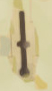                                               | - arrow_slit_1x3.json - arrow_slit_1x3_collision.json - arrow_slit_1x3_interaction.json - arrow_slit_1x3_glass.json - arrow_slit_1x3_hat.json - arrow_slit_1x3_outline.json |
| **Arrow Slit 1x2 Half-Dormer**              | - arrow_slit_1x2_halfdormer.json                                                                                                                                                           |
| **Arrow Slit 1x3 Half-Dormer** 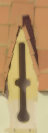             | - arrow_slit_1x3_halfdormer.json                                                                                                                                                           |
| **Cottage Window 1x1**                                    | - window_cottage_1x1.json - window_cottage_1x1_collision.json - window_cottage_1x1_interaction.json - window_cottage_1x1_glass.json - window_cottage_1x1_outline.json          |
| **Cottage Window 1x1 Dormer**               | - window_cottage_1x1_dormer.json - window_cottage_1x1_full_dormer.json                                                                                                                  |
| **Cottage Window 1x1 Half-Dormer** 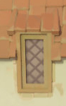 | - window_cottage_1x1_halfdormer_frame.json                                                                                                                                                 |
| **Cottage Window 1x2**                                    | - window_cottage_2x1.json - window_cottage_2x1_collision.json - window_cottage_2x1_interaction.json - window_cottage_2x1_glass.json - window_cottage_2x1_outline.json          |
| **Cottage Window 1x2 Dormer** 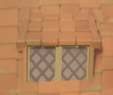              | - window_cottage_2x1_full_dormer.json                                                                                                                                                      |
| **Cottage Window 1x2 Half-Dormer**  | - window_cottage_2x1_halfdormer_frame.json                                                                                                                                                 |
| **Cottage Window 1x3**                                    | - window_cottage_3x1.json - window_cottage_3x1_collision.json - window_cottage_3x1_interaction.json - window_cottage_3x1_glass.json - window_cottage_3x1_outline.json          |
| **Cottage Window 1x3 Dormer** 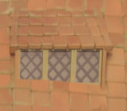              | - window_cottage_3x1_full_dormer.json                                                                                                                                                      |
| **Cottage Window 1x3 Half-Dormer**  | - window_cottage_3x1_halfdormer_frame.json                                                                                                                                                 |
| **Gothic Window 1x1** 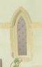                                      | - window_gothic_1x1.json - window_gothic_1x1_collision.json - window_gothic_1x1_interaction.json - window_gothic_1x1_glass.json - window_gothic_1x1_outline.json               |
| **Gothic Window 1x1 Dormer** 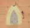                 | - window_gothic_1x1_dormer.json - window_gothic_1x1_hat.json - window_gothic_1x1_hat_full.json                                                                                       |
| **Gothic Window 1x1 Half-Dormer**     |                                                                                                                                                                                            |
| **Gothic Window 1x2**                                       | - window_gothic_2x1.json - window_gothic_2x1_collision.json - window_gothic_2x1_interaction.json - window_gothic_2x1_glass.json - window_gothic_2x1_outline.json               |
| **Gothic Window 1x2 Dormer**                  | - window_gothic_2x1_dormer.json - window_gothic_2x1_hat.json - window_gothic_2x1_hat_full.json                                                                                       |
| **Gothic Window 1x2 Half-Dormer**     |                                                                                                                                                                                            |
| **Gothic Window 1x3** 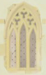                                      | - window_gothic_3x1.json - window_gothic_3x1_collision.json - window_gothic_3x1_interaction.json - window_gothic_3x1_glass.json - window_gothic_3x1_outline.json               |
| **Gothic Window 1x3 Dormer**                  | - window_gothic_3x1_dormer.json - window_gothic_3x1_hat.json - window_gothic_3x1_hat_full.json                                                                                       |
| **Gothic Window 1x3 Half-Dormer** 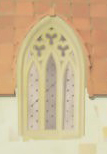    |                                                                                                                                                                                            |

