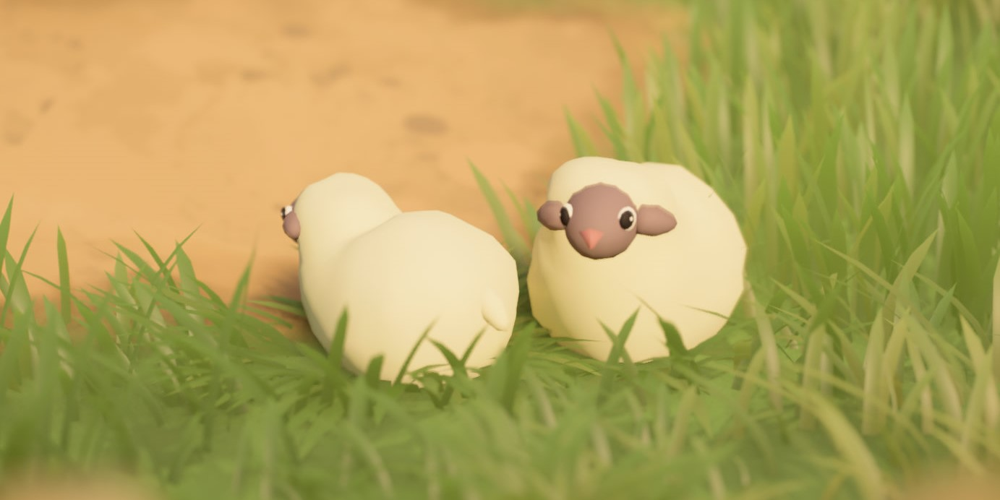
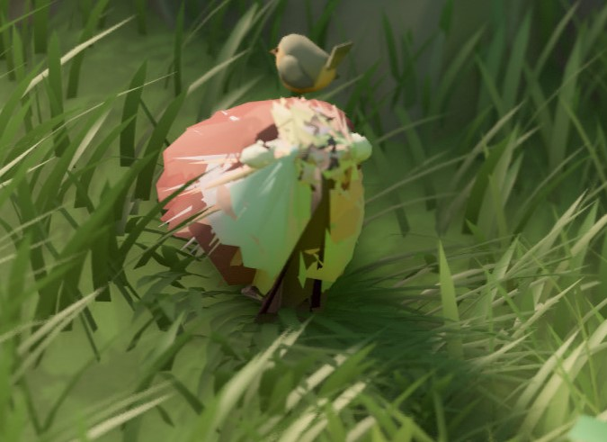

# Sheep

Sheep are some of the most iconic creatures in *Tiny Glade*. They wander around your builds and can be petted by the player.

Under the hood, their animation system works in an unusual way compared with a conventional skeletal animation setup.



## Meshes

The sheep meshes are located in the `meshes/sheep_animation` folder.

There are **31 mesh files** used by the animation system:

- **30** files for the walking animation, named `1.json` through `30.json`
- **1** file for the petting animation, named `delighted.json`

!!! info

    The `1.json` mesh is also used for the **idle** state.

Each mesh file contains the standard [mesh attributes](../meshes.md), including:

- `Vertex_Position` — the 3D coordinates of each vertex
- `Vertex_Normal` — the normal direction of each vertex
- `Vertex_Color` — the colour associated with each vertex

## Animation

The sheep animation system works by **switching between mesh frames**.

- **Idle state** — the sheep remains on the `1.json` mesh.
- **Walking state** — the sheep cycles through the 30 walking frames, from `1.json` to `30.json`, creating the appearance of movement.
- **Petting state** — when the player pets a sheep, the mesh switches to `delighted.json`.

The original walking animation uses 30 frames, but a custom animation does not need to contain 30 unique poses. Shorter animations can repeat frames to fill the sequence.

However, **all 30 numbered files must still be present**. If one or more expected files are missing, the game may crash during startup.

### Technical Constraints

For the animation to work correctly, all animation meshes must meet several structural requirements:

- They must contain **the same number of vertices**.
- Vertices must appear **in the same order across every frame**.

This is important because the animation system interpolates between corresponding vertex positions over time. If the vertex count or ordering differs between frames, the animation may break or produce visual artefacts.



If the vertex count differs between animation meshes, the game may produce an error similar to:

```text
ERROR [tiny_glade::panic_reporter] [frame:0] PANIC: panicked at crates/country-core/src/startup/startup_sheep.rs:98:21:
index out of bounds: the len is 860 but the index is 860
```

In this example, `860` corresponds to the vertex count of the shorter mesh.

!!! danger

    When exporting or modifying sheep meshes in Blender, make sure the export process does **not reorder the vertex list**.

    Even if two frames contain the same number of vertices, changing their order can cause incorrect interpolation between frames.

### Version Notes

- **Versions ≤ 1.13** — each sheep mesh must contain **exactly 860 vertices**.
- **Versions ≥ 1.14** — the fixed 860-vertex requirement has been removed. Meshes can use a different vertex count as long as that count is consistent across all animation frames.