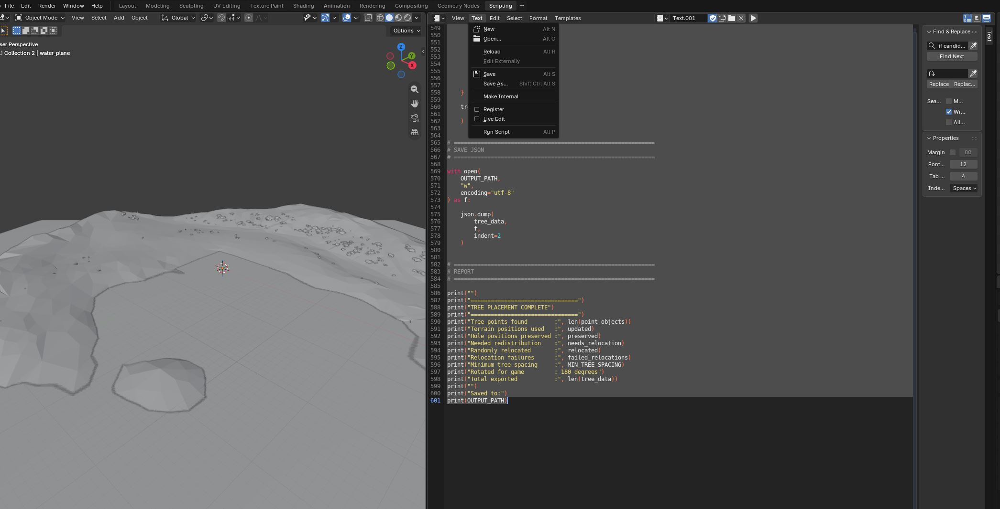
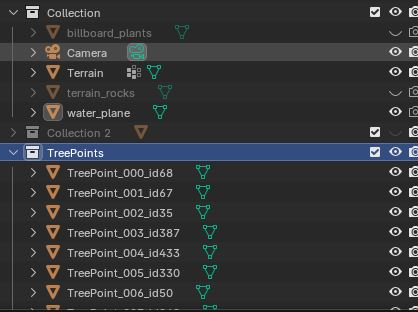
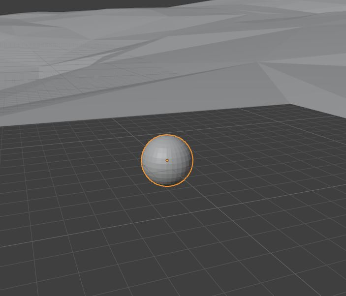
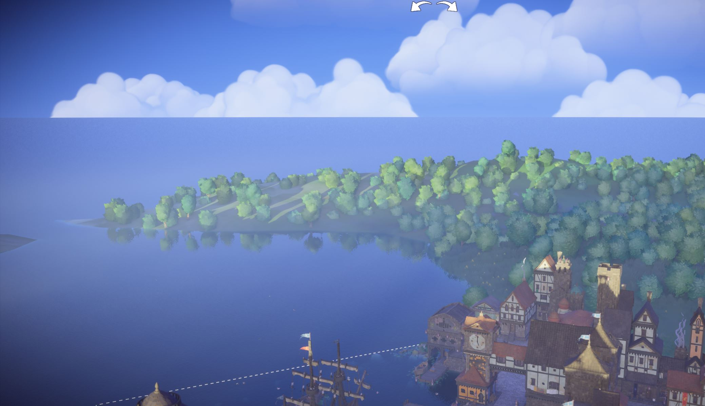

# Editing the Trees

Custom terrain changes the height and shape of the landscape, but Tiny Glade's tree-placement files are still positioned for the original terrain.

If these files are left unchanged, trees may float above the ground, clip into hills, appear underwater, or otherwise sit incorrectly on the new terrain.

The tree placement files are stored under the seasonal glade folders:

```text
assets/glade/
├── autumn/
├── flowery/
├── olden/
├── summer/
└── winter/
```

Each season contains a `trees` folder with the JSON files used to position background and clearing-edge trees.

## Required Tree Files

For **Autumn**, **Flowery**, and **Summer**, the following files need to be updated:

```text
bg_terrain_trees.json
clearing_edge1.json
clearing_edge2.json
clearing_edge3.json
```

For **Winter**, additional files are also used:

```text
bg_terrain_trees.json
bg_terrain_trees_2.json
clearing_edge1.json
clearing_edge2.json
clearing_edge3.json
clearing_edge_naked_trees.json
```

For **Olden**, `clearing_edge_naked_trees.json` is also required.

!!! info

    Copy the required tree files into your mod while preserving the original folder structure.

    For example:

    ```text
    YOUR_MOD/
    └── assets/
        └── glade/
            └── summer/
                └── trees/
                    ├── bg_terrain_trees.json
                    ├── clearing_edge1.json
                    ├── clearing_edge2.json
                    └── clearing_edge3.json
    ```

The following two Blender scripts can then be used to reposition the trees against your custom terrain.

## 1. Import the Tree Positions into Blender

Use the Blender Scripts tab to edit the tree files. Open a new script by clicking `Text` and then `New` and then paste the following scripts in. 



The first script reads one of the Tiny Glade tree JSON files and creates visible marker objects in Blender for each tree position.

Before running it, edit `JSON_PATH` so that it points to the tree file inside your mod.

```python
import bpy
import json
from mathutils import Vector

# -----------------------------------
# SETTINGS
# -----------------------------------

# Change this path to the tree JSON file you want to edit.
#
# Example:
# ...\mods\YOUR_MOD\assets\glade\summer\trees\clearing_edge3.json
JSON_PATH = r"C:\Users\YOUR_NAME\Saved Games\Tiny Glade\Steam\YOUR_STEAM_ID\mods\YOUR_MOD\assets\glade\summer\trees\clearing_edge3.json"

POINT_COLLECTION_NAME = "TreePoints"
POINT_SIZE = 1.2   # Increase or decrease if the markers are difficult to see.

# -----------------------------------
# COORDINATE CONVERSION
# -----------------------------------
# Tiny Glade position = [X, Y, Z]
# where Y is height.
#
# Blender uses Z as height, so:
# Game (X, Y, Z) -> Blender (X, -Z, Y)
#
# If the points appear mirrored, change -Z to Z.

def game_to_blender(pos):
    x, y, z = pos
    return Vector((x, -z, y))

def blender_to_game(pos):
    x, y, z = pos
    return [x, z, -y]

# -----------------------------------
# LOAD JSON
# -----------------------------------

with open(JSON_PATH, "r", encoding="utf-8") as f:
    trees = json.load(f)

# -----------------------------------
# MAKE / GET COLLECTION
# -----------------------------------

if POINT_COLLECTION_NAME in bpy.data.collections:
    collection = bpy.data.collections[POINT_COLLECTION_NAME]
else:
    collection = bpy.data.collections.new(POINT_COLLECTION_NAME)
    bpy.context.scene.collection.children.link(collection)

# Clear old objects in the collection.
for obj in list(collection.objects):
    bpy.data.objects.remove(obj, do_unlink=True)

# -----------------------------------
# CREATE A SMALL SPHERE MESH TO INSTANCE
# -----------------------------------

mesh_name = "TreePointMesh"

if mesh_name in bpy.data.meshes:
    point_mesh = bpy.data.meshes[mesh_name]
else:
    bpy.ops.mesh.primitive_uv_sphere_add(
        radius=POINT_SIZE,
        location=(0, 0, 0)
    )

    temp_obj = bpy.context.active_object
    point_mesh = temp_obj.data
    point_mesh.name = mesh_name

    bpy.data.objects.remove(
        temp_obj,
        do_unlink=True
    )

# -----------------------------------
# CREATE POINT OBJECTS
# -----------------------------------

created = 0

for i, tree in enumerate(trees):
    pos_game = tree["position"]
    pos_blender = game_to_blender(pos_game)

    obj = bpy.data.objects.new(
        f"TreePoint_{i:03d}_id{tree['id']}",
        point_mesh.copy()
    )

    obj.location = pos_blender

    # Preserve the original tree data as custom properties.
    obj["tree_index"] = i
    obj["tree_id"] = tree["id"]
    obj["scale_value"] = tree.get("scale", 1.0)
    obj["rotation_angle"] = tree.get("rotation_angle", 0.0)
    obj["pad0"] = tree.get("pad0", 0)
    obj["pad1"] = tree.get("pad1", 0)

    collection.objects.link(obj)

    created += 1

print(
    f"Created {created} visible tree points "
    f"in collection '{POINT_COLLECTION_NAME}'"
)
```

After running the script, the tree positions will appear as spheres in a collection named:

```text
TreePoints
```

These markers represent the original Tiny Glade tree positions.





!!! warning "Delete the TreePoints collection before importing another file"

    If you reuse the scripts for another tree JSON file, delete the existing `TreePoints` collection from the Blender scene first by right clicking the collection and selecting `Delete Hierarchy`.

    Do not leave markers from a previous file in the scene when loading a new one. Reusing the scripts with old tree-point objects still present can cause incorrect placement and unexpected results.

## 2. Make Sure the Terrain Object Is Named Correctly

The placement script expects the custom terrain object to be named:

```text
Terrain
```

Rename your terrain object in Blender if necessary.

The script raycasts directly against this object to determine the correct ground height for each tree.

## 3. Configure the Placement Script

The second script moves the tree positions onto the custom terrain and writes the updated positions directly back into the JSON file.

No Blender export is required.

Before running the script, edit the settings at the top:

```python
OUTPUT_PATH = r"C:\Users\YOUR_NAME\Saved Games\Tiny Glade\Steam\YOUR_STEAM_ID\mods\YOUR_MOD\assets\glade\summer\trees\clearing_edge3.json"

TERRAIN_NAME = "Terrain"
POINT_COLLECTION_NAME = "TreePoints"

RAY_HEIGHT = 1000.0

MIN_TREE_Z = 0.0

MIN_TREE_SPACING = 2.5

MAX_PLACEMENT_ATTEMPTS = 5000

RANDOM_SEED = 481516

TREE_SINK_DEPTH = 0.0
```

The most important settings are:

- `OUTPUT_PATH` — the JSON file being edited
- `TERRAIN_NAME` — the name of the terrain object in Blender
- `POINT_COLLECTION_NAME` — the collection created by the first script
- `MIN_TREE_Z` — the minimum allowed terrain height
- `MIN_TREE_SPACING` — minimum distance between trees that are redistributed
- `TREE_SINK_DEPTH` — how far the trees are pushed into the terrain

## 4. Set the Tree Sink Depth

For most of the clearing-edge files, the default value can remain:

```python
TREE_SINK_DEPTH = 0.0
```

For:

```text
bg_terrain_trees.json
```

use:

```python
TREE_SINK_DEPTH = 5.0
```

The background terrain trees do not have visible trunks, so pushing them slightly into the terrain helps prevent them from appearing to float.

!!! tip

    If another tree group appears to float or sink too deeply, `TREE_SINK_DEPTH` can be adjusted as needed.

## 5. Run the Placement and Export Script

Use the following script after the tree markers have been imported:

```python
import bpy
import json
import random
from mathutils import Vector

# ============================================================
# SETTINGS
# ============================================================

# Change this path to the SAME tree JSON file loaded
# with the first script.
OUTPUT_PATH = r"C:\Users\YOUR_NAME\Saved Games\Tiny Glade\Steam\YOUR_STEAM_ID\mods\YOUR_MOD\assets\glade\summer\trees\clearing_edge3.json"

TERRAIN_NAME = "Terrain"
POINT_COLLECTION_NAME = "TreePoints"

# How far above the terrain to begin raycasts.
RAY_HEIGHT = 1000.0

# Any terrain/tree position below this Blender Z height
# is considered ocean / invalid.
MIN_TREE_Z = 0.0

# Minimum horizontal spacing between tree points.
# Increase this if trees still overlap too much.
MIN_TREE_SPACING = 2.5

# Number of random positions to try for each displaced tree.
MAX_PLACEMENT_ATTEMPTS = 5000

# Fixed seed gives repeatable random redistribution.
RANDOM_SEED = 481516

# Sink trees slightly into the terrain.
#
# For bg_terrain_trees.json, use:
# TREE_SINK_DEPTH = 5.0
TREE_SINK_DEPTH = 0.0


# ============================================================
# COORDINATE CONVERSION
# ============================================================

# Tiny Glade JSON:
# X = horizontal
# Y = height
# Z = horizontal
#
# Blender:
# X = horizontal
# Y = horizontal
# Z = height

def blender_to_game(pos):
    x, y, z = pos
    return [x, z, -y]


# ============================================================
# 180 DEGREE IN-GAME ROTATION
# ============================================================

# The terrain appears rotated 180 degrees in Tiny Glade.
# Rotate exported tree coordinates around the Blender
# world origin before writing them back to the JSON.
#
# (x, y, z) -> (-x, -y, z)

def rotate_180_world(pos):
    return Vector((
        -pos.x,
        -pos.y,
        pos.z
    ))


# ============================================================
# GET TERRAIN AND TREE POINT COLLECTION
# ============================================================

terrain = bpy.data.objects.get(TERRAIN_NAME)

if terrain is None:
    raise RuntimeError(
        f'Could not find terrain object named "{TERRAIN_NAME}"'
    )

collection = bpy.data.collections.get(
    POINT_COLLECTION_NAME
)

if collection is None:
    raise RuntimeError(
        f'Could not find collection named "{POINT_COLLECTION_NAME}"'
    )


# ============================================================
# GET EVALUATED TERRAIN
# ============================================================

depsgraph = bpy.context.evaluated_depsgraph_get()

terrain_eval = terrain.evaluated_get(
    depsgraph
)

terrain_matrix = terrain_eval.matrix_world.copy()
terrain_matrix_inv = terrain_matrix.inverted()


# ============================================================
# TERRAIN WORLD BOUNDS
# ============================================================

terrain_bbox_world = [
    terrain.matrix_world @ Vector(corner)
    for corner in terrain.bound_box
]

TERRAIN_MIN_X = min(
    v.x for v in terrain_bbox_world
)

TERRAIN_MAX_X = max(
    v.x for v in terrain_bbox_world
)

TERRAIN_MIN_Y = min(
    v.y for v in terrain_bbox_world
)

TERRAIN_MAX_Y = max(
    v.y for v in terrain_bbox_world
)

print("")
print("Terrain random-placement bounds:")
print("X:", TERRAIN_MIN_X, "to", TERRAIN_MAX_X)
print("Y:", TERRAIN_MIN_Y, "to", TERRAIN_MAX_Y)


# ============================================================
# TERRAIN RAYCAST FUNCTION
# ============================================================

def terrain_height_at(x, y):
    """
    Cast directly downward against only the Terrain object.

    Returns the world-space terrain hit position if terrain
    exists at this X/Y location.

    Returns None if no Terrain mesh exists underneath.
    """

    ray_origin_world = Vector((
        x,
        y,
        RAY_HEIGHT
    ))

    ray_direction_world = Vector((
        0.0,
        0.0,
        -1.0
    ))

    # Convert ray into terrain-local space.
    ray_origin_local = (
        terrain_matrix_inv @ ray_origin_world
    )

    ray_direction_local = (
        terrain_matrix_inv.to_3x3()
        @ ray_direction_world
    ).normalized()

    # Raycast against Terrain only.
    hit, hit_location_local, normal, face_index = (
        terrain_eval.ray_cast(
            ray_origin_local,
            ray_direction_local,
            distance=RAY_HEIGHT * 2.0
        )
    )

    if not hit:
        return None

    # Convert hit back into world coordinates.
    hit_location_world = (
        terrain_matrix @ hit_location_local
    )

    return hit_location_world


# ============================================================
# TREE SPACING FUNCTION
# ============================================================

def is_far_enough(
    candidate,
    occupied_positions
):
    """
    Checks horizontal X/Y distance only.

    Height is ignored so trees are not placed directly
    above or below one another.
    """

    minimum_distance_squared = (
        MIN_TREE_SPACING * MIN_TREE_SPACING
    )

    for existing in occupied_positions:

        dx = candidate.x - existing.x
        dy = candidate.y - existing.y

        distance_squared = (
            dx * dx +
            dy * dy
        )

        if distance_squared < minimum_distance_squared:
            return False

    return True


# ============================================================
# RANDOM VALID TERRAIN POSITION
# ============================================================

def find_random_valid_position(
    occupied_positions
):
    """
    Search randomly across the complete Terrain bounding box.

    A position is accepted only if:

    1. The ray hits Terrain.
    2. Terrain is at or above MIN_TREE_Z.
    3. The position is not too close to another tree.
    """

    for attempt in range(
        MAX_PLACEMENT_ATTEMPTS
    ):

        random_x = random.uniform(
            TERRAIN_MIN_X,
            TERRAIN_MAX_X
        )

        random_y = random.uniform(
            TERRAIN_MIN_Y,
            TERRAIN_MAX_Y
        )

        hit_location = terrain_height_at(
            random_x,
            random_y
        )

        # No terrain at this position.
        if hit_location is None:
            continue

        # Terrain exists but is underwater.
        if hit_location.z < MIN_TREE_Z:
            continue

        # Too close to another tree.
        if not is_far_enough(
            hit_location,
            occupied_positions
        ):
            continue

        return hit_location

    return None


# ============================================================
# GET TREE POINTS
# ============================================================

point_objects = [
    obj
    for obj in collection.objects
    if "tree_index" in obj
]

point_objects.sort(
    key=lambda obj: obj["tree_index"]
)


# ============================================================
# RANDOM SEED
# ============================================================

random.seed(
    RANDOM_SEED
)


# ============================================================
# FIRST PASS:
# DETERMINE WHICH TREES ALREADY HAVE VALID POSITIONS
# ============================================================

tree_records = []
valid_positions = []

updated = 0
preserved = 0
needs_relocation = 0

for obj in point_objects:

    current_world_loc = (
        obj.matrix_world.translation.copy()
    )

    # Look for terrain at the tree's current X/Y.
    terrain_hit = terrain_height_at(
        current_world_loc.x,
        current_world_loc.y
    )

    # If terrain exists, snap to its height.
    if terrain_hit is not None:

        candidate_position = Vector((
            current_world_loc.x,
            current_world_loc.y,
            terrain_hit.z
        ))

        updated += 1

    # If there is a hole in the terrain,
    # preserve the current position.
    else:

        candidate_position = (
            current_world_loc.copy()
        )

        preserved += 1

    # Valid position above sea level.
    if candidate_position.z >= MIN_TREE_Z:

        final_position = (
            candidate_position.copy()
        )

        final_position.z -= (
            TREE_SINK_DEPTH
        )

        valid_positions.append(
            final_position
        )

        requires_relocation = False

    else:

        # Below sea level:
        # mark this tree for redistribution.
        final_position = None
        requires_relocation = True

        needs_relocation += 1

    tree_records.append({
        "object": obj,
        "candidate_position": candidate_position,
        "final_position": final_position,
        "requires_relocation": requires_relocation
    })


# ============================================================
# SECOND PASS:
# RANDOMLY REDISTRIBUTE OCEAN TREES
# ============================================================

relocated = 0
failed_relocations = 0

for record in tree_records:

    if not record["requires_relocation"]:
        continue

    obj = record["object"]

    random_position = (
        find_random_valid_position(
            valid_positions
        )
    )

    if random_position is not None:

        record["final_position"] = (
            random_position.copy()
        )

        valid_positions.append(
            random_position.copy()
        )

        relocated += 1

        print(
            "RELOCATED:",
            obj.name,
            "->",
            tuple(
                round(v, 3)
                for v in random_position
            )
        )

    else:

        # This should normally happen only if the terrain is
        # extremely crowded or MIN_TREE_SPACING is too large.
        #
        # Preserve the tree entry instead of deleting it.
        failed_relocations += 1

        print(
            "WARNING: Could not find valid position for:",
            obj.name
        )

        # Emergency fallback.
        fallback = Vector((
            0.0,
            0.0,
            MIN_TREE_Z
        ))

        record["final_position"] = fallback

        valid_positions.append(
            fallback
        )


# ============================================================
# THIRD PASS:
# UPDATE BLENDER POINTS AND BUILD JSON
# ============================================================

tree_data = []

for record in tree_records:

    obj = record["object"]

    final_world_loc = (
        record["final_position"]
    )

    # Ensure all tree markers are visible.
    obj.hide_viewport = False
    obj.hide_render = False

    # Update the Blender preview.
    matrix = obj.matrix_world.copy()
    matrix.translation = final_world_loc
    obj.matrix_world = matrix

    # Rotate position 180 degrees for Tiny Glade.
    rotated_world_loc = rotate_180_world(
        final_world_loc
    )

    # Build the output tree entry.
    tree_entry = {
        "position": blender_to_game(
            rotated_world_loc
        ),
        "id": int(
            obj["tree_id"]
        ),
        "scale": float(
            obj["scale_value"]
        ),
        "rotation_angle": float(
            obj["rotation_angle"]
        ),
        "pad0": int(
            obj["pad0"]
        ),
        "pad1": int(
            obj["pad1"]
        ),
    }

    tree_data.append(
        tree_entry
    )


# ============================================================
# SAVE JSON
# ============================================================

with open(
    OUTPUT_PATH,
    "w",
    encoding="utf-8"
) as f:

    json.dump(
        tree_data,
        f,
        indent=2
    )


# ============================================================
# REPORT
# ============================================================

print("")
print("================================")
print("TREE PLACEMENT COMPLETE")
print("================================")
print(
    "Tree points found        :",
    len(point_objects)
)
print(
    "Terrain positions used   :",
    updated
)
print(
    "Hole positions preserved :",
    preserved
)
print(
    "Needed redistribution    :",
    needs_relocation
)
print(
    "Randomly relocated       :",
    relocated
)
print(
    "Relocation failures      :",
    failed_relocations
)
print(
    "Minimum tree spacing     :",
    MIN_TREE_SPACING
)
print(
    "Rotated for game         : 180 degrees"
)
print(
    "Total exported           :",
    len(tree_data)
)
print("")
print("Saved to:")
print(OUTPUT_PATH)
```

The script performs three main operations:

1. Trees that still sit over valid terrain are snapped vertically onto the new terrain surface.
2. Trees that would now be below `MIN_TREE_Z`, such as trees that have ended up in an ocean area, are redistributed to random valid positions on the terrain while respecting `MIN_TREE_SPACING`.
3. The final positions are converted back into Tiny Glade coordinates and written directly into the original tree JSON file.

## 6. Check the Result in Blender

After the second script finishes, the `TreePoints` markers will move to their new positions.

Inspect them in the Blender viewport before opening the game.

Check for:

- trees floating above the terrain
- trees buried too deeply
- trees placed underwater
- excessive clustering
- unexpected gaps
- trees appearing in places where you do not want vegetation



If the trees are too close together, increase:

```python
MIN_TREE_SPACING = 2.5
```

If too many trees cannot find a valid position, either reduce `MIN_TREE_SPACING` or increase:

```python
MAX_PLACEMENT_ATTEMPTS = 5000
```

## 7. Repeat for Each Tree File

Repeat the process for every tree JSON file required by the season:

1. Delete the existing `TreePoints` collection.
2. Change `JSON_PATH` in the first script.
3. Run the first script to import that file's tree positions.
4. Change `OUTPUT_PATH` in the second script to the same file.
5. Set the appropriate `TREE_SINK_DEPTH`.
6. Run the second script.
7. Inspect the resulting tree positions.
8. Repeat for the next JSON file.

For `bg_terrain_trees.json`, remember to use:

```python
TREE_SINK_DEPTH = 5.0
```

For the other tree files, start with:

```python
TREE_SINK_DEPTH = 0.0
```

and adjust only if necessary.

!!! warning

    Always make sure `JSON_PATH` and `OUTPUT_PATH` refer to the same tree file before running the placement script.

    The second script writes directly to `OUTPUT_PATH`, so an incorrect path can overwrite the wrong tree file.

## 8. Test the Trees in Tiny Glade

Once all required tree files have been updated, start Tiny Glade and inspect the terrain in the relevant season.

Check the edges of the glade as well as the distant background terrain.

If trees are floating, clipping, or appearing underwater, return to Blender and adjust the placement settings before running the script again.

Because each season uses its own tree files, you can copy and paste the files into each tree folder, making sure to stay aware of which seasons should have each type of tree file. 

## Next Step

Continue on to the next step [modifying the plants](plants.md)

