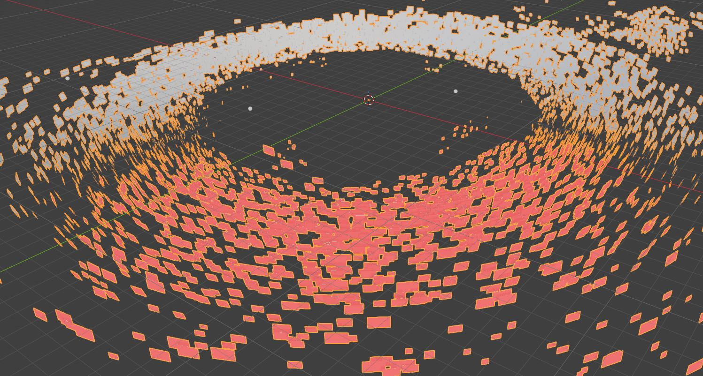
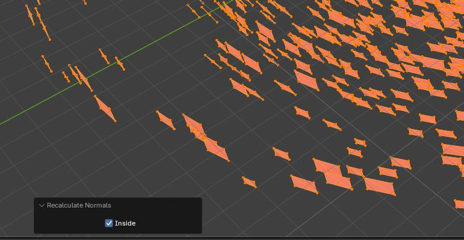
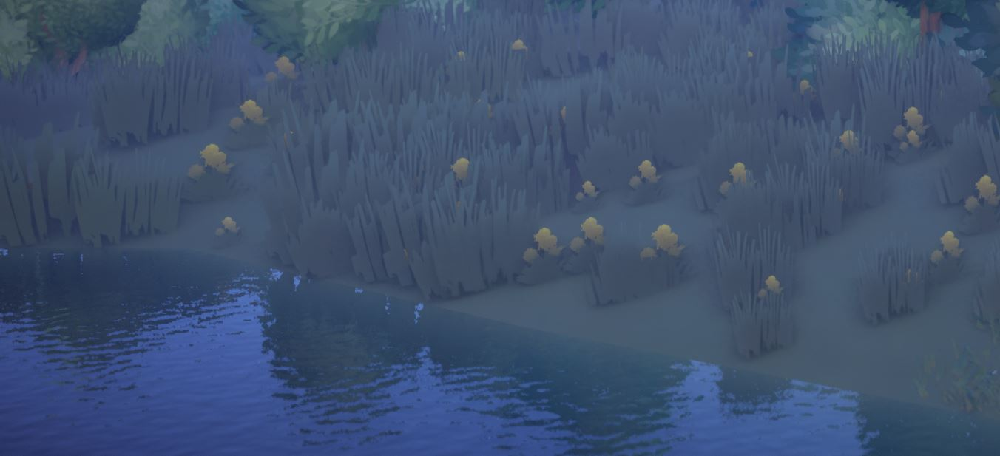

# Editing the Plants

Plant placement can be updated using the same Blender workflow described in [Editing the Trees](bg_trees.md).

In the **Summer** and **Flowery** glade folders, a `plants` folder is located alongside the `trees` folder. The relevant files are:

```text
terrain_plant1.json
terrain_plant2.json
```

The workflow is the same as for trees:

1. Copy the relevant plant JSON files into your mod while preserving the original folder structure.
2. Point the first placement script at the plant JSON file you want to edit.
3. Import the placement points into Blender.
4. Make sure the custom terrain object is named `Terrain`.
5. Point the second script at the same plant JSON file.
6. Run the placement script to snap the plants to the custom terrain and write the updated positions directly back to the JSON.
7. Inspect the result in Blender and repeat for the remaining plant files.

!!! warning

    Delete the generated `TreePoints` collection before loading another placement file.

    The collection keeps the same name even when the scripts are being used for plants.

## Editing the Billboard Plants

In addition to the seasonal plant-placement JSON files, Tiny Glade uses a billboard plant mesh:

```text
assets/meshes/billboard_plants.json
```

This mesh contains the small billboard plants distributed across the terrain. Because their original positions are based on Tiny Glade's default terrain, they also need to be adjusted when the terrain shape is changed.



The billboard workflow uses **two Blender scripts**:

1. **Terrain Snap Script** — moves each billboard vertically so that its bottom edge sits on the custom terrain. Billboards with no terrain beneath them, or terrain below the configured water level, are removed.
2. **Billboard Export Script** — matches the surviving billboards back to their original Tiny Glade data, preserves the special billboard attributes, recalculates terrain-dependent values, and writes a new `billboard_plants.json` directly into the mod.

Copy the original `billboard_plants.json` into your mod using the same folder structure:

```text
YOUR_MOD/
└── assets/
    └── meshes/
        └── billboard_plants.json
```

### 1. Import the Billboard Plants

Import the original Tiny Glade `billboard_plants.json` into Blender using the Tiny Glade Blender Add-On. Make sure to hop into `Edit Mode` and flip the normals by selecting everything with `A` and recalculating the normals with `Shift + N` so the billboards' normals are facing the center. 



The imported object should be named:

```text
billboard_plants
```

Your custom terrain should also be present in the Blender scene and named:

```text
Terrain
```

!!! warning

    Both scripts expect these object names by default.

    If your objects use different names, change `PLANT_OBJECT_NAME` and `TERRAIN_NAME` at the top of both scripts.

### 2. Snap the Billboard Plants to the Terrain

Open Blender's **Scripting** workspace, create a new text file, and paste the following script.

This script checks the terrain directly beneath each billboard and moves the entire quad vertically so that its bottom edge rests on the new terrain.

If there is no terrain below the billboard, or if the terrain is below `MIN_TERRAIN_Z`, the billboard is removed.

```python
import bpy
import bmesh
from mathutils import Vector

# ============================================================
# SETTINGS
# ============================================================

PLANT_OBJECT_NAME = "billboard_plants"
TERRAIN_NAME = "Terrain"

# Anything below this world-space Z is ocean
MIN_TERRAIN_Z = 0.0

# Height above the map from which terrain rays are fired
RAY_HEIGHT = 1000.0

# Used when identifying the bottom vertices of each billboard.
# Vertices within this much of the lowest Z are treated as
# belonging to the bottom edge.
BOTTOM_EPSILON = 0.01


# ============================================================
# GET OBJECTS
# ============================================================

plants = bpy.data.objects.get(PLANT_OBJECT_NAME)

if plants is None:
    raise RuntimeError(
        f'Could not find plant object "{PLANT_OBJECT_NAME}"'
    )

if plants.type != 'MESH':
    raise RuntimeError(
        f'"{PLANT_OBJECT_NAME}" is not a mesh object'
    )


terrain = bpy.data.objects.get(TERRAIN_NAME)

if terrain is None:
    raise RuntimeError(
        f'Could not find terrain object "{TERRAIN_NAME}"'
    )

if terrain.type != 'MESH':
    raise RuntimeError(
        f'"{TERRAIN_NAME}" is not a mesh object'
    )


# ============================================================
# TERRAIN SETUP
# ============================================================

depsgraph = bpy.context.evaluated_depsgraph_get()

terrain_eval = terrain.evaluated_get(depsgraph)

terrain_matrix = terrain_eval.matrix_world.copy()
terrain_matrix_inv = terrain_matrix.inverted()


# ============================================================
# TERRAIN RAYCAST
# ============================================================

def terrain_height_at(world_x, world_y):
    """
    Raycast vertically downward against Terrain only.

    Returns the world-space hit position, or None if there is
    no terrain at the supplied X/Y coordinate.
    """

    ray_origin_world = Vector((
        world_x,
        world_y,
        RAY_HEIGHT
    ))

    ray_direction_world = Vector((
        0.0,
        0.0,
        -1.0
    ))


    # Convert world-space ray into Terrain local space

    ray_origin_local = (
        terrain_matrix_inv @ ray_origin_world
    )

    ray_direction_local = (
        terrain_matrix_inv.to_3x3()
        @ ray_direction_world
    ).normalized()


    hit, location_local, normal, face_index = (
        terrain_eval.ray_cast(
            ray_origin_local,
            ray_direction_local,
            distance=RAY_HEIGHT * 2.0
        )
    )


    if not hit:
        return None


    # Convert terrain hit back into world space

    return terrain_matrix @ location_local


# ============================================================
# LOAD PLANT MESH INTO BMESH
# ============================================================

mesh = plants.data

bm = bmesh.new()
bm.from_mesh(mesh)

bm.verts.ensure_lookup_table()
bm.edges.ensure_lookup_table()
bm.faces.ensure_lookup_table()


# ============================================================
# FIND DISCONNECTED BILLBOARDS
# ============================================================

visited = set()
components = []


for start_vert in bm.verts:

    if start_vert in visited:
        continue

    # Flood-fill connected vertices
    stack = [start_vert]
    component = []

    visited.add(start_vert)

    while stack:

        vert = stack.pop()

        component.append(vert)

        for edge in vert.link_edges:

            other = edge.other_vert(vert)

            if other not in visited:

                visited.add(other)
                stack.append(other)


    components.append(component)


print("")
print("================================")
print("PLANT BILLBOARD TERRAIN SNAP")
print("================================")
print("Disconnected components found:", len(components))


# ============================================================
# PROCESS EACH BILLBOARD
# ============================================================

plant_matrix = plants.matrix_world.copy()
plant_matrix_inv = plant_matrix.inverted()

moved_count = 0
ocean_count = 0
no_terrain_count = 0

components_to_delete = []


for component in components:

    # --------------------------------------------------------
    # GET WORLD-SPACE VERTEX POSITIONS
    # --------------------------------------------------------

    world_positions = [
        plant_matrix @ vert.co
        for vert in component
    ]


    # --------------------------------------------------------
    # FIND BOTTOM OF BILLBOARD
    # --------------------------------------------------------

    lowest_z = min(
        pos.z
        for pos in world_positions
    )


    bottom_positions = [
        pos
        for pos in world_positions
        if abs(pos.z - lowest_z) <= BOTTOM_EPSILON
    ]


    # Fallback in case numerical differences mean only one
    # vertex is detected as lowest.
    if not bottom_positions:

        bottom_positions = [
            min(
                world_positions,
                key=lambda p: p.z
            )
        ]


    # --------------------------------------------------------
    # BOTTOM EDGE CENTRE
    # --------------------------------------------------------

    bottom_center_x = (
        sum(p.x for p in bottom_positions)
        / len(bottom_positions)
    )

    bottom_center_y = (
        sum(p.y for p in bottom_positions)
        / len(bottom_positions)
    )


    # --------------------------------------------------------
    # FIND TERRAIN BENEATH BILLBOARD
    # --------------------------------------------------------

    terrain_hit = terrain_height_at(
        bottom_center_x,
        bottom_center_y
    )


    # --------------------------------------------------------
    # NO TERRAIN = REMOVE BILLBOARD
    # --------------------------------------------------------

    if terrain_hit is None:

        components_to_delete.append(component)

        no_terrain_count += 1

        continue


    # --------------------------------------------------------
    # UNDERWATER TERRAIN = REMOVE BILLBOARD
    # --------------------------------------------------------

    if terrain_hit.z < MIN_TERRAIN_Z:

        components_to_delete.append(component)

        ocean_count += 1

        continue


    # --------------------------------------------------------
    # MOVE WHOLE BILLBOARD VERTICALLY
    # --------------------------------------------------------

    height_difference = (
        terrain_hit.z - lowest_z
    )


    for vert in component:

        # Get current vertex in world space
        world_pos = plant_matrix @ vert.co

        # Change WORLD Z only
        world_pos.z += height_difference

        # Convert back into plant-object local coordinates
        vert.co = plant_matrix_inv @ world_pos


    moved_count += 1


# ============================================================
# DELETE INVALID BILLBOARDS
# ============================================================

verts_to_delete = set()

for component in components_to_delete:

    for vert in component:
        verts_to_delete.add(vert)


if verts_to_delete:

    bmesh.ops.delete(
        bm,
        geom=list(verts_to_delete),
        context='VERTS'
    )


# ============================================================
# WRITE BACK TO MESH
# ============================================================

bm.to_mesh(mesh)
bm.free()

mesh.update()


# ============================================================
# REPORT
# ============================================================

print("")
print("================================")
print("PLANT BILLBOARDS COMPLETE")
print("================================")
print("Moved onto terrain :", moved_count)
print("Removed underwater :", ocean_count)
print("Removed no terrain :", no_terrain_count)
print(
    "Remaining billboards:",
    moved_count
)
print("")
```

Run the script.

The billboard plants should now move vertically onto the surface of the custom terrain.

The script does **not** move the plants horizontally, which is important because the second script identifies each edited billboard using its original horizontal position.

!!! info

    `MIN_TERRAIN_Z` controls which parts of the terrain are considered underwater.

    The default is:

    ```python
    MIN_TERRAIN_Z = 0.0
    ```

    Billboards over terrain below this height will be removed.

### 3. Inspect the Billboard Plants

Before exporting, inspect the result in the Blender viewport.

Check for:

- plants floating above the terrain
- plants clipping into steep slopes
- plants remaining in areas that should now be water
- unexpected missing plants

The terrain-snap script removes billboards that have no valid terrain beneath them, so some plants may disappear automatically when large parts of the original landscape have been replaced by water.

!!! warning

    Do not manually move the billboard plants horizontally unless necessary.

    The export script matches each surviving billboard back to the original Tiny Glade billboard using its horizontal position. Moving a billboard too far in X or Y can prevent the script from finding the corresponding original data.

### 4. Run the Billboard Export Script

The edited Blender mesh cannot simply be exported with the normal Tiny Glade mesh exporter because `billboard_plants.json` contains several specialised attributes.

The second script rebuilds the JSON while preserving those attributes.

It uses:

- the **untouched original** `billboard_plants.json` from the Tiny Glade installation
- the modified `billboard_plants` object currently in Blender
- the custom `Terrain` object
- an output path inside your mod

Create another text file in Blender's **Scripting** workspace and paste the following script:

```python
import bpy
import bmesh
import json
from mathutils import Vector
from mathutils.kdtree import KDTree


# ============================================================
# SETTINGS
# ============================================================

# Untouched original Tiny Glade billboard JSON.
#
# Change this to the location of the ORIGINAL game file.
ORIGINAL_JSON_PATH = r"C:\Program Files (x86)\Steam\steamapps\common\Tiny Glade\assets\meshes\billboard_plants.json"

# Output file inside your mod.
#
# Change YOUR_NAME, YOUR_STEAM_ID and YOUR_MOD as needed.
OUTPUT_JSON_PATH = r"C:\Users\YOUR_NAME\Saved Games\Tiny Glade\Steam\YOUR_STEAM_ID\mods\YOUR_MOD\assets\meshes\billboard_plants.json"

PLANT_OBJECT_NAME = "billboard_plants"
TERRAIN_NAME = "Terrain"

# Surviving billboards should still have essentially the same
# horizontal position as their original version.
MATCH_TOLERANCE = 0.05

# Terrain-normal raycast.
RAY_HEIGHT = 1000.0


# ============================================================
# COORDINATE CONVERSION
# ============================================================

# Raw billboard mesh mapping:
#
# Tiny Glade:
# X = horizontal
# Y = vertical
# Z = horizontal
#
# Blender:
# X = -game X
# Y =  game Z
# Z =  game Y
#
# Therefore:
#
# Game    (X, Y, Z)
# Blender (-X, Z, Y)
#
# IMPORTANT:
# There is NO additional 180-degree rotation on export.


def game_to_blender(pos):
    x, y, z = pos

    return Vector((
        -x,
        z,
        y
    ))


def blender_to_game(pos):
    x, y, z = pos

    return [
        -x,
        z,
        y
    ]


def game_normal_to_blender(normal):
    x, y, z = normal

    result = Vector((
        -x,
        z,
        y
    ))

    if result.length > 0:
        result.normalize()

    return result


def blender_normal_to_game(normal):
    x, y, z = normal

    result = Vector((
        -x,
        z,
        y
    ))

    if result.length > 0:
        result.normalize()

    return [
        result.x,
        result.y,
        result.z
    ]


# ============================================================
# LOAD ORIGINAL JSON
# ============================================================

with open(
    ORIGINAL_JSON_PATH,
    "r",
    encoding="utf-8"
) as f:
    original = json.load(f)


original_positions = (
    original["Vertex_Position"]["buffer"]
)

original_normals = (
    original["Vertex_Normal"]["buffer"]
)

original_uv = (
    original["Vertex_UV"]["buffer"]
)

original_uv2 = (
    original["uv2"]["buffer"]
)

original_bby = (
    original["bby"]["buffer"]
)

original_plant_id = (
    original["plant_id"]["buffer"]
)

original_prim_id = (
    original["prim_id"]["buffer"]
)


vertex_count = len(original_positions)

if vertex_count % 4 != 0:
    raise RuntimeError(
        "Original billboard JSON vertex count is not divisible by 4."
    )


original_billboard_count = (
    vertex_count // 4
)


print("")
print("================================")
print("ORIGINAL BILLBOARD DATA")
print("================================")
print("Original vertices   :", vertex_count)
print("Original billboards :", original_billboard_count)


# ============================================================
# LEARN UV2 FORMULA FROM ORIGINAL FILE
# ============================================================

def fit_linear(xs, ys):

    n = len(xs)

    mean_x = sum(xs) / n
    mean_y = sum(ys) / n

    numerator = 0.0
    denominator = 0.0

    for x, y in zip(xs, ys):

        dx = x - mean_x

        numerator += (
            dx * (y - mean_y)
        )

        denominator += (
            dx * dx
        )

    if abs(denominator) < 1e-12:
        raise RuntimeError(
            "Could not calculate UV2 mapping."
        )

    slope = (
        numerator / denominator
    )

    intercept = (
        mean_y -
        slope * mean_x
    )

    return intercept, slope


game_x = [
    p[0]
    for p in original_positions
]

game_y = [
    p[1]
    for p in original_positions
]

game_z = [
    p[2]
    for p in original_positions
]


uv2_x = [
    uv[0]
    for uv in original_uv2
]

uv2_y = [
    uv[1]
    for uv in original_uv2
]

uv2_z = [
    uv[2]
    for uv in original_uv2
]


# uv2.x <- game Z
UV2_X_INTERCEPT, UV2_X_SLOPE = (
    fit_linear(
        game_z,
        uv2_x
    )
)

# uv2.y <- game X
UV2_Y_INTERCEPT, UV2_Y_SLOPE = (
    fit_linear(
        game_x,
        uv2_y
    )
)

# uv2.z <- game Y
UV2_Z_INTERCEPT, UV2_Z_SLOPE = (
    fit_linear(
        game_y,
        uv2_z
    )
)


def calculate_uv2(game_pos):

    x, y, z = game_pos

    return [
        (
            UV2_X_INTERCEPT +
            UV2_X_SLOPE * z
        ),
        (
            UV2_Y_INTERCEPT +
            UV2_Y_SLOPE * x
        ),
        (
            UV2_Z_INTERCEPT +
            UV2_Z_SLOPE * y
        )
    ]


print("")
print("UV2 mapping learned:")
print(
    "uv2.x =",
    UV2_X_INTERCEPT,
    "+",
    UV2_X_SLOPE,
    "* game Z"
)
print(
    "uv2.y =",
    UV2_Y_INTERCEPT,
    "+",
    UV2_Y_SLOPE,
    "* game X"
)
print(
    "uv2.z =",
    UV2_Z_INTERCEPT,
    "+",
    UV2_Z_SLOPE,
    "* game Y"
)


# ============================================================
# BUILD ORIGINAL BILLBOARD RECORDS
# ============================================================

original_billboards = []


for billboard_index in range(
    original_billboard_count
):

    start = (
        billboard_index * 4
    )

    end = (
        start + 4
    )


    game_positions = (
        original_positions[start:end]
    )


    blender_positions = [
        game_to_blender(p)
        for p in game_positions
    ]


    center = sum(
        blender_positions,
        Vector((0.0, 0.0, 0.0))
    ) / 4.0


    original_billboards.append({

        "index":
            billboard_index,

        "game_positions":
            game_positions,

        "blender_positions":
            blender_positions,

        "center":
            center,

        "uv":
            original_uv[start:end],

        "bby":
            original_bby[start:end],

        "plant_id":
            original_plant_id[start:end],

        "prim_id":
            original_prim_id[start:end],

        "original_normal":
            original_normals[start:end],

    })


# ============================================================
# GET BLENDER OBJECTS
# ============================================================

plants = bpy.data.objects.get(
    PLANT_OBJECT_NAME
)

if plants is None:
    raise RuntimeError(
        f'Could not find "{PLANT_OBJECT_NAME}"'
    )


terrain = bpy.data.objects.get(
    TERRAIN_NAME
)

if terrain is None:
    raise RuntimeError(
        f'Could not find "{TERRAIN_NAME}"'
    )


if plants.type != 'MESH':
    raise RuntimeError(
        f'"{PLANT_OBJECT_NAME}" is not a mesh.'
    )


if terrain.type != 'MESH':
    raise RuntimeError(
        f'"{TERRAIN_NAME}" is not a mesh.'
    )


# ============================================================
# TERRAIN SETUP
# ============================================================

depsgraph = (
    bpy.context.evaluated_depsgraph_get()
)

terrain_eval = (
    terrain.evaluated_get(
        depsgraph
    )
)

terrain_matrix = (
    terrain_eval.matrix_world.copy()
)

terrain_matrix_inv = (
    terrain_matrix.inverted()
)


# ============================================================
# GET TERRAIN NORMAL
# ============================================================

def terrain_normal_at(
    world_x,
    world_y
):

    ray_origin_world = Vector((
        world_x,
        world_y,
        RAY_HEIGHT
    ))

    ray_direction_world = Vector((
        0.0,
        0.0,
        -1.0
    ))


    ray_origin_local = (
        terrain_matrix_inv
        @ ray_origin_world
    )

    ray_direction_local = (
        terrain_matrix_inv.to_3x3()
        @ ray_direction_world
    ).normalized()


    hit, location, normal, face_index = (
        terrain_eval.ray_cast(
            ray_origin_local,
            ray_direction_local,
            distance=RAY_HEIGHT * 2.0
        )
    )


    if not hit:
        return None


    normal_matrix = (
        terrain_matrix.to_3x3()
        .inverted()
        .transposed()
    )

    world_normal = (
        normal_matrix @ normal
    ).normalized()


    return world_normal


# ============================================================
# LOAD CURRENT BILLBOARD MESH
# ============================================================

bm = bmesh.new()
bm.from_mesh(plants.data)

bm.verts.ensure_lookup_table()
bm.edges.ensure_lookup_table()


# ============================================================
# FIND DISCONNECTED BILLBOARDS
# ============================================================

visited = set()

current_components = []


for start_vert in bm.verts:

    if start_vert in visited:
        continue


    stack = [start_vert]

    visited.add(
        start_vert
    )

    component = []


    while stack:

        vert = stack.pop()

        component.append(
            vert
        )


        for edge in vert.link_edges:

            other = (
                edge.other_vert(
                    vert
                )
            )

            if other not in visited:

                visited.add(
                    other
                )

                stack.append(
                    other
                )


    current_components.append(
        component
    )


print("")
print(
    "Current disconnected components:",
    len(current_components)
)


# ============================================================
# CONVERT CURRENT COMPONENTS TO WORLD SPACE
# ============================================================

plant_matrix = (
    plants.matrix_world.copy()
)


component_records = []


for component in current_components:

    if len(component) != 4:

        print(
            "WARNING: skipping component with",
            len(component),
            "vertices"
        )

        continue


    positions = [
        plant_matrix @ vert.co
        for vert in component
    ]


    center = sum(
        positions,
        Vector((0.0, 0.0, 0.0))
    ) / 4.0


    component_records.append({

        "verts":
            component,

        "positions":
            positions,

        "center":
            center

    })


# ============================================================
# MATCH CURRENT BILLBOARDS TO ORIGINALS
# ============================================================

# Matching uses Blender horizontal X/Y only.
# The terrain-snap script changes only vertical Z.


def horizontal_distance_squared(
    a,
    b
):

    dx = (
        a.x - b.x
    )

    dy = (
        a.y - b.y
    )

    return (
        dx * dx +
        dy * dy
    )


# ------------------------------------------------------------
# BUILD KD TREE
# ------------------------------------------------------------

original_kd = KDTree(
    len(original_billboards)
)


for original_index, record in enumerate(
    original_billboards
):

    center = record["center"]

    original_kd.insert(
        Vector((
            center.x,
            center.y,
            0.0
        )),
        original_index
    )


original_kd.balance()


# ------------------------------------------------------------
# MATCH BILLBOARDS
# ------------------------------------------------------------

matched_billboards = []

used_originals = set()

match_distances = []


for current_number, current in enumerate(
    component_records
):

    current_center = current["center"]

    search_position = Vector((
        current_center.x,
        current_center.y,
        0.0
    ))


    candidates = original_kd.find_range(
        search_position,
        MATCH_TOLERANCE
    )


    candidates.sort(
        key=lambda result: result[2]
    )


    selected_index = None
    selected_distance = None


    for location, original_index, distance in candidates:

        if original_index in used_originals:
            continue

        selected_index = original_index
        selected_distance = distance
        break


    # --------------------------------------------------------
    # NO UNIQUE MATCH INSIDE TOLERANCE
    # --------------------------------------------------------

    if selected_index is None:

        nearest_location, nearest_index, nearest_distance = (
            original_kd.find(
                search_position
            )
        )

        print("")
        print("================================")
        print("BILLBOARD MATCH FAILURE")
        print("================================")
        print(
            "Current billboard :",
            current_number
        )
        print(
            "Current centre     :",
            tuple(
                round(v, 6)
                for v in current_center
            )
        )
        print(
            "Nearest original   :",
            nearest_index
        )
        print(
            "Nearest distance   :",
            nearest_distance
        )
        print(
            "Tolerance          :",
            MATCH_TOLERANCE
        )
        print("")

        raise RuntimeError(
            "Could not uniquely match billboard "
            f"{current_number}. "
            f"Nearest original is "
            f"{nearest_distance:.6f} Blender units away."
        )


    used_originals.add(
        selected_index
    )

    match_distances.append(
        selected_distance
    )


    matched_billboards.append({

        "current":
            current,

        "original":
            original_billboards[
                selected_index
            ],

        "distance":
            selected_distance

    })


# ============================================================
# MATCH REPORT
# ============================================================

unmatched_originals = (
    set(
        range(
            len(original_billboards)
        )
    )
    -
    used_originals
)


print("")
print("================================")
print("BILLBOARD MATCHING COMPLETE")
print("================================")
print(
    "Current billboards matched :",
    len(matched_billboards)
)
print(
    "Original billboards unused :",
    len(unmatched_originals)
)


if match_distances:

    print(
        "Closest match             :",
        min(match_distances)
    )

    print(
        "Furthest match            :",
        max(match_distances)
    )

    print(
        "Average match distance    :",
        (
            sum(match_distances)
            /
            len(match_distances)
        )
    )


# ============================================================
# MATCH CURRENT VERTICES TO ORIGINAL CORNERS
# ============================================================

def match_current_corners(
    current_positions,
    original_positions
):

    remaining = set(
        range(4)
    )

    ordered = [
        None,
        None,
        None,
        None
    ]


    for original_corner in range(4):

        original_pos = (
            original_positions[
                original_corner
            ]
        )


        best_current = None
        best_distance = None


        for current_corner in remaining:

            current_pos = (
                current_positions[
                    current_corner
                ]
            )


            distance = (
                horizontal_distance_squared(
                    current_pos,
                    original_pos
                )
            )


            if (
                best_distance is None
                or
                distance < best_distance
            ):

                best_distance = distance
                best_current = current_corner


        ordered[
            original_corner
        ] = (
            current_positions[
                best_current
            ].copy()
        )


        remaining.remove(
            best_current
        )


    return ordered


# ============================================================
# BUILD NEW ATTRIBUTE BUFFERS
# ============================================================

new_positions = []
new_normals = []
new_uv = []
new_uv2 = []
new_bby = []
new_plant_id = []
new_prim_id = []


for match in matched_billboards:

    current = (
        match["current"]
    )

    source = (
        match["original"]
    )


    ordered_blender_positions = (
        match_current_corners(
            current["positions"],
            source[
                "blender_positions"
            ]
        )
    )


    # --------------------------------------------------------
    # TERRAIN NORMAL AT BILLBOARD CENTRE
    # --------------------------------------------------------

    current_center = (
        current["center"]
    )


    world_normal = (
        terrain_normal_at(
            current_center.x,
            current_center.y
        )
    )


    if world_normal is None:
        use_original_normal = True

    else:
        use_original_normal = False


    # --------------------------------------------------------
    # OUTPUT FOUR VERTICES
    # --------------------------------------------------------

    for corner in range(4):

        world_pos = (
            ordered_blender_positions[
                corner
            ]
        )


        # ----------------------------------------------------
        # CONVERT DIRECTLY BACK TO TINY GLADE
        # ----------------------------------------------------

        game_pos = (
            blender_to_game(
                world_pos
            )
        )


        new_positions.append(
            game_pos
        )


        # ----------------------------------------------------
        # NORMAL
        # ----------------------------------------------------

        if use_original_normal:

            source_normal_game = Vector(
                source[
                    "original_normal"
                ][corner]
            )


            blender_normal = (
                game_normal_to_blender(
                    source_normal_game
                )
            )


            game_normal = (
                blender_normal_to_game(
                    blender_normal
                )
            )

        else:

            game_normal = (
                blender_normal_to_game(
                    world_normal
                )
            )


        new_normals.append(
            game_normal
        )


        # ----------------------------------------------------
        # ORIGINAL GAME ATTRIBUTES
        # ----------------------------------------------------

        new_uv.append(
            list(
                source["uv"][
                    corner
                ]
            )
        )


        new_bby.append(
            source["bby"][
                corner
            ]
        )


        new_plant_id.append(
            source["plant_id"][
                corner
            ]
        )


        new_prim_id.append(
            source["prim_id"][
                corner
            ]
        )


        # ----------------------------------------------------
        # RECALCULATE UV2
        # ----------------------------------------------------

        new_uv2.append(
            calculate_uv2(
                game_pos
            )
        )


# ============================================================
# REBUILD INDEX BUFFER
# ============================================================

billboard_count = (
    len(matched_billboards)
)


new_indices = []


# First triangle of every billboard:
# [0, 3, 2]

for i in range(
    billboard_count
):

    base = (
        i * 4
    )

    new_indices.extend([
        base,
        base + 3,
        base + 2
    ])


# Second triangle:
# [3, 0, 1]
#
# Keep the same reverse ordering pattern as the source file.

for i in reversed(
    range(
        billboard_count
    )
):

    base = (
        i * 4
    )

    new_indices.extend([
        base + 3,
        base,
        base + 1
    ])


# ============================================================
# BUILD FINAL JSON
# ============================================================

output = {

    "attributes": [
        "Vertex_Position",
        "Vertex_Normal",
        "Vertex_UV",
        "uv2",
        "bby",
        "plant_id",
        "prim_id"
    ],


    "indices": {
        "type": [
            "int",
            1
        ],
        "buffer":
            new_indices
    },


    "Vertex_Position": {
        "type": [
            "float",
            3
        ],
        "buffer":
            new_positions
    },


    "Vertex_Normal": {
        "type": [
            "float",
            3
        ],
        "buffer":
            new_normals
    },


    "Vertex_UV": {
        "type": [
            "float",
            2
        ],
        "buffer":
            new_uv
    },


    "uv2": {
        "type": [
            "float",
            3
        ],
        "buffer":
            new_uv2
    },


    "bby": {
        "type": [
            "float",
            1
        ],
        "buffer":
            new_bby
    },


    "plant_id": {
        "type": [
            "int",
            1
        ],
        "buffer":
            new_plant_id
    },


    "prim_id": {
        "type": [
            "int",
            1
        ],
        "buffer":
            new_prim_id
    },


    "double_sided":
        original.get(
            "double_sided",
            False
        )
}


# ============================================================
# SANITY CHECKS
# ============================================================

expected_vertices = (
    billboard_count * 4
)

expected_indices = (
    billboard_count * 6
)


buffers = {

    "Vertex_Position":
        new_positions,

    "Vertex_Normal":
        new_normals,

    "Vertex_UV":
        new_uv,

    "uv2":
        new_uv2,

    "bby":
        new_bby,

    "plant_id":
        new_plant_id,

    "prim_id":
        new_prim_id
}


for name, buffer in buffers.items():

    if len(buffer) != expected_vertices:

        raise RuntimeError(
            f"{name} contains "
            f"{len(buffer)} entries; "
            f"expected {expected_vertices}."
        )


if len(new_indices) != expected_indices:

    raise RuntimeError(
        "Index count is incorrect: "
        f"{len(new_indices)} vs "
        f"{expected_indices} expected."
    )


# ============================================================
# SAVE
# ============================================================

with open(
    OUTPUT_JSON_PATH,
    "w",
    encoding="utf-8"
) as f:

    json.dump(
        output,
        f,
        separators=(",", ":")
    )


# ============================================================
# FINISHED
# ============================================================

print("")
print("================================")
print("TINY GLADE BILLBOARD EXPORT")
print("================================")
print(
    "Original billboards :",
    original_billboard_count
)
print(
    "Exported billboards :",
    billboard_count
)
print(
    "Removed billboards  :",
    (
        original_billboard_count -
        billboard_count
    )
)
print(
    "Exported vertices   :",
    len(new_positions)
)
print(
    "Exported indices    :",
    len(new_indices)
)
print("")
print("Output:")
print(
    OUTPUT_JSON_PATH
)
print("")
print("EXPORT COMPLETE")
```

### 5. Configure the File Paths

Before running the export script, change these two paths:

```python
ORIGINAL_JSON_PATH = r"C:\Program Files (x86)\Steam\steamapps\common\Tiny Glade\assets\meshes\billboard_plants.json"

OUTPUT_JSON_PATH = r"C:\Users\YOUR_NAME\Saved Games\Tiny Glade\Steam\YOUR_STEAM_ID\mods\YOUR_MOD\assets\meshes\billboard_plants.json"
```

`ORIGINAL_JSON_PATH` must point to the **untouched original Tiny Glade file**.

`OUTPUT_JSON_PATH` should point to the `billboard_plants.json` file inside your mod.

!!! danger "Do not use the same file for both paths"

    The export script uses the original file as a reference for the specialised billboard attributes.

    If `ORIGINAL_JSON_PATH` points to a previously modified or overwritten file, the script may no longer be able to reconstruct the billboard data correctly.

### 6. Export the Modified Billboard Mesh

Run the second script after the terrain-snap script has finished.

The export script:

1. Reads the untouched original Tiny Glade billboard mesh.
2. Identifies the original billboard quads and their attributes.
3. Finds the billboard quads that remain in Blender.
4. Matches them using their horizontal positions.
5. Preserves:
    - `Vertex_UV`
    - `bby`
    - `plant_id`
    - `prim_id`
6. Uses the custom terrain to calculate updated normals.
7. Recalculates `uv2` for the adjusted billboard positions.
8. Rebuilds the index buffer.
9. Writes the finished mesh directly to `OUTPUT_JSON_PATH`.

No normal Blender export is required.

When the script completes, the Blender console should show a report similar to:

```text
================================
TINY GLADE BILLBOARD EXPORT
================================
Original billboards : ...
Exported billboards : ...
Removed billboards  : ...
Exported vertices   : ...
Exported indices    : ...

Output:
...\assets\meshes\billboard_plants.json

EXPORT COMPLETE
```

The number of **removed billboards** should correspond to plants that were removed by the terrain-snap script because they were over water or no longer had terrain beneath them.

### 7. Test the Billboard Plants In-Game

Start Tiny Glade and inspect the terrain.

Look for:

- billboard plants floating above the ground
- plants buried in the terrain
- plants appearing over water
- plants intersecting cliffs or very steep slopes
- unexpected missing plants
- incorrect billboard orientation

If plants are still positioned incorrectly, return to Blender, restore or re-import the original `billboard_plants.json`, and repeat the terrain-snap and export process.



!!! note

    The billboard plant mesh uses a different coordinate conversion from the tree-placement JSON files.

    Both scripts handle the billboard coordinate system automatically, so no additional rotation or manual coordinate conversion should be applied.

## Next Step

Now that the hard parts are out of the way, [moving rocks](rocks.md)