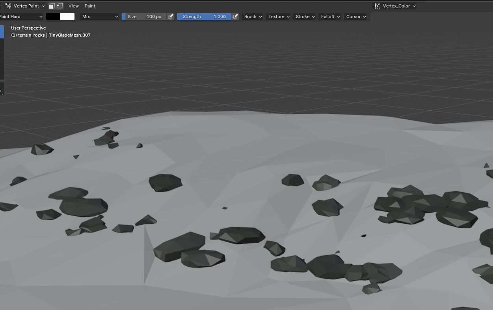
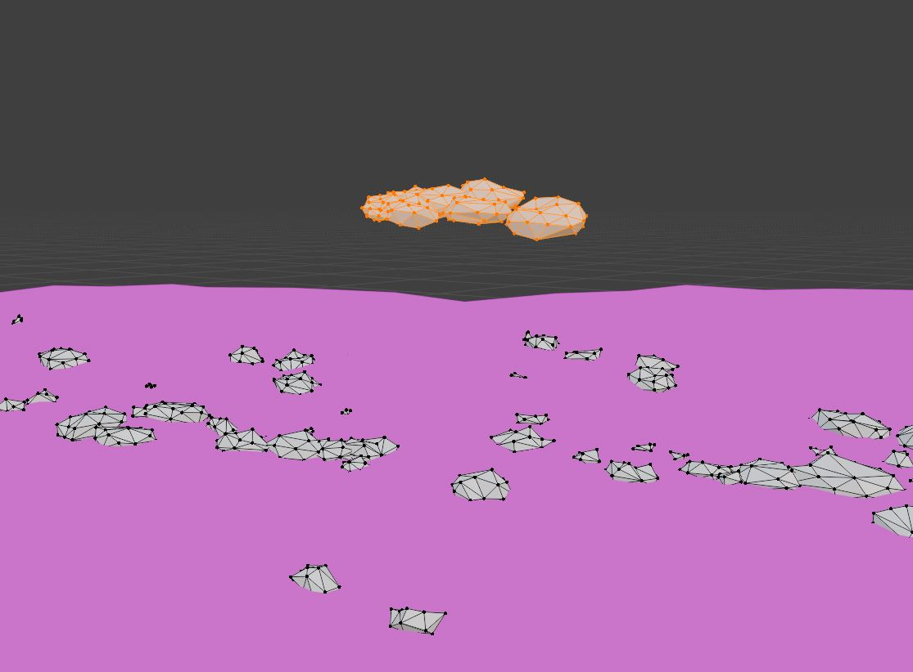

# Editing the Terrain Rocks

Tiny Glade's terrain rocks are stored as a separate [mesh](../../meshes.md):

```text
assets/meshes/terrain_rocks.json
```

These rocks are positioned around the default terrain and need to be adjusted if the shape or height of the terrain changes.

Unlike some of the other terrain assets, the rocks should be imported from Tiny Glade rather than recreated from scratch because the original mesh contains the vertex colours used by the game.

## 1. Import the Original Rock Mesh

Import the original Tiny Glade rock mesh:

```text
Tiny Glade/
└── assets/
    └── meshes/
        └── terrain_rocks.json
```

Use the Tiny Glade Blender Add-On to import `terrain_rocks.json` into the same Blender scene as your custom terrain.

Keep the original vertex colours intact.



!!! warning

    Do not remove or overwrite the existing vertex colours.

    The terrain rocks rely on vertex colour data, so creating a completely new rock mesh without preserving this information may cause the rocks to display incorrectly in-game.

### 2. Position the Rocks on the New Terrain

There is no special placement script required for the rocks.

The simplest method is to adjust them manually in Blender.

Depending on how much your terrain has changed, select individual rocks or groups of nearby rocks and move them vertically until they sit correctly on the terrain.

A quick way to do this is:

1. Select the rocks you want to move.
2. Press `G` followed by `Z`.
3. Move the selected rocks up or down along the Z axis.
4. Confirm the movement when they sit naturally against the terrain.



This constrains the movement to Blender's vertical axis.

You can bulk-select several rocks at once when a large section of terrain has been raised or lowered.

Alternatively you can model your own rocks and paint their vertexes gray. 

!!! tip

    Adjusting groups of rocks together is much faster than repositioning every rock individually.

    Start with large groups, then make smaller corrections to individual rocks where necessary.

## 3. Inspect the Terrain

Move around the Blender scene and check the rocks from several angles.

Pay particular attention to:

- rocks floating above the terrain
- rocks buried too deeply
- rocks intersecting cliffs awkwardly
- rocks sitting in areas that are now water
- rocks that no longer fit the shape of the surrounding terrain

If part of the original terrain has been removed completely, you can also delete rocks that are no longer appropriate for that area.

## 4. Export `terrain_rocks.json`

When the rocks are positioned correctly, export the mesh using the Tiny Glade Blender Add-On.

The exported rock mesh requires the following attributes:

- **Vertex Position**
- **Vertex Normal**
- **Vertex UV**
- **Vertex Colour**
- **Face Indices**

Make sure **Vertex Colour** is enabled during export.

!!! warning

    `terrain_rocks.json` requires vertex colours in addition to the normal mesh attributes.

    Exporting the mesh without its vertex colour data can change or break the appearance of the rocks in Tiny Glade.

Save the exported file as:

```text
terrain_rocks.json
```

and place it in your mod at:

```text
YOUR_MOD/
└── assets/
    └── meshes/
        └── terrain_rocks.json
```

## 5. Test the Rocks In-Game

Launch Tiny Glade and inspect the rocks around the custom terrain.

Check that:

- the rocks sit directly on the terrain
- no rocks are visibly floating
- rocks are not excessively buried
- rocks do not appear in unwanted water areas
- the original rock shading and colouring are preserved
- the rocks still blend naturally with the surrounding terrain

If any rocks are misplaced, return to Blender, adjust their Z position, export `terrain_rocks.json` again, and retest.

## Next Step

Move on to the last step [creating seasonal terrain textures](textures.md)