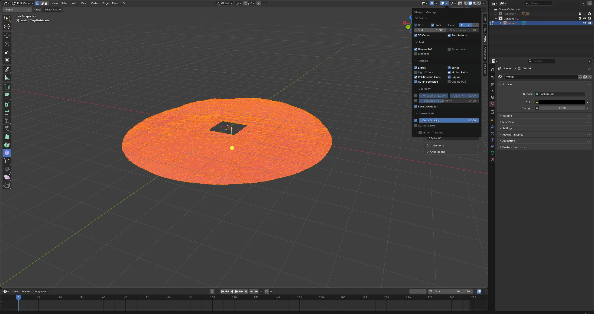
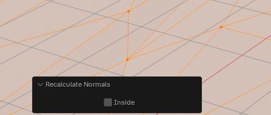
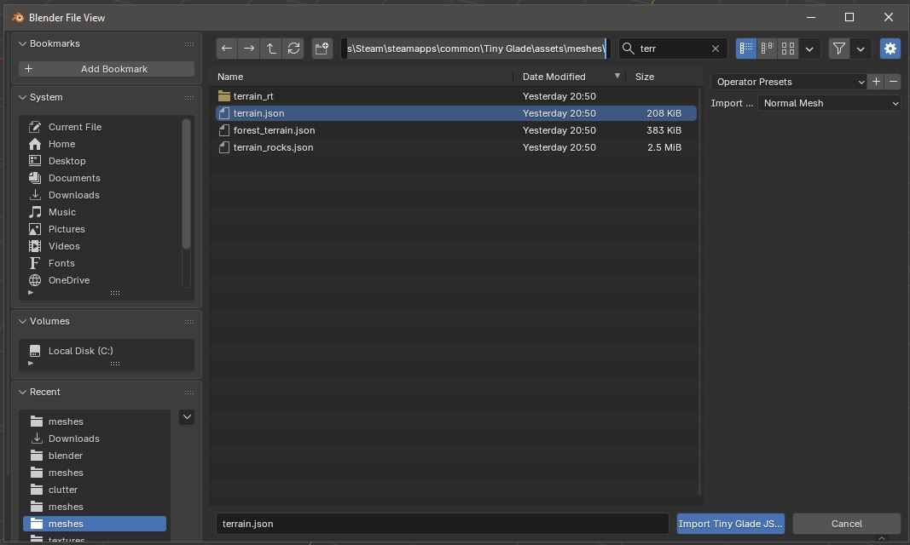
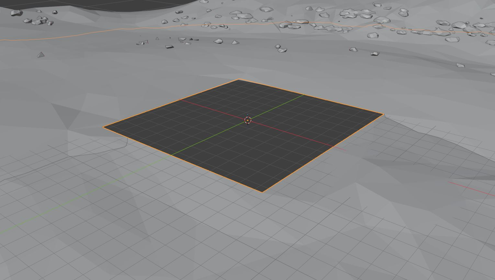
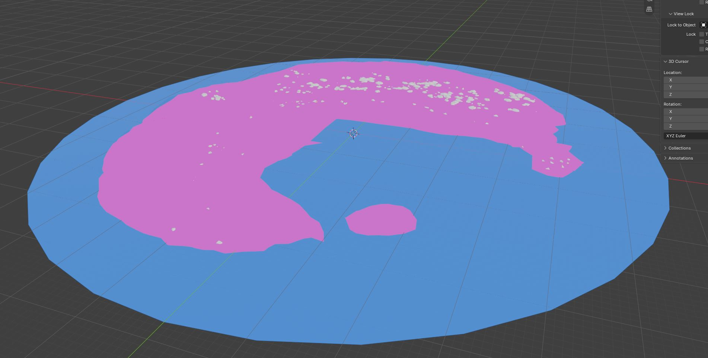
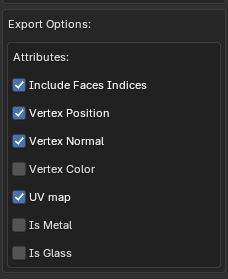

# Terrain Modding

Terrain mods in Tiny Glade currently work by replacing the game's existing terrain assets.

This tutorial covers the basic workflow for creating a custom terrain [mesh](../../meshes.md), water geometry, seasonal textures, trees, plants, rocks, and other terrain-bound assets and preparing them for use in-game.

## The Terrain Mesh

### 1. Import the Original Terrain into Blender

Before modelling a new terrain, import Tiny Glade's original terrain mesh into Blender using the [Tiny Glade Blender Add-On](../modding-tools/mesh-edit-with-blender.md).

The terrain file can be found at:

```text
Tiny Glade/assets/meshes/terrain.json
```

Import `terrain.json` into Blender and make sure to check the normals! Sometimes normals can be imported swapped. Check normals by:

1. Clicking `Overlays` in the viewport display
{ .center }

2. If the mesh looks red that means its inside out and it won't render properly. Swap the normals by tabbing into Edit Mode, pressing `A` to select all verticies, and then `Shift + N` to swap the normals. The `inside` box at the bottom should remain unchecked, and the mesh should no longer be red.

   { style="display: block; margin-left: auto; margin-right: auto;" }

!!! warning

    The original terrain contains a square cutout that marks the playable glade area.

    This cutout is important because it shows exactly where the glade sits within the larger terrain mesh. Keep the original terrain visible while modelling so you can align your replacement terrain correctly with the edges of the glade.

The original terrain can therefore be used as a reference for:

- the position of the glade
- the size of the glade opening
- the overall scale and alignment of the replacement terrain



### 2. Model the New Terrain

Create or edit your terrain while keeping the original `terrain.json` mesh available as a reference.

The most important requirement is that the new terrain lines up correctly with the edges of the glade opening.

You can reshape the surrounding landscape however you like, for example by creating:

- hills
- mountains
- cliffs
- valleys
- riverbanks
- coastlines
- lakeshores



#### Preparing Areas for Water

If you want water to reach the edge of the glade, such as for a river, lake, or ocean, lower the terrain vertices in that area by moving them down along the z-axis.

Pull the relevant vertices down far enough that the water plane can sit above them without the terrain clipping through the water surface.



!!! tip

    It can be useful to position a temporary plane at the intended water height while modelling. This makes it easier to see which parts of the terrain need to be lowered.

### 3. Export the Terrain Mesh

Once the new terrain is finished, export it using the Tiny Glade Blender Add-On.

The terrain mesh should include:

- **Vertex Position**
- **Vertex Normal**
- **Vertex UV**
- **Face Indices**

Do **not** export vertex colours for the terrain mesh.

!!! warning

    Make sure the exported terrain contains the required UVs, normals, face indices, and vertex positions.

    Vertex colours are not required for this mesh and should not be included.

Export the finished mesh as a Tiny Glade JSON mesh and use it to replace the original `terrain.json`.



## Next Step

Continue to the next step [editing the water plane](water_plane.md).