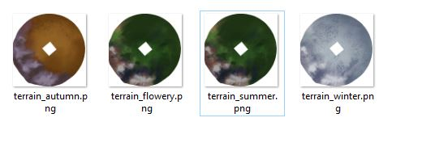

# Creating Seasonal Terrain Textures

*By Rampion*

The final step is to create terrain textures for each glade season.

Tiny Glade uses different terrain textures depending on the selected glade style, so a complete terrain mod should provide matching textures for the relevant seasons.

For the general texture-replacement workflow, including how Tiny Glade loads replacement textures and how to preview changes in-game, see the official [Tiny Glade modding guide](https://pouncelight.games/tiny-glade/info/modding/).

## 1. Paint the Terrain Textures

Create a separate terrain texture for each seasonal appearance you want to replace.

For example:

```text
terrain_autumn.png
terrain_flowery.png
terrain_summer.png
terrain_winter.png
```

!!! Note
    There is no Olden Glade terrain texture.

You can create and edit these textures using any image-editing or 3D-painting software you prefer. For example, Blender can be useful for painting directly against the terrain UV layout, while programs such as Procreate, Krita, Photoshop, or similar tools can be used to refine the final image.

Because the replacement terrain keeps its UV mapping, use the same UV layout for every seasonal texture so that terrain features remain aligned.

Useful features to keep visually distinct include:

- cliffs
- beaches and shorelines
- rivers
- rocky areas
- grass
- snow
- paths or other landmarks

## 2. Add the Textures to the Mod

Place the finished textures inside a `textures` folder at the root of the mod.

For example:

```text
YOUR_MOD/
├── assets/
│   └── ...
└── textures/
    ├── terrain_autumn.png
    ├── terrain_flowery.png
    ├── terrain_summer.png
    └── terrain_winter.png
```

Tiny Glade's official modding documentation also uses this `textures/` directory for replacement textures. See the developer's [texture replacement instructions](https://pouncelight.games/tiny-glade/info/modding/) for the general workflow and supported formats.



## 3. Check the Texture Orientation In-Game

Launch Tiny Glade and enable the terrain mod for a glade.

Check the terrain carefully to make sure the texture is oriented correctly relative to the geometry.

Depending on how the image was painted or exported, the texture may appear:

- rotated
- mirrored
- flipped
- offset from expected terrain features

!!! warning

    Always check the texture orientation in Tiny Glade before considering the terrain mod finished.

    Distinctive features such as coastlines, rivers, cliffs, or paths make it much easier to identify an incorrectly rotated or mirrored texture.

If the texture is oriented incorrectly, rotate or flip the image in your preferred image editor and test it again.

### 4. Check Every Season

Switch between the different glade styles and verify that:

- the correct seasonal texture loads
- the texture aligns with the terrain geometry
- coastlines and water edges match
- cliffs, mountains, and other landmarks are in the correct locations
- no season is accidentally using an outdated texture
- no texture is rotated or mirrored

!!! tip

    Tiny Glade can reload replacement textures while the game is running, which makes it easier to iterate while adjusting your terrain textures.

For more information about replacement textures, mod folder structure, and testing asset-replacement mods, see the official [Tiny Glade modding documentation](https://pouncelight.games/tiny-glade/info/modding/).