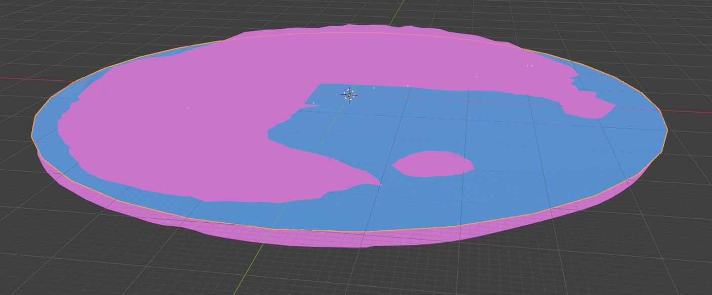

## Replace the Water Plane

This step is only necessary if your custom terrain includes water **outside the glade**, such as an ocean, lake, or river.

Tiny Glade's water mesh is stored in the same folder as `terrain.json`:

```text
Tiny Glade/assets/meshes/water_plane.json
```

Replace `water_plane.json` with a simple flat plane.

The replacement water plane should be approximately the same overall size as the terrain mesh.

!!! info

    `water_plane.json` is scaled differently in-game from most other meshes.

    Because of this, the replacement plane does not need to be extremely large to create the appearance of an endless ocean. A plane roughly matching the size of the terrain is usually sufficient for the water to appear effectively infinite in-game.

A circular plane is recommended because it avoids unnecessary corners at the outer edge, although a circular shape is not strictly required.



### Preparing the Water Mesh

The water plane should:

- remain completely flat
- cover the parts of the terrain where water should be visible
- be approximately the same size as the terrain
- be triangulated before export

As with the terrain mesh, make sure the final geometry is triangulated before exporting it back to Tiny Glade.

!!! tip

    A circular plane works well for large bodies of water because the outer boundary is less noticeable from within the playable area.

If your terrain does not require water outside the glade, you can leave the original `water_plane.json` unchanged.

Export the water plane with the same settings as the terrain: UVs, normals, face indices, and vertex positions are required. Do not export with vertex colors. 

## Next Step

Continue on to [editing the background terrain trees](bg_trees.md)