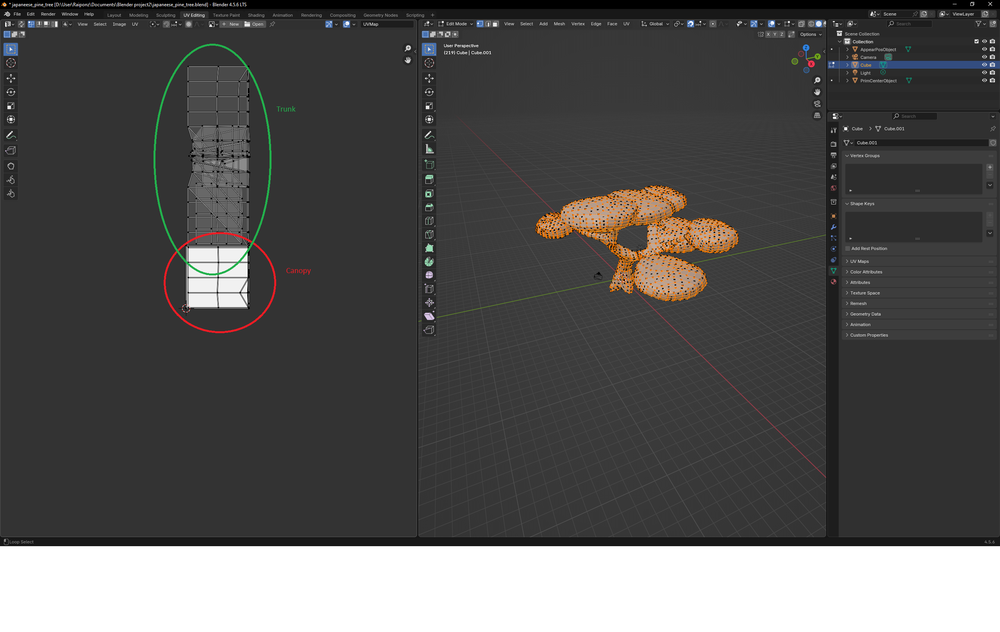
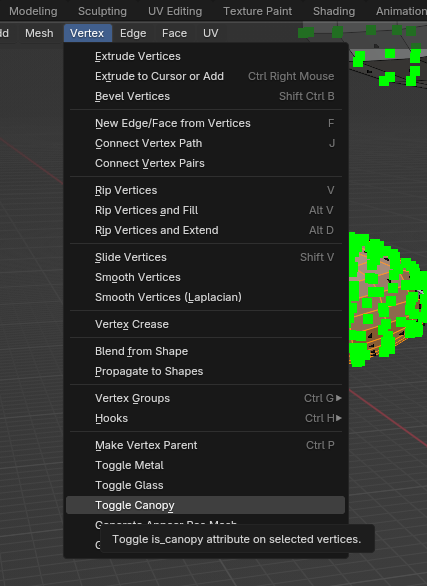
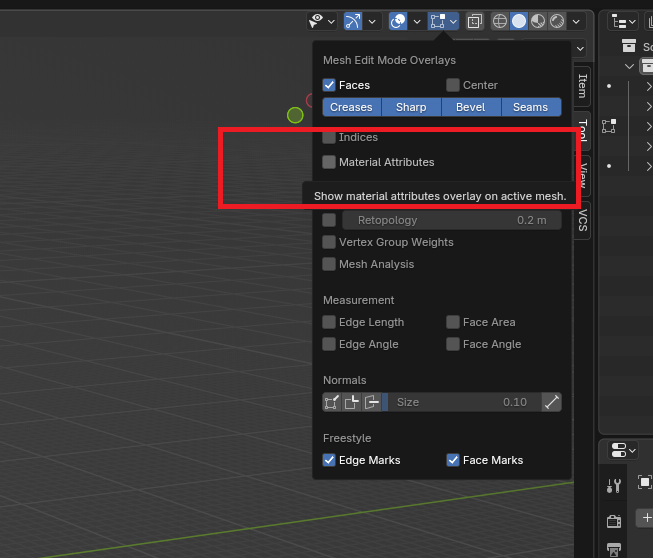
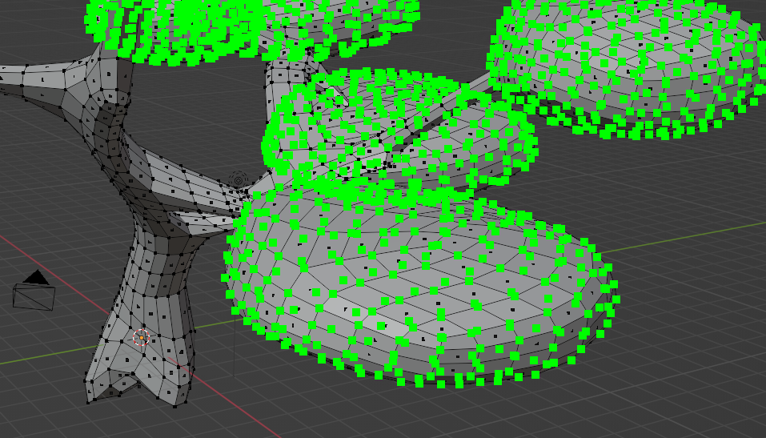
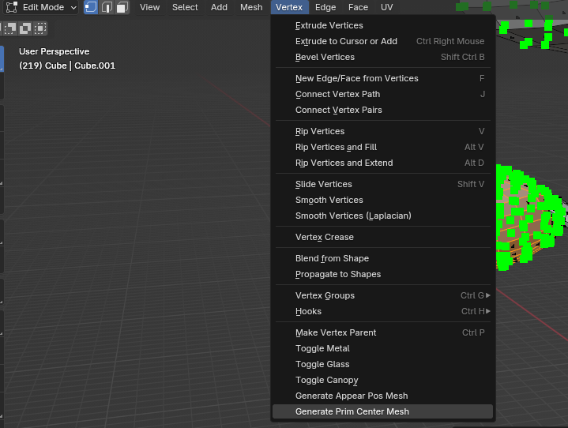

# Trees in Tiny Glade

Trees in Tiny Glade are not ordinary 3‑D objects. They have their own loading rulesand shaders 
because they have to behave correctly with the seasons. This page explains how the system works, 
how tree meshes are stored, and walks you through creating your own using the Blender addon.

---

## Forms and Level‑of‑Detail

There are three *main* tree models in the base game, each with its own set of LODs, plus
one “naked” variant used for olden (no leaves). When the camera gets far from a tree,
the engine swaps in progressively simpler meshes so that performance stays smooth.

Trees are **not** loaded the same way as normal meshes. The logic that chooses a mesh
based on the current season lives in the rendering code; in the olden season the naked tree
model is used.

## Registration and Shaders

Trees don’t appear in `nani_mesh.ron` like generic meshes. Instead they are defined in the
`prefab/` folder and the engine uses a special shader that knows how to decode the
vertex colours described below.

!!! info 
    You *can* register additional trees and load them via the mod tools, but that is beyond
    the scope of this document. The process is very similar to adding any other prefab;
    refer to the modding documentation for details.

## JSON Format and Vertex Attributes

A tree is stored on disk as a JSON file, just like other meshes. However, the engine
expects some unusual vertex attributes:

* **Colour channel:**
  * Red   → U coordinate of a hidden UV map
  * Green → V coordinate of the hidden UV map
  * Blue  → flag: `1` = trunk, `0` = canopy

* **`appear_pos`** – In my comprehention, it's thethe center point of each quad used for billboard rendering.
    The game uses this to place the billboards correctly when drawing distant trees.
  (Tom, if you can add a better description here, please do.)
* **`prim_center`** – similar to `appear_pos` but tied to the original vertex position.
  It isn’t well‑documented; feel free to write a few sentences explaining its purpose.

## Blender Add‑on (v1.3+)

Version 1.3 of the Tiny Glade Blender addon adds support for trees on both import and
export.

* **Import:**
  * Colours are interpreted automatically (UV + trunk/canopy flag).
  * Two extra vertex sets (`appear_pos` and `prim_center`) are created as separate
    vertex clouds so you can see and edit them in Blender.
* **Export:**
  * A new tree pipeline collects the trunk mesh, canopy mesh, and the two helper
    clouds. You just choose which object corresponds to each attribute.
  * Quad‑to‑triangle conversion is now non‑destructive, so you can export quad meshes
    directly; an edge split is applied for better rendering.

!!! info
    The quad‑to‑triangle and the edge split step are now generic and applies to all meshes, not just trees.

## Creating a Tree: Step‑by‑Step Tutorial

1. **Model the trunk.** Keep it as a separate object from the leaves/canopy.
2. **Model the canopy.** faces must not be connected to the
   trunk.
3. **Select the canopy object, switch to Edit mode and enable the **Canopy** option**
   in the addon panel. This sets the blue colour flag correctly.
   
   
   
4. **Create a UV map for the canopy.** Each leaf quad should occupy one of the four
   corners of the 0–1 UV square (e.g. 0,0 → 0,1 → 1,1 → 1,0). This encodes the hidden
   billboard UV coords.
5. **Unwrap the trunk UVs** and leave them as you would normally; they are used for the
   trunk texture.
6. **Generate `appear_pos` and `prim_center`.** With the tree object selected, click
   _Generate Tree Attributes_ in the addon so that the two vertex clouds are filled.
7. **Verify the helper clouds.** In viewport, show them to make sure they line up with the
   geometry.
   
8. **Export the tree.** Go to the export menu, choose the tree pipeline, and designate the
   trunk, canopy, `appear_pos`, and `prim_center` objects.
9. **Import into the game.** you can now set your new file in the `/decorators` folder with a name
   such as `branchy_tree_v1`, `branchy_tree_v2`, or `branchy_tree_v3`.
10. **Test in Tiny Glade.** Start the game And pray the sheep run till the end of the loading screen

:deciduous_tree: Enjoy making your own trees!

