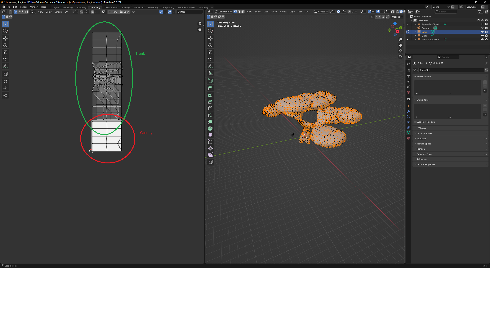
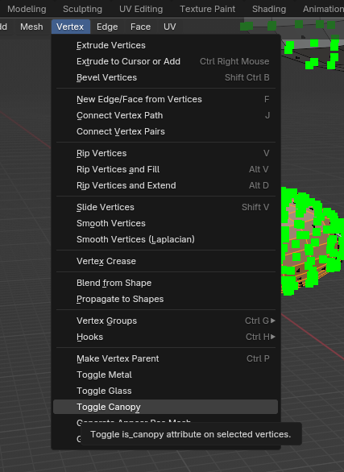
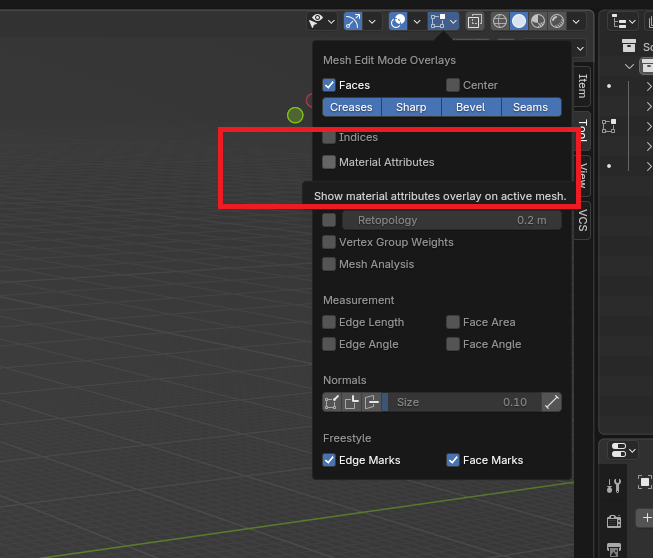
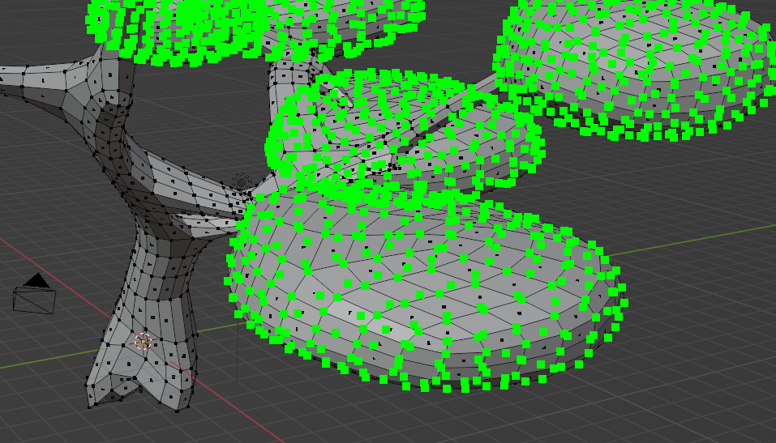
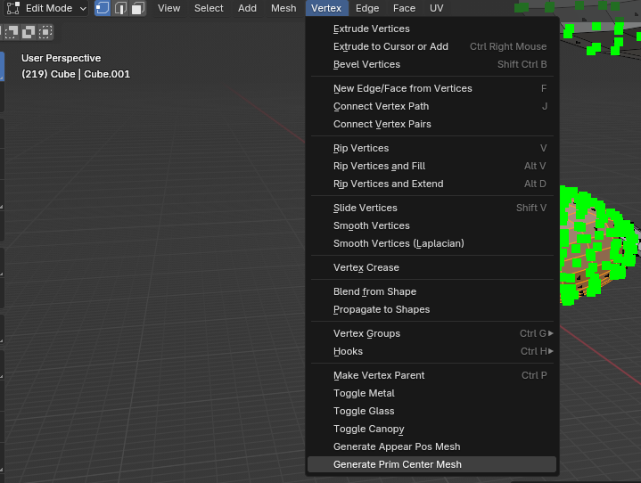

# Trees in Tiny Glade

Trees in Tiny Glade are not ordinary 3D objects. They use their own loading rules and shaders so they can behave correctly across the different seasons.

This page explains how the tree system works, how tree meshes are stored, and how to create your own using the Tiny Glade Blender Add-On.

## Forms and Level of Detail

There are three main tree models in the base game, each with its own set of LODs, plus one "naked" variant used for the Olden season when trees have no leaves.

When the camera moves farther away from a tree, the engine swaps in progressively simpler meshes to maintain performance.

Trees are **not** loaded in the same way as standard meshes. The logic that selects the appropriate tree mesh depends on the current season. During the Olden season, the naked tree model is used.

## Registration and Shaders

Trees do not appear in `nani_mesh.ron` like generic meshes. Instead, they are defined through files in the `prefab/` folder.

The engine uses a dedicated tree shader that interprets the specialised vertex data described below.

!!! info

    Additional trees can be registered and loaded using modding tools, but that process is beyond the scope of this page.

    The process is similar to adding other prefabs. Refer to the relevant modding documentation for details.

## JSON Format and Vertex Attributes

Tree meshes are stored as JSON files, like other built-in Tiny Glade meshes. However, the engine expects several unusual attributes.

### Colour Channel

The vertex colour channels are used to encode additional data:

- **Red** → U coordinate of a hidden UV map
- **Green** → V coordinate of the hidden UV map
- **Blue** → canopy flag:
    - `1` = trunk
    - `0` = canopy



### `appear_pos`

`appear_pos` appears to represent the centre point of each quad used for billboard rendering.

The game uses this information to position the billboards correctly when rendering distant trees.

!!! note

    The exact role of `appear_pos` has not been fully documented and this interpretation is based on current reverse-engineering work.

### `prim_center`

`prim_center` appears to be similar to `appear_pos`, but tied to the original vertex position.

Its exact purpose is not yet fully understood.

## Blender Add-On Support

Version 1.3 and later of the Tiny Glade Blender Add-On includes dedicated support for importing and exporting tree meshes.

### Import

When importing a tree:

- the encoded colour data is interpreted automatically
- the hidden UV coordinates and trunk/canopy flag are separated
- `appear_pos` and `prim_center` are imported as separate vertex clouds so they can be inspected and edited in Blender

### Export

The tree export pipeline collects:

- the trunk mesh
- the canopy mesh
- the `appear_pos` helper cloud
- the `prim_center` helper cloud

You can select which Blender object corresponds to each required attribute before exporting.

Quad-to-triangle conversion is non-destructive, allowing quad meshes to be exported directly. Edge splitting is also applied where needed to improve rendering.

!!! info

    Quad-to-triangle conversion and edge splitting are now part of the general export pipeline and are not limited to tree meshes.

## Creating a Tree

### 1. Model the Trunk

Create the trunk as a separate object from the leaves or canopy.

### 2. Model the Canopy

Create the canopy as a separate object.

The canopy faces should not be connected directly to the trunk geometry.

### 3. Enable the Canopy Attribute

Select the canopy object, switch to **Edit Mode**, and enable the **Canopy** option in the Blender Add-On panel.

This sets the blue colour-channel flag used to identify canopy geometry.







### 4. Create a UV Map for the Canopy

Each leaf quad should use the four corners of the `0–1` UV square.

For example:

```text
(0,0) → (0,1) → (1,1) → (1,0)
```

These UV coordinates are encoded into the tree's vertex colour data and are used by the billboard rendering system.

### 5. Unwrap the Trunk UVs

The trunk UVs can be unwrapped normally.

These UV coordinates are used for the trunk texture.

### 6. Generate `appear_pos` and `prim_center`

With the tree object selected, use **Generate Tree Attributes** in the Blender Add-On.

This creates the `appear_pos` and `prim_center` helper vertex clouds.

### 7. Verify the Helper Clouds

Display the generated helper clouds in the viewport and check that they align correctly with the tree geometry.



### 8. Export the Tree

Open the Tiny Glade tree export menu and select the tree export pipeline.

Assign the appropriate objects for:

- trunk
- canopy
- `appear_pos`
- `prim_center`

Then export the JSON mesh.

### 9. Add the Tree to the Game

The exported tree mesh can be placed in the appropriate `/decorators` location and named according to the expected tree variants, for example:

```text
branchy_tree_v1
branchy_tree_v2
branchy_tree_v3
```

!!! note

    This section describes the built-in JSON tree asset workflow. If the official modding system gains dedicated support for adding new tree assets, follow the developer documentation for that workflow instead.

### 10. Test in Tiny Glade

Start Tiny Glade and check that the tree loads correctly in-game.

If the game fails during loading, review the exported attributes and verify that the trunk, canopy, UV data, and helper clouds were exported correctly.

:deciduous_tree: Enjoy making your own trees!