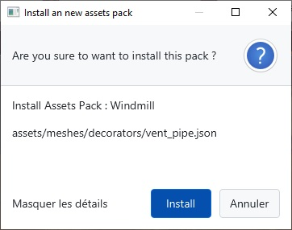
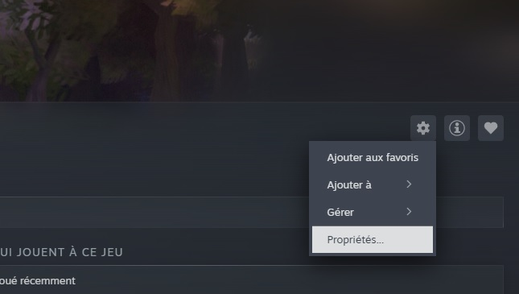
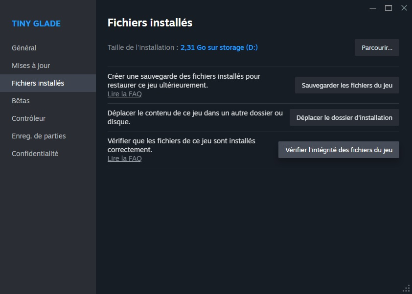

# How to edit game Assets

Tiny Glade includes many [assets](../game-knowledge/game-structure.md) and **Compiled assets (Aka Textures)** that you can modify to change the look and feel of your game.  
**Asset packs** are collections of these modified files gather in an zip file, letting you customize things like:  
- Decorations and clutter  
- Entities (sheep, ducks, etc.)  
- Trees  
- Seasonal settings  
- Banners

Asset packs **replace existing game files** and are loaded when the game starts.

---

# Installation Methods

There are **two ways** to install custom assets:  
- **Manual installation**  
- **Automatic installation** (using Whiterun)

## Manual Installation

1. **Extract** the new asset pack (usually a ZIP file).
2. **Copy** the new `assets` folder into your game directory, replacing existing files if prompted.
3. **Start the game** and enjoy your new content!

!!! danger
    **Modding is fun but risky!**  
    - Always **back up your saves** before experimenting.  
    - If the game asks to send a crash report, say **no** to avoid annoying the dev teams (but you can share logs on Discord’s #modding channel, click on details, open `log.txt` and scroll to the bottom).  
    {: style="height:400px;display:block;margin:auto"}
    - The manifest is reset after every game update, so check it regularly!

---

## Automatic Installation


You can use the **Whiterun** tool to automate the process:

1. **Download Whiterun** from [GitHub](https://github.com/Hbeau/Whiterun/releases/tag/V1.2)  
   *(Requires [Java 24](https://adoptium.net/temurin/releases/?version=24) to run)*
2. **Open Whiterun** by double-clicking on the `jar` file (make sure you launch it with the right version of java)
3. **Patch your game**  
 The game should be automaticly located and the path is shown in the text field. verify the path or edit it with the **Browse...** button  
_The path should lead to something like :   
`C:\program Files (x86)\Steam\SteamLibrary\steamapps\common\Tiny Glade\`_

Then click on the **Patch Game** button to patch the game
3. Click **"Add asset pack"** to open the folder where asset packs are stored. You can download packs from the [Reddit community](https://www.reddit.com/r/TinyGladeMods/) or the Discord **#Mods-list** channel.
4. The pack should appear in Whiterun automatically.  
   Click on it, then click **"Install"**.  
   
5. **Start the game** and enjoy!

# Creating a New Asset Pack

To **create your own asset pack**, follow these steps:

1. **Set up your pack folder**  
   - Create an **empty directory** for your pack.
   - Inside this folder, **replicate the structure** of the original game files for any assets you want to modify.
     - *Example:* To edit the anvil clutter, place your modified file at `assets/meshes/clutter/anvil.json`.
     - *For compiled assets:* To change the flag texture, place your file at `compiled-assets/textures/flag_patterns.texture`.

2. **Add a manifest file**  
   - At the **root of your pack folder**, create a file named `manifest.json` to describe your pack.
   - Example manifest:
     ```json
     {
       "name": "My very own assets",
       "description": "Change things that look very cool!",
       "authors": ["Name 1", "Name 2"]
     }
     ```
   - **This file is required** for your pack to be recognized by the game or Whiterun.

3. **Include a thumbnail**  
   - Add a **128x128 JPG image** named `thumbnail.jpg` at the root of your pack folder.
   - This image will represent your pack in mod managers.

4. **Package your pack**  
   - **Zip the entire folder** (including all files, manifest, and thumbnail).
   - Your asset pack is now ready to share or install!

> **Tip:**  
> If you want to skip creating the manifest and zipping manually, you can use the **Whiterun** tool’s built-in pack creation form for a streamlined process.


---

## Recovering from Problems

If you want to **restore the default game** or if something breaks.  
1. go one the Tiny Glade steam page in your library  
2. click on the cog at the right and in the dropdown menu click on properties  
{: style="height:300px;display:block;margin:auto"}  
3. On the pop-up go to "installed files" menu and click on "verify integrity"
{: style="height:300px;display:block;margin:auto"}

---

## Need Help?

- Join the **Tiny Glade Discord** (accessible inside the game) for help and sharing mods.
- You can find mods in the [Reddit community](https://www.reddit.com/r/TinyGladeMods/).

---

*Happy tinkering!*