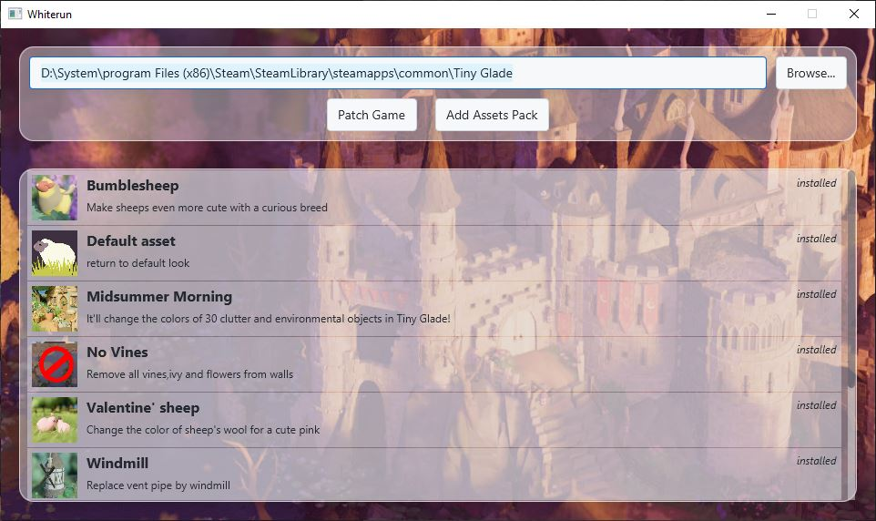
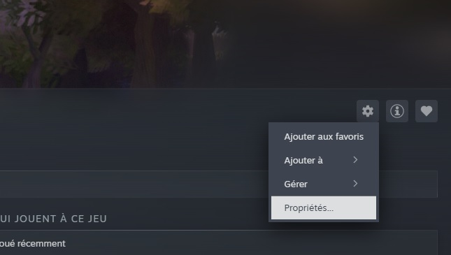
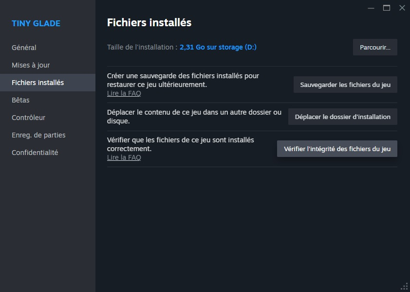

# Modding and Asset Replacement

Tiny Glade now includes **official mod support**, with workflows centred around the in-game mod menu and the **Steam Workshop**.

For most players, this is the recommended way to install and use mods.

See the official [Tiny Glade modding guide](https://pouncelight.games/tiny-glade/info/modding/) for the latest information about the supported modding system.

!!! info "Legacy asset packs"

    Before official mod support was introduced, many Tiny Glade mods were distributed as asset packs that directly replaced files in the game's installation directory.

    These older asset packs, including packs created for **Whiterun**, are still useful and can often be used with the new modding system. However, direct game-file patching is no longer required for most mods.

## Installing Mods

### Steam Workshop

The easiest way to install supported mods is through the **Steam Workshop**.

Subscribe to a mod from the Workshop and Tiny Glade will make it available in-game.

Modded clutter becomes available automatically in the clutter picker. Other types of mods may need to be enabled for an individual glade through:

`Escape → MODS → GLADE MODS`

For complete instructions, see the official [Tiny Glade modding guide](https://pouncelight.games/tiny-glade/info/modding/).

## Installing Local Mods

Tiny Glade can also load mods directly from a local `mods` folder.

On Windows, the default location is:

```text
%USERPROFILE%\Saved Games\Tiny Glade\Steam\YOUR_STEAM_ID\mods
```

Each folder or `.zip` file placed directly inside this directory is treated as a separate mod.

!!! tip "Using older Whiterun packs"

    Existing zipped mods made for **Whiterun** can be placed directly into the `mods` folder.

    They no longer need to patch files inside the Tiny Glade installation directory.

    Asset-replacement mods must still be enabled for a glade through the in-game **Mods** menu.

## Legacy Asset Replacement

Before official mod support was added, Tiny Glade mods commonly worked by replacing files inside the game's `assets` or `compiled-assets` directories.

Asset packs could modify things such as:

- decorations and clutter
- entities such as sheep and ducks
- trees
- seasonal settings
- banners
- textures and other compiled assets

These methods are still relevant when working with older mods or when investigating Tiny Glade's internal assets, but they should now be considered a **legacy modding workflow**.

!!! warning

    Directly modifying files in the Tiny Glade installation directory is more fragile than using the official mod system.

    Game updates may overwrite modified files, and invalid replacements can prevent the game from loading correctly.

## Whiterun



**Whiterun** is a community-created modding application by Hbeau that was widely used before Tiny Glade gained official mod support.

It automated several parts of the older asset-replacement workflow, including patching the game and managing asset packs.

Whiterun can still be useful for:

- working with older asset packs
- understanding legacy Tiny Glade mods
- managing packs created specifically for the Whiterun format

However, for installing modern Tiny Glade mods, the official mod system and Steam Workshop should generally be used instead.

### Installing Whiterun

1. Download Whiterun from the [GitHub releases page](https://github.com/Hbeau/Whiterun/releases/tag/V1.2).

    Whiterun requires [Java 24](https://adoptium.net/temurin/releases/?version=24).

2. Open Whiterun by launching the `.jar` file with Java.

3. Verify the Tiny Glade installation path.

    It will usually resemble:

    ```text
    C:\Program Files (x86)\Steam\steamapps\common\Tiny Glade\
    ```

    

4. Follow Whiterun's interface to manage legacy asset packs.

!!! note

    Older instructions may tell you to use Whiterun's **Patch Game** function and directly modify the Tiny Glade installation.

    This is no longer necessary for many legacy mods. The official Tiny Glade mod loader can recognise compatible zipped mods placed in the `mods` folder.

## Creating a Legacy Asset Pack

The following format describes the older asset-pack system used before official mod support.

For new mods, particularly new clutter items, use Tiny Glade's official modding workflow instead.

### 1. Create the Pack Folder

Create an empty directory for the pack.

Inside it, reproduce the directory structure of the game files you intend to replace.

For example:

```text
assets/meshes/clutter/anvil.json
```

or:

```text
compiled-assets/textures/flag_patterns.texture
```

### 2. Add a Manifest

At the root of the pack, create a `manifest.json` file describing the pack.

For example:

```json
{
    "name": "My very own assets",
    "description": "Change things that look very cool!",
    "authors": ["Name 1", "Name 2"]
}
```

### 3. Add a Thumbnail

Add a thumbnail image at the root of the pack if required by the tool or distribution format you are using.

Older Whiterun packs commonly use:

```text
thumbnail.jpg
```

### 4. Package the Mod

Zip the pack directory when distributing it.

!!! note

    Modern Tiny Glade mods use a different structure. For example, official clutter mods use `.glb` files and are created through Tiny Glade's built-in mod editor.

## Troubleshooting

If direct asset replacement causes problems, Steam can restore the original Tiny Glade files.

1. Open **Tiny Glade** in your Steam library.
2. Click the **gear icon** and select **Properties**.

    

3. Open **Installed Files** and select **Verify integrity of game files**.

    

Steam will restore missing or modified game files.

## Need Help?

- See the official [Tiny Glade modding guide](https://pouncelight.games/tiny-glade/info/modding/).
- Join the Tiny Glade Discord through the link available in-game.
- Community mods and older asset packs can also be found through the [Tiny Glade Mods subreddit](https://www.reddit.com/r/TinyGladeMods/).