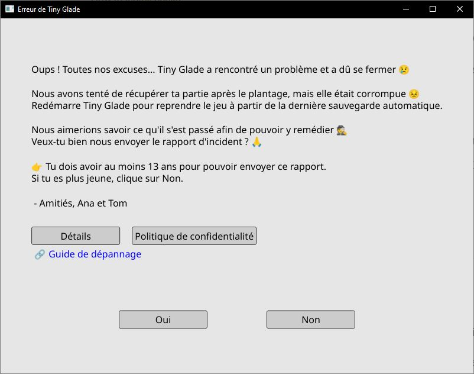
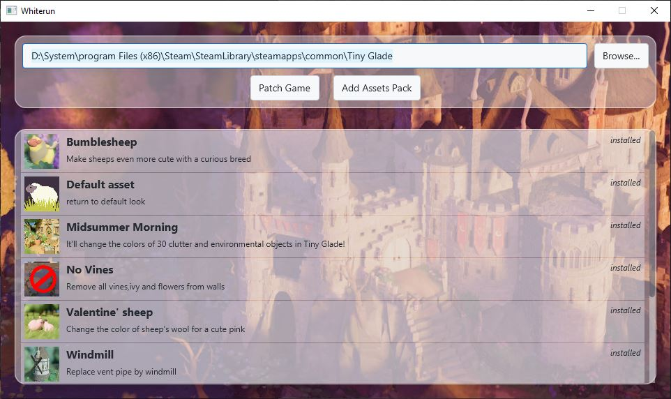
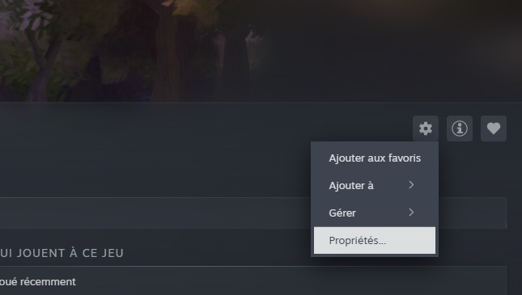
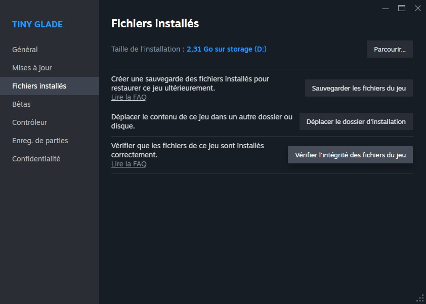

# How to Install Asset Packs

Tiny Glade includes many [assets](../game-knowledge/game-structure.md) that you can modify to change the look and feel of your game.  
**Asset packs** are collections of these modified files, letting you customize things like:  
- Decorations and clutter  
- Entities (sheep, ducks, etc.)  
- Trees  
- Seasonal settings  

Asset packs **replace existing game files** and are loaded when the game starts.

---

## Installation Methods

There are **two ways** to install custom assets:  
- **Manual installation**  
- **Automatic installation** (using Whiterun)

## Manual Installation

1. **Extract** the new asset pack (usually a ZIP file).
2. **Copy** the new `assets` folder into your game directory, replacing existing files if prompted.
3. **Start the game** and enjoy your new content!

!!! danger
    **Modding is fun but risky!**  
    - Always **back up your saves** before experimenting.  
    - If the game asks to send a crash report, say **no** to avoid annoying the dev teams (but you can share logs on Discord’s #modding channel, click on details, open `log.txt` and scroll to the bottom).  
    {: style="height:400px;display:block;margin:auto"}
    - The manifest is reset after every game update, so check it regularly!

---

## Automatic Installation

You can use the **Whiterun** tool to automate the process:

1. **Download Whiterun** from [GitHub](https://github.com/Hbeau/Whiterun/releases/tag/V1.2)  
   *(Requires [Java 24](https://adoptium.net/temurin/releases/?version=24) to run)*
2. **Open Whiterun** and patch your game.
3. Click **"Add asset pack"** and move your ZIP file (do not extract) into the folder.
4. The pack should appear in the list.  
   Click on it, then click **"Install"**.
5. **Start the game** and enjoy!

---

## Recovering from Problems

If you want to **restore the default game** or if something breaks.  
1. go one the Tiny Glade steam page in your library  
2. click on the cog at the right and in the dropdown menu click on properties  
{: style="height:300px;display:block;margin:auto"}  
3. On the pop-up go to "installed files" menu and click on "verify integrity"
{: style="height:300px;display:block;margin:auto"}

---

## Need Help?

- Join the **Tiny Glade Discord** (accessible inside the game) for help and sharing mods.
- You can find mods in the [Reddit community](https://www.reddit.com/r/TinyGladeMods/).

---

*Happy tinkering!*