# Editing LUT's
 
## What are LUT's?

<figure markdown="span">  
  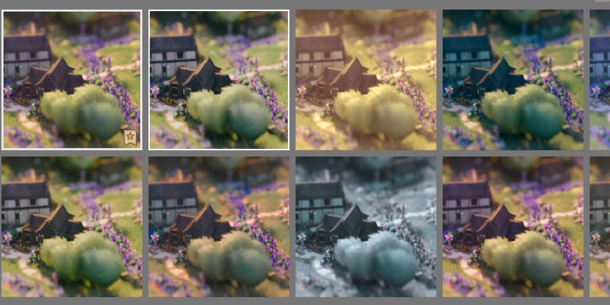{ width="500" }  
  <figcaption>Filters / LUT's in the Games Photomode</figcaption>  
</figure>

LUT's are **look-up tables** (in Tiny Glade these specifically are color look-up tables)

These contain mathematical formulas that instantly convert a base color to a different color. Hence changing the visual look of something without changing the base texture/lighting/renderer.

Tiny Glade uses *.CUBE 3D-LUT's. While these files can have a lot of different information about plugins, effects and Color. Tiny Glade only uses the RGB color data.

## Where do i find the LUT's

LUT's are saved in **`...Steam\steamapps\common\Tiny Glade\assets\luts`**

## Making your Own!

For this i will concentrate on making LUT's with [DaVinci Resolve](https://www.blackmagicdesign.com/de/products/davinciresolve) since it has a fully free version and is very easy to use, specially when it comes to Color grading.

!!! info
    There are certainly other Tools that can create LUT's, there are also multiple Online Tools, but i dont have any experience with them. And the results of the few i tried where... not exactly what i was after.

- Download and Install the Free version of DaVinci Resolve. (You need to make an account for that tho)
- Now we want to take a Screenshot of Tiny Glade, preferrably the glade we want to change the color of.

For this, i want to make a Sin-City and Akira Kurosawa inspired, black and white japanese samurai movie colorgrading with only the reds showing.
<figure markdown="span">  
  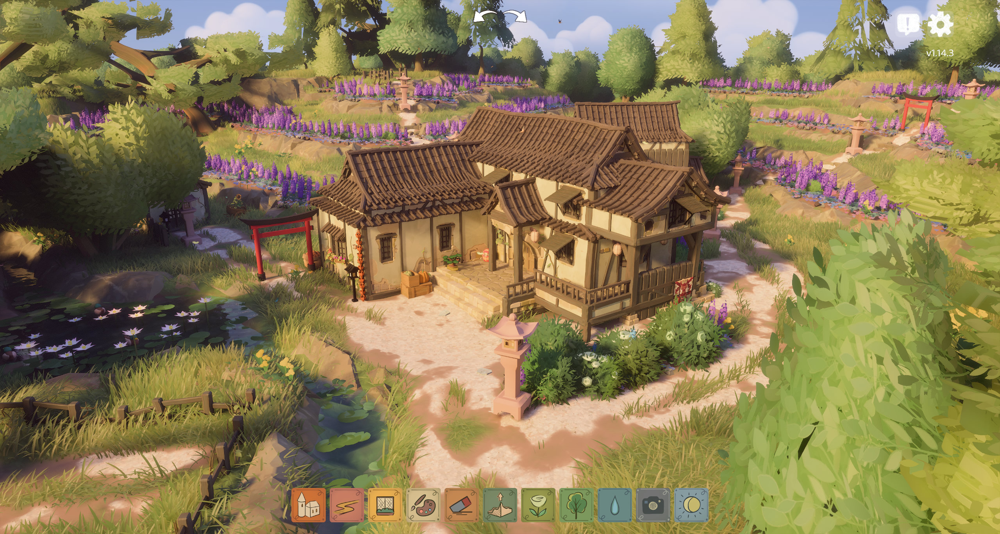{ width="800" }  
  <figcaption>Mod:"Eastern Glade" by Rapunzilla</figcaption>  
</figure>

- Open the DaVinci Resolve and go to the **Color** tab
- Drag your screenshot into DaVinci
<figure markdown="span">  
  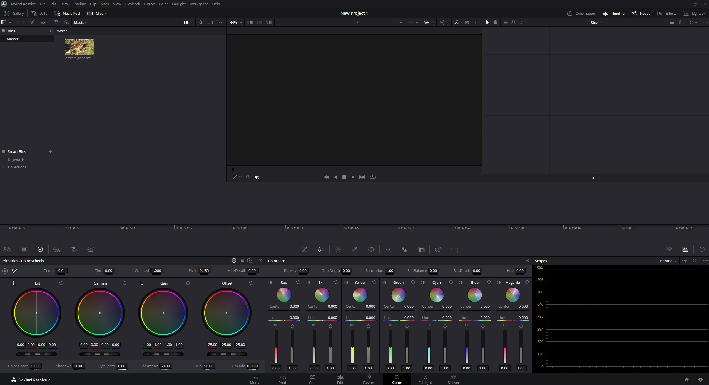{ width="800" }   
</figure>
- right click the screenshot and select "create new timeline using selected Clip" (the top option)
<figure markdown="span">  
  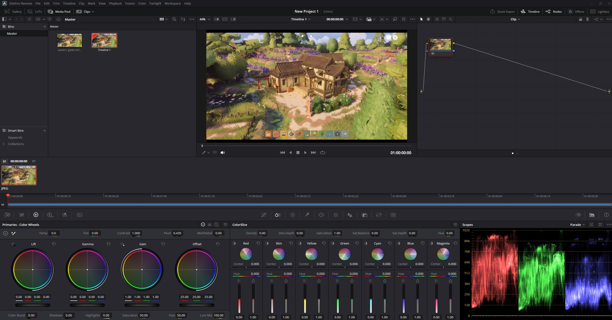{ width="800" }   
</figure>
- Main Tools to use are these here. In the end its up to you to play around with them.
<figure markdown="span">  
  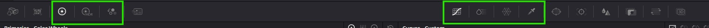{ width="800" }   
</figure>
- I then added a Node infront of the original image
- since i dont know the hotkeys i right clicked the window -> add node "corrector" -> and dragged the node onto the line infront of the original image.
<figure markdown="span">  
  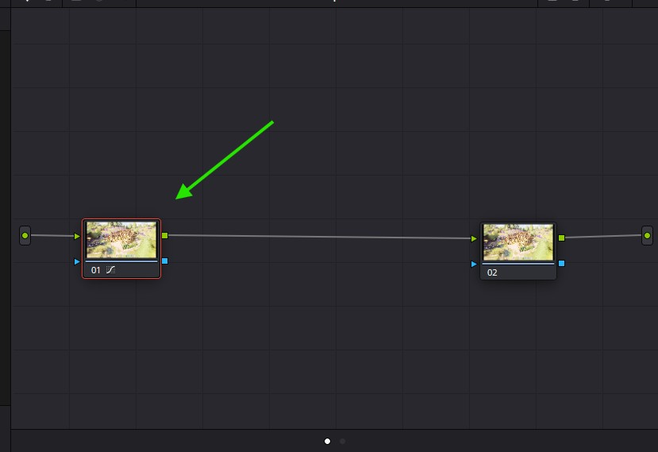{ width="800" }   
</figure>
!!! info
    you can add as many Nodes as you like and use every node for a different color correction, so you have more gradual control. 
    
    For a more indepth tutorial you should look up LUT Tutorials for DaVinci on YouTube
- Edit the Node to your liking
<figure markdown="span">  
  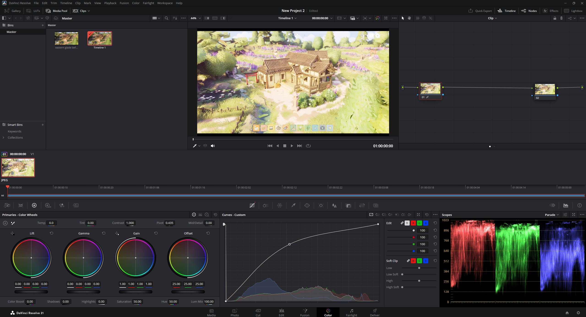{ width="800" }  
  <figcaption>For demonstartion i just raised the curve to make it brighter</figcaption>  
</figure>
- i quickly done it all with one Node and came to this result.
<figure markdown="span">  
  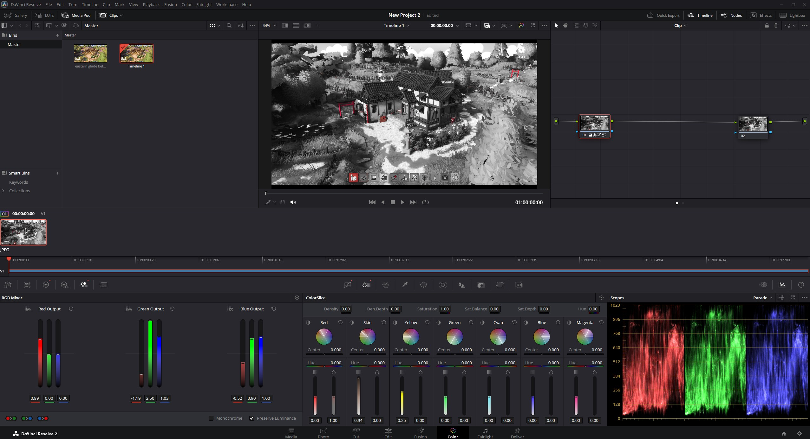{ width="800" }   
</figure>
- then you right click your image, go to "generate LUT" and export as a 33 Point Cube into TinyGlades **`luts`** folder (33 Point is enough for the game, we dont need more data for a small RGB LUT like this).
<figure markdown="span">  
  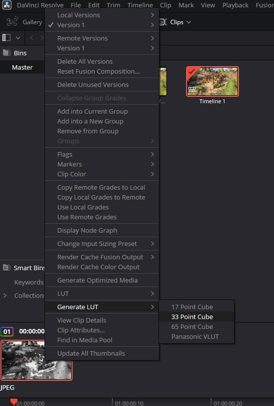{ width="800" }   
</figure>

*`Lets open up TG and see how it went`*

- there we have our LUT in the selector
<figure markdown="span">  
  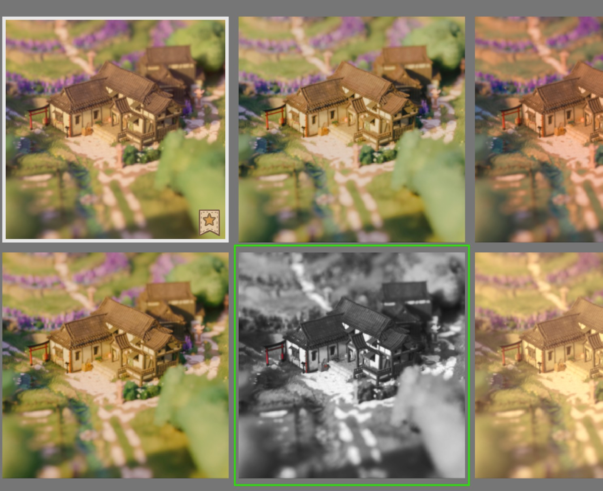{ width="800" }   
</figure>
- and the result
<figure markdown="span">  
  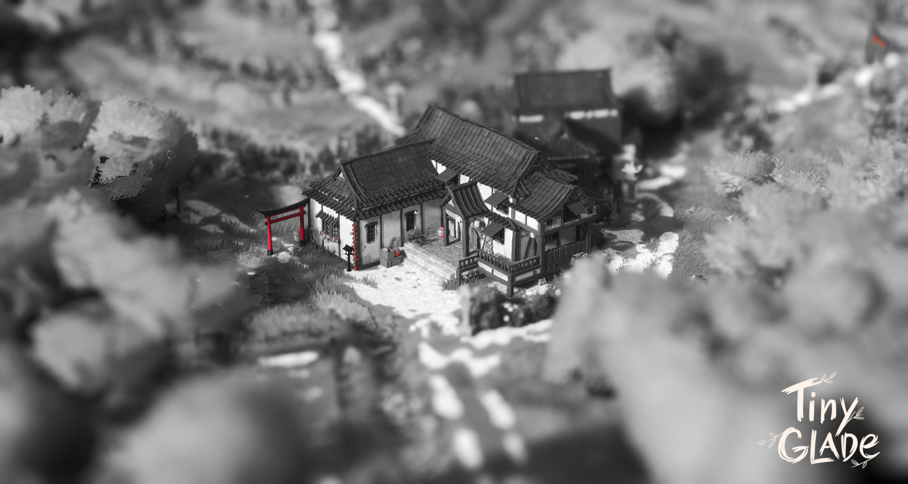{ width="800" }  
  <figcaption>Final look with newly created LUT and Eastern Glade mod</figcaption>  
</figure>

Thats all you need to know to make your own LUT's and give your glades the look you want.

!!! info
    I, again, wanted to point out, only RGB changes will be read by Tiny Glade. Other special effects you can add with DaVinci wont work for TG since they are based on DaVinci and VFX Plugins that are not present in Tiny Glade. So you can add them as you will, but they will not be shown in game

*Used mod:* ["Eastern Glade" by Rapunzilla](https://www.reddit.com/r/TinyGladeMods/comments/1tkxiwk/eastern_glade/)

*Download of this LUT:* [Akira/Sin-City LUT](https://drive.google.com/file/d/1gK6pwC2tvOngdzA6v66fi0foSbouxZk9/view?usp=sharing)