# Editing LUTs

*By Rapunzilla*

## What Are LUTs?

<figure markdown="span">
  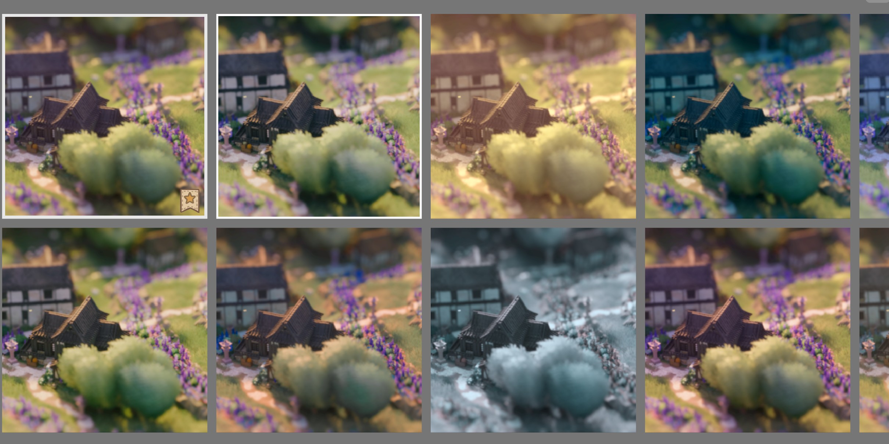{ width="500" }
  <figcaption>Filters and LUTs in Tiny Glade's Photo Mode.</figcaption>
</figure>

LUTs, or **look-up tables**, are used to remap colours. In Tiny Glade, they are specifically used as **colour look-up tables** to alter the final appearance of a scene.

Rather than changing the underlying textures, lighting, or renderer, a LUT transforms input colour values into different output colour values.

Tiny Glade uses **3D LUTs in `.cube` format**. Although `.cube` files can contain several kinds of metadata and configuration information, Tiny Glade primarily uses the RGB colour transformation data.

## Where Are LUTs Stored?

Tiny Glade's LUTs can be found in:

```text
...\Steam\steamapps\common\Tiny Glade\assets\luts
```

The exact location of your Steam library may vary.

## Creating Your Own LUT

This guide uses [DaVinci Resolve](https://www.blackmagicdesign.com/de/products/davinciresolve), which has a free version and provides powerful colour-grading tools.

!!! info

    Other tools can also create `.cube` LUTs, including some online tools. This guide focuses on DaVinci Resolve because it provides reliable colour controls and an easy way to export LUTs.

### 1. Install DaVinci Resolve

Download and install the free version of DaVinci Resolve.

A Blackmagic Design account may be required during installation.

### 2. Capture a Tiny Glade Screenshot

Take a screenshot of the glade you want to use as a colour-grading reference.

For this example, the goal is to create a black-and-white, Japanese samurai-film-inspired look with only the red tones remaining visible.

<figure markdown="span">
  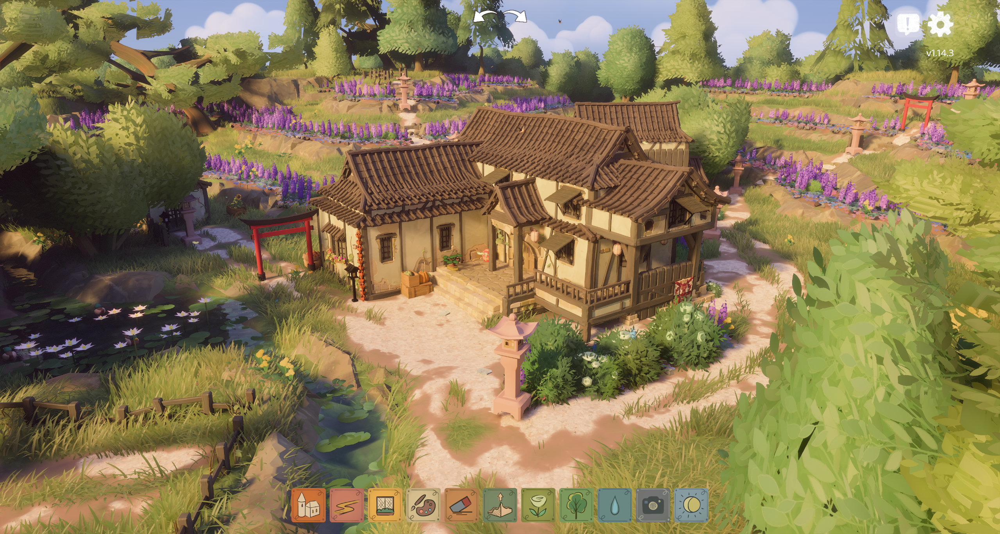{ width="800" }
  <figcaption>Eastern Glade mod by Rapunzilla before colour grading.</figcaption>
</figure>

### 3. Import the Screenshot into DaVinci Resolve

Open DaVinci Resolve and switch to the **Color** tab.

Drag your Tiny Glade screenshot into DaVinci Resolve.

<figure markdown="span">
  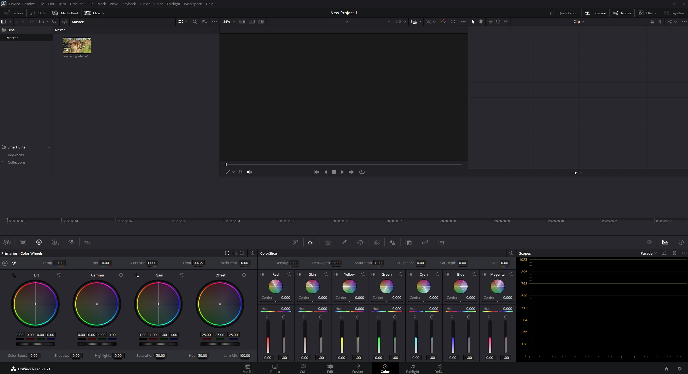
</figure>

Right-click the screenshot and select **Create New Timeline Using Selected Clip**.

<figure markdown="span">
  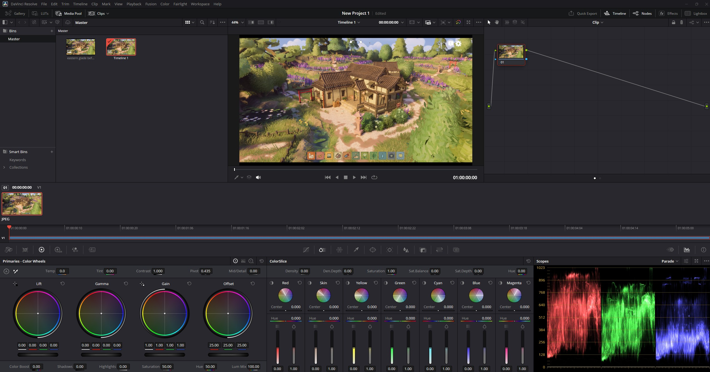
</figure>

### 4. Adjust the Colour Grade

The main colour-grading controls can be found in the Color workspace.

<figure markdown="span">
  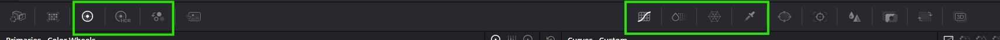{ width="800" }
</figure>

You can experiment with these controls until the image has the appearance you want.

For more control, colour corrections can be separated across multiple **nodes**.

To add a node:

1. Right-click in the node editor.
2. Select **Add Node → Add Serial** or the appropriate corrector option.
3. Connect the node into the existing node chain.

<figure markdown="span">
  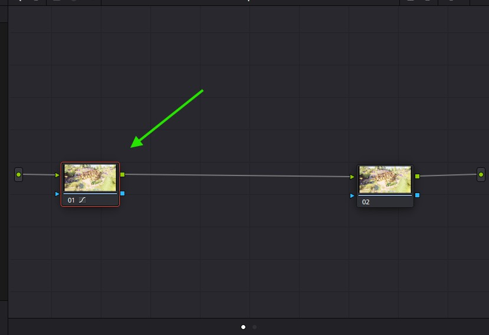{ width="800" }
</figure>

!!! info

    You can use multiple nodes, with each node handling a different part of the colour grade. This makes more complex adjustments easier to manage.

    For more advanced techniques, look for colour-grading or LUT-creation tutorials for DaVinci Resolve.

Edit the node or nodes until the image looks the way you want.

<figure markdown="span">
  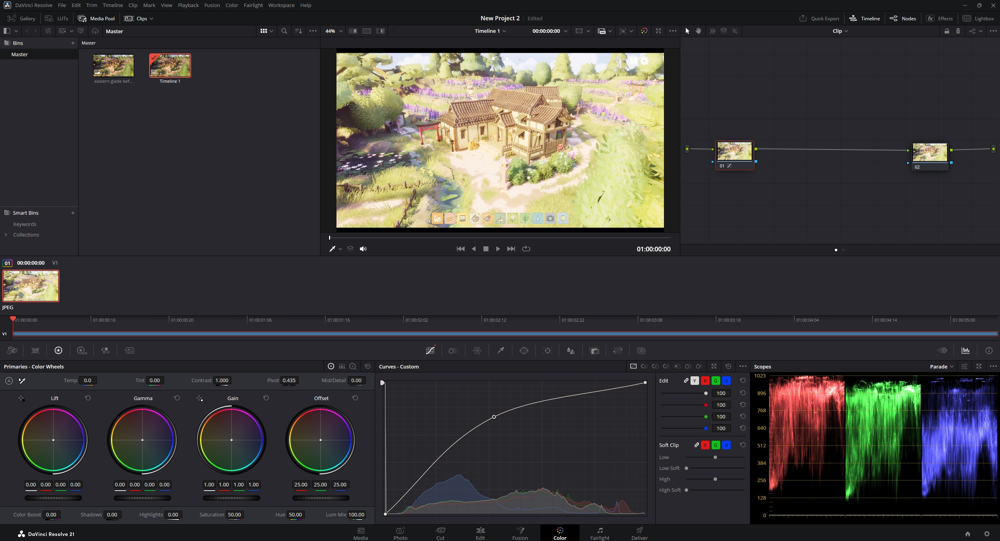{ width="800" }
  <figcaption>For demonstration, the curve has been raised to make the image brighter.</figcaption>
</figure>

For this example, the final grade was created using a single node.

<figure markdown="span">
  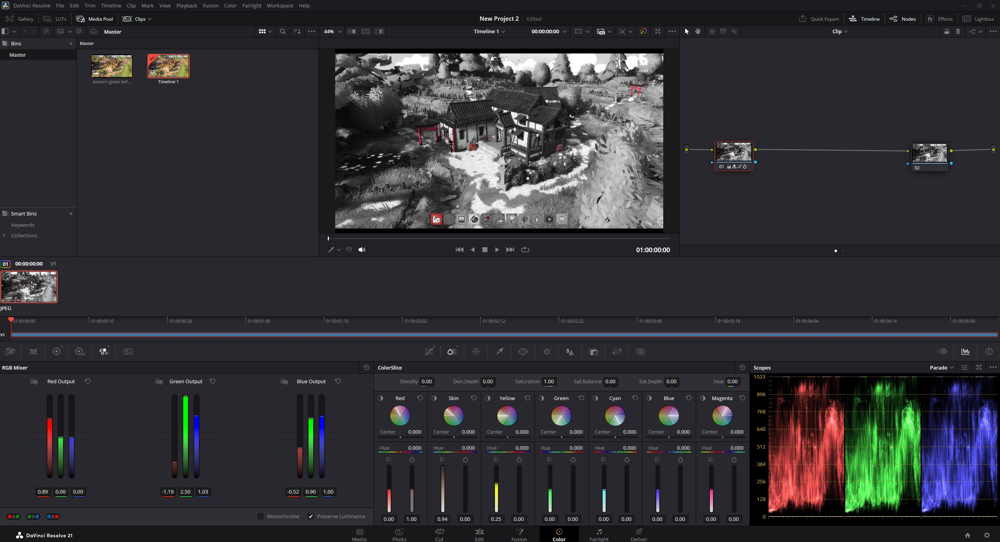{ width="800" }
</figure>

### 5. Export the LUT

When you are happy with the result, right-click the image and select **Generate LUT**.

Export the LUT as a **33-point `.cube` file** into Tiny Glade's `luts` folder.

A 33-point LUT provides sufficient resolution for this type of in-game colour transformation.

<figure markdown="span">
  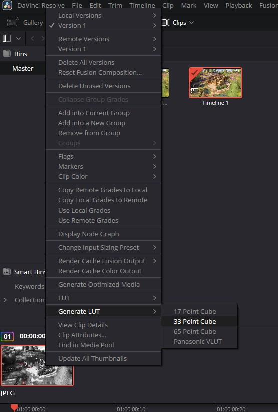{ width="800" }
</figure>

### 6. Test the LUT in Tiny Glade

Start Tiny Glade and open Photo Mode.

Your new LUT should appear in the LUT or filter selector.

<figure markdown="span">
  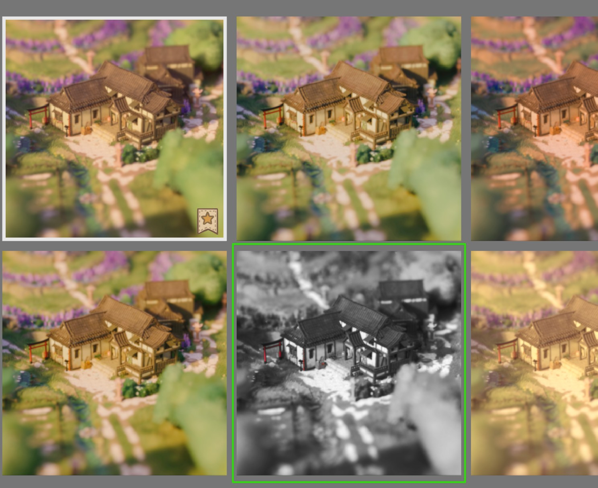{ width="800" }
</figure>

The LUT can then be applied to the current scene.

<figure markdown="span">
  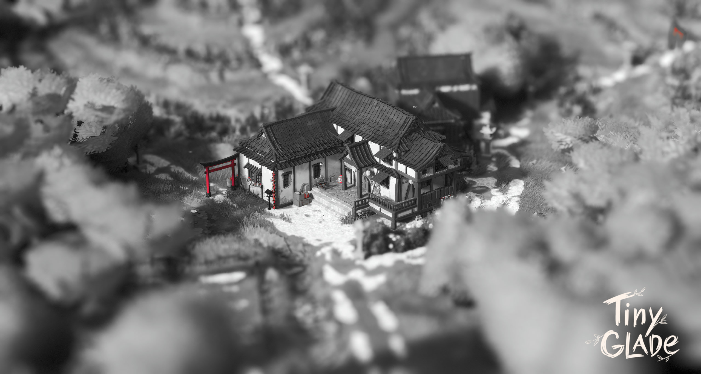{ width="800" }
  <figcaption>Final appearance using the custom LUT and the Eastern Glade mod.</figcaption>
</figure>

That is all that is required to create a custom colour LUT for Tiny Glade.

!!! warning

    Tiny Glade only uses the RGB colour transformation contained in the LUT.

    Effects that depend on DaVinci Resolve itself, external VFX plugins, masks, tracking, compositing, or other processing that cannot be represented as a simple colour transformation will not be reproduced in-game.

## Resources Used in This Example

- **Mod:** ["Eastern Glade" by Rapunzilla](https://www.reddit.com/r/TinyGladeMods/comments/1tkxiwk/eastern_glade/)
- **Example LUT:** [Akira / Sin City LUT](https://drive.google.com/file/d/1gK6pwC2tvOngdzA6v66fi0foSbouxZk9/view?usp=sharing)