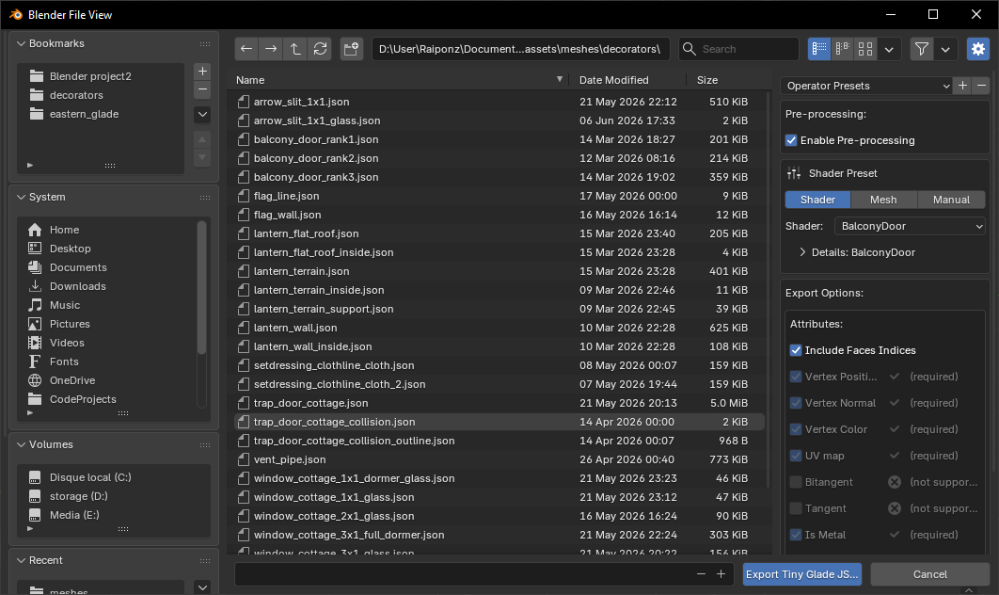
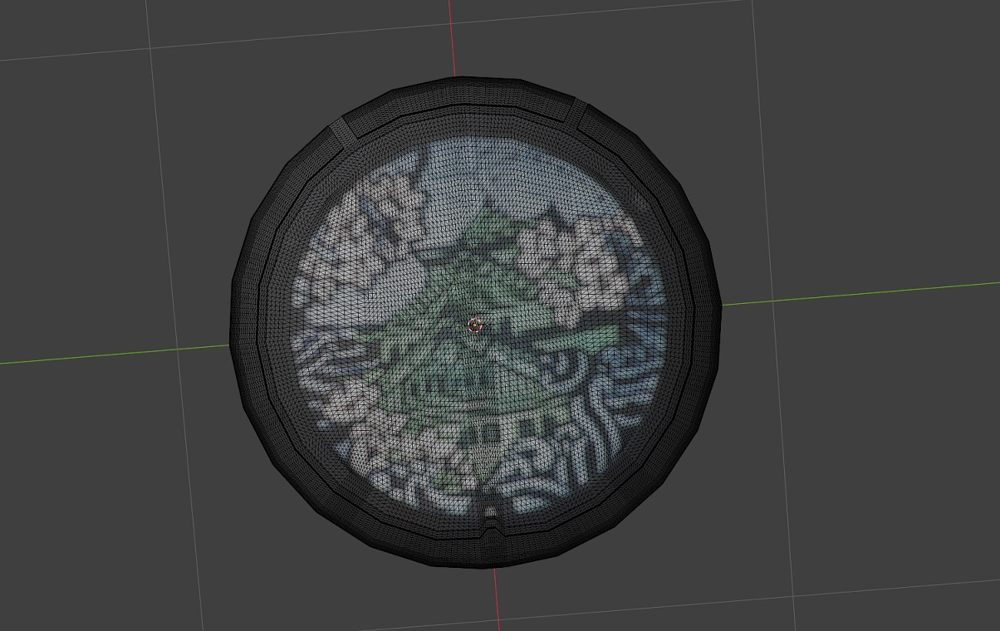
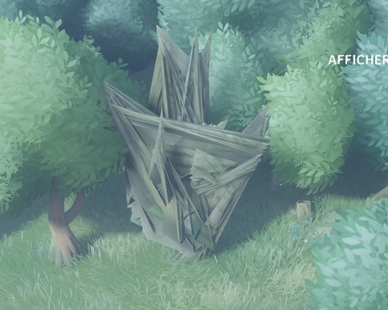
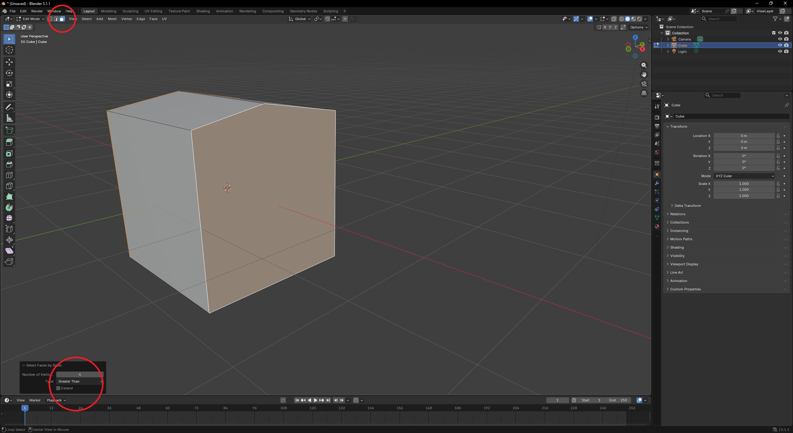

# Mesh Editing with Blender Add-On

The **Tiny Glade Blender Add-On** lets you easily **import and export** [Tiny Glade mesh files](../game-knowledge/meshes.md) (`.json`) for editing in [Blender](https://www.blender.org/).

---

## Installation

### **Requirements:**  
- [Blender](https://www.blender.org/download/) (any recent version)
- The add-on Python script: [Download from GitHub](https://github.com/Hbeau/TinyGlade-Blender-AddOn/releases)

### **To install:**  
1. Open Blender.  
2. Go to **Edit → Preferences → Add-ons**.  
3. Click the **arrow-down button** at the top right, then select **Install from Disk**.  
4. Choose the downloaded `tiny_glade_blender_addon.zip` file and click **Install from Disk** (bottom right).  
5. **Enable** the add-on by checking its box in the add-ons list.  

---

## Importing Tiny Glade Meshes

1. In Blender, go to **File → Import → Tiny Glade JSON (.json)**.
2. Select your mesh file and click **Import**.
3. if you will to import a tree, chose the right option on top right


Your object will appear in Blender as with it name like  **"lantern_terrain"**.

### **Supported features:**
The **Normal Mesh**(well named in oppostion of tree mesh) import support most of the attribute : `Vertex_Position` , `Vertex_Color`, `Vertex_Normal`, `UV_map` and flags like `is_metal_part`, `is_glass` and `is_tip`
that's include every decorator, every clutter and most of the static meshes.  
!!! info
    Birds and ducks are not yet supported. you can still import them but some feature will be missing

the [Trees](../game-knowledge/objects/trees.md) import use a different pipeline. it will import the color correclty by spliting `UV_Map` from the canopy flag. It also import `prim_center` and `appear_pos` in separated meshes

---

## Exporting Tiny Glade Meshes
### Normal Meshes
Mesh export will convert your blender object into a JSON file readable in the game. Not every meshes work the same way, there are a lots of differents shaders that require differents properties.  
The export tool will guide you in the export and ddo a lot of work for you. To export follow the steps below :  


1. Select your object in **Object Mode**.
2. Go to **File → Export → Tiny Glade JSON (.json)**.
3. Choose a file name matching the asset you want to replace.
4. Select in the right panel the export settings
  a. the pre-process pipeline will do a bunch of operation for you : apply modifiers,split edges, triangulate. leave it enable unless you know what you are doing
  b. select a shader or a specific mesh to load the preset of attributes to export.if you're brave enough, use the manual option to select attributes by yourself.
5. Click on the export button and get your file 🎉

!!! info
    Export may change the order of vertex and faces, that can cause trouble especially when you animate sheep

### Trees meshes
Tree meshes also require a special export pipeline. you find the export window in  **File → Export → Tiny Glade Tree JSON (.json)**.

the export windows look pretty the same as the normal mesh export window, but it will ask you to add two extra meshes for the `appear_pos` and `prim_center` attributes.
The `age` attribute is required for some trees, toggle the option if needed. (by default the age is set to 0.5, you can change it with the slider).

!!! tip
    Before exporting, make sure the tree is correctly setup with the canopy flag and the UV map for the leaves. see [Trees](../game-knowledge/objects/trees.md) for more details.


## Modeling Tips


### **Apply vertex colors**
**Why:** The game reads per-vertex color data. Paint on the final (triangulated) mesh so colors align with exported vertices.  
**How:**  
- With the object selected, switch to *Vertex Paint* mode.  
- Create or select a vertex color layer (`Object Data Properties → Color Attributes / Vertex Colors`).  
- Use the Paint tools or *Bucket Fill* to paint the mesh. Use Fill for a quick base color.  
- Verify the color layer is active and saved before export.  


!!! info
    In recent Blender versions vertex colors are stored as *color attributes*. Ensure the attribute name is preserved in export.

### **Check normals**
**Why:** Normals determine surface orientation for lighting; inverted normals produce dark or transparent appearances in‑game.  
**How:**  
- In *Edit Mode*, select all faces (`A`) and use `Mesh → Normals → Recalculate Outside` (`Shift+N`).  
- To flip specific faces, select them and use `Mesh → Normals → Flip`.  
- Visualize normals via *Overlays → Face Orientation* or enable normal display in *Viewport Overlays*.  


### **Split edges (preserve sharp edges)**
_by default, the export tool will split edges for you, but if you want to do it manually, here is how to do it._
**Why:** Sharp edges often require duplicated vertices so normals and vertex colors don’t interpolate across a hard seam.  
**How:**  
- Option 1 (modifier): In *Object Mode* add an *Edge Split* modifier (`Modifiers → Add Modifier → Edge Split`), choose *Sharp Edges* or angle threshold, then **Apply**.  
- Option 2 (mark sharp): In *Edit Mode*, select edges → `Edge → Mark Sharp`, then enable *Auto Smooth* (`Object Data Properties → Normals → Auto Smooth`) or apply *Edge Split*.  
<div markdown="span" style="display:flex">
<figure style="margin:0" markdown="span">
  {style="max-width:320px;height:auto;display:block}
</figure>
<figure style="margin:0" markdown="span">
  {style="max-width:320px;height:auto;display:block}
</figure>
</div>
<p style="text-align:center;font-style:italic;margin-top:0.5rem;font-size:0.7rem">Edge Split preserves hard seams so normals and vertex colors don't interpolate across the edge — prevents color bleeding and shading artifacts.</p>

### **Paint every vertex**
**Why:** *Missing vertex color data will crash the game.* Every exported vertex must have a color value.  
**How:**  
- After triangulating and splitting edges, enter *Vertex Paint* and do a complete fill (Bucket Fill) to set a color for every vertex.  
- Verify vertex count and color layer length match: open the object’s *Color Attributes* and confirm the layer exists and covers the mesh.  

!!! tip
    It's also possible to bake a texture to vertex color using "Bake". it requires a mesh with many vertices to have a good result. se in the exemple below, the texture is baked to vertex color on a 21k vertices mesh. the result is not perfect but it works well in game. 
     { width=320px }
    [here is a tutorial on how to bake a texture to vertex color](https://blender.stackexchange.com/questions/271985/how-to-bake-texture-to-vertex-colors)


---


## Video Tutorial

Watch this step-by-step video by JSK for a full walkthrough:

<div align="center">
<iframe width="560" height="315" src="https://www.youtube.com/embed/0-j9FaxsRGE?si=H5yMLdaPEZ3J2YAw" title="YouTube video player" frameborder="0" allow="accelerometer; autoplay; clipboard-write; encrypted-media; gyroscope; picture-in-picture; web-share" referrerpolicy="strict-origin-when-cross-origin" allowfullscreen></iframe>
</div>

---
## Troubleshooting

If you run into problems after importing or exporting meshes, here are some common issues and solutions:

### 1. Game Crashes at Startup

{: style="height:360px;display:block;margin:auto"}

If Tiny Glade crashes, a log file is generated in `tmp/panics/panic_yyyy-mm-dd hh:mm:ss` inside your Tiny Glade folder.  
To access the log, click the right button and then the "Details" button in the crash window.

**Check the bottom of the log for error messages.**  
The two most common causes are:

- **Missing required mesh attributes:**  
  Your exported mesh may lack necessary data (like normals or colors).  
  Example error:
  ```
  2025-03-24T22:27:02.493+01:00 ERROR [tiny_glade::panic_reporter] [frame:0] PANIC: panicked at crates/country-core/src/resources/render/mesh_atlas_library.rs:89:17:
  Error adding prefab AtlassedMeshName(NameHash { hash: 13536922265885218580 }) to atlas of shader SolidVertexColor: Mesh attribute mismatch.
      Existing: ["Vertex_Color", "Vertex_Normal", "Vertex_Position", "flags"]
      Incoming: ["Vertex_Color", "Vertex_Position", "flags"]
  ```
  **Solution:**  
  Make sure your mesh includes all required attributes in the export windows 
!!!Info
    If the atribute is not in the export windows you can try to add it manually in the json file

- **Unpainted vertices:**  
  If any vertex is missing a color, the game will crash.
  ```
  2025-05-30T18:02:02.238+02:00 ERROR [tiny_glade::panic_reporter] [frame:0] PANIC: panicked at crates/country-core/src/utils/load_json.rs:44:9:
  assertion failed: values.array_length() as i32 > max_index
  ```
  **Solution:**  
  In Blender, use Vertex Paint mode and make sure every vertex is painted.

---

### 2. N-gons
{align=right width=320px }
Be careful to N-gons, they are faces with more than four sides, they can appear in the mesh when you bevel edges or add cylinders for example. if you leave N-gons, the triangulation will be unpredictable and will cause problems in the game.  

<br><br><br>

To find n-gons in your mesh, go to **Edit Mode → Select → Select All by Trait Faces by Sides** and choose **Greater Than 4**. make sure to be in **Select Mode : Face**.
After that, you can either delete the face and fill it with quads.

You don't need to triangulate the mesh, the export tool will do it for you unless if you disable the **Pre-process**


### 3. Tree leaves 
Tree use [billboard](https://www.opengl-tutorial.org/intermediate-tutorials/billboards-particles/billboards/) to render the leaves, so they always face the camera. it looks like it really dislike when the leave square face upward, so always set an angle to the leaves. then do no edge split on the leaves(it appears to be worse). each face should be a quad, and the UV map should be set to the four corners of the 0-1 square. see [Trees](../game-knowledge/objects/trees.md) for more details. 


---

**Still stuck?**   
- Visit the **Tiny Glade Discord** #modding channel for help.  
- Check the [Mesh Rendering](../game-knowledge/meshes.md) page for more technical details.  

---


