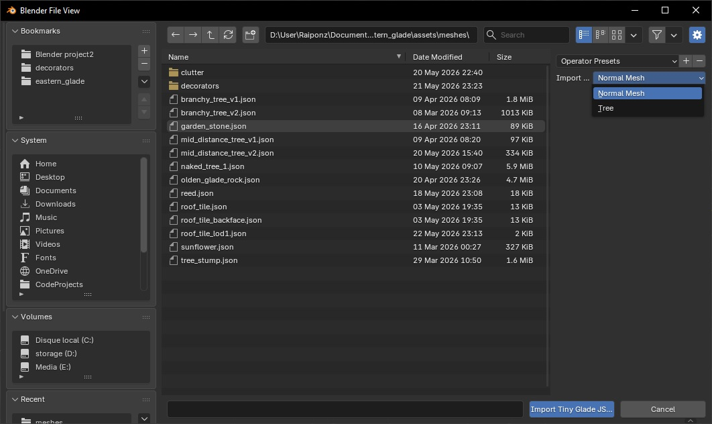
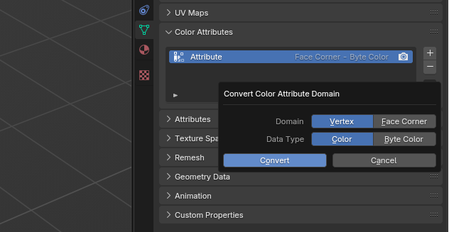
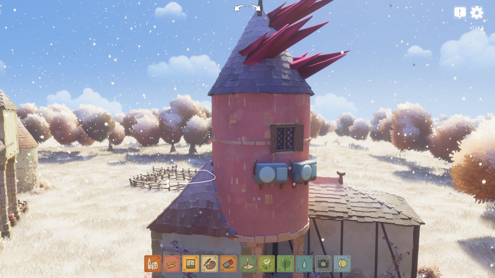
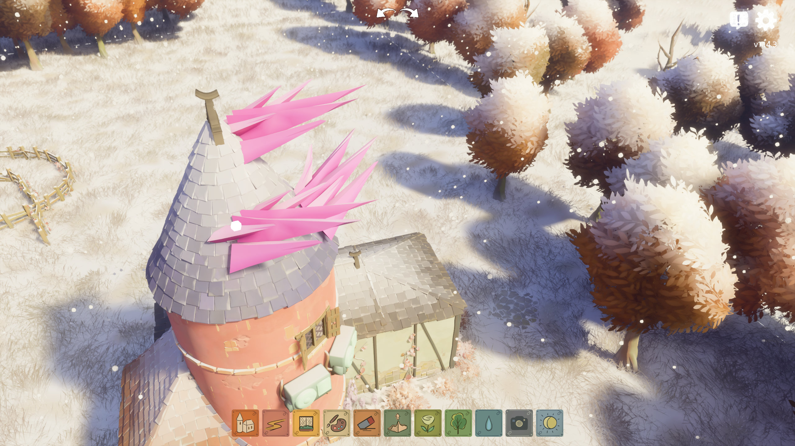
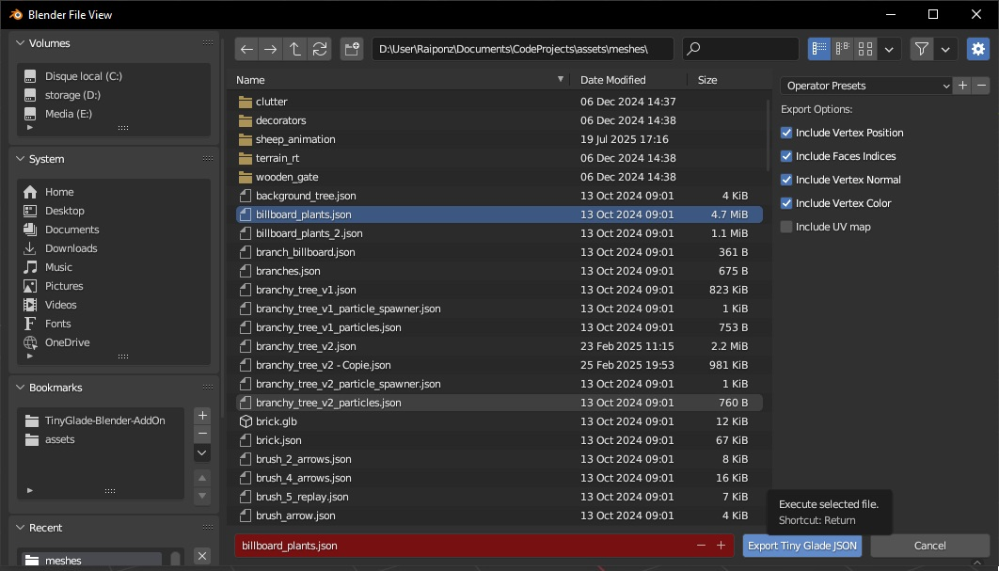
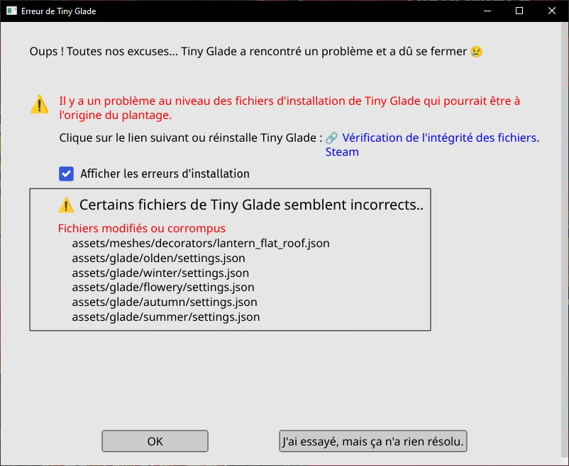
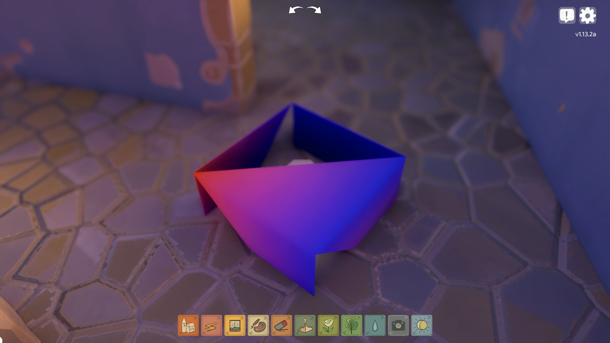
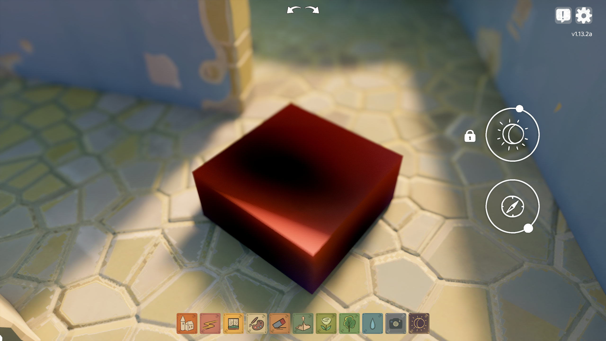

# Mesh Editing with Blender Add-On

The **Tiny Glade Blender Add-On** lets you easily **import and export** [Tiny Glade mesh files](../game-knowledge/meshes.md) (`.json`) for editing in [Blender](https://www.blender.org/).

---

## Installation

### **Requirements:**  
- [Blender](https://www.blender.org/download/) (any recent version)
- The add-on Python script: [Download from GitHub](https://github.com/Hbeau/TinyGlade-Blender-AddOn/releases)

### **To install:**  
1. Open Blender.  
2. Go to **Edit → Preferences → Add-ons**.  
3. Click the **arrow-down button** at the top right, then select **Install from Disk**.  
4. Choose the downloaded `tiny_glade_blender_addon.zip` file and click **Install from Disk** (bottom right).  
5. **Enable** the add-on by checking its box in the add-ons list.  

---

## Importing Tiny Glade Meshes

1. In Blender, go to **File → Import → Tiny Glade JSON (.json)**.
2. Select your mesh file and click **Import**.


Your object will appear in Blender as **"Tiny Glade Object"**.

### **Supported features:**
- **Vertex positions** and **faces** import correctly.  
- **Normals** may sometimes be inverted—double-check them!  
- **Vertex colors** are poorly supported (may need manual adjustment).  
- **UV maps** are not well supported.  

*Other mesh attributes are not currently supported.*

---

## Modeling Tips
### Triangulate faces
**Why:** Tiny Glade expects *triangles*. Quads or n-gons can cause incorrect color mapping and rendering artifacts. 
**How:**     
- Enter *Edit Mode*: select the whole mesh (`A`).  
- Press `Ctrl+T` or use `Mesh → Faces → Triangulate Faces` to convert faces to triangles.  
- For a non‑destructive workflow, add a *Triangulate* modifier (Object `Properties → Modifiers → Add Modifier → Triangulate`) — then **apply it before export**.  

!!! info
    If you use modifiers, **apply them in Object Mode before exporting** so the exported geometry matches the viewport.

### **Apply vertex colors**
**Why:** The game reads per-vertex color data. Paint on the final (triangulated) mesh so colors align with exported vertices.  
**How:**  
- With the object selected, switch to *Vertex Paint* mode.  
- Create or select a vertex color layer (`Object Data Properties → Color Attributes / Vertex Colors`).  
- Use the Paint tools or *Bucket Fill* to paint the mesh. Use Fill for a quick base color.  
- Verify the color layer is active and saved before export.  



!!! info
    In recent Blender versions vertex colors are stored as *color attributes*. Ensure the attribute name is preserved in export.

### **Check normals**
**Why:** Normals determine surface orientation for lighting; inverted normals produce dark or transparent appearances in‑game.  
**How:**  
- In *Edit Mode*, select all faces (`A`) and use `Mesh → Normals → Recalculate Outside` (`Shift+N`).  
- To flip specific faces, select them and use `Mesh → Normals → Flip`.  
- Visualize normals via *Overlays → Face Orientation* or enable normal display in *Viewport Overlays*.  

**Notes:**
- If your shader relies on split normals, either clear custom split normals (`Mesh → Normals → Clear Custom Split Normals Data`) or export proper normal data.

### **Split edges (preserve sharp edges)**
**Why:** Sharp edges often require duplicated vertices so normals and vertex colors don’t interpolate across a hard seam.  
**How:**  
- Option 1 (modifier): In *Object Mode* add an *Edge Split* modifier (`Modifiers → Add Modifier → Edge Split`), choose *Sharp Edges* or angle threshold, then **Apply**.  
- Option 2 (mark sharp): In *Edit Mode*, select edges → `Edge → Mark Sharp`, then enable *Auto Smooth* (`Object Data Properties → Normals → Auto Smooth`) or apply *Edge Split*.  
<div markdown="span" style="display:flex">
<figure style="margin:0" markdown="span">
  {style="max-width:320px;height:auto;display:block}
</figure>
<figure style="margin:0" markdown="span">
  {style="max-width:320px;height:auto;display:block}
</figure>
</div>
<p style="text-align:center;font-style:italic;margin-top:0.5rem;font-size:0.7rem">Edge Split preserves hard seams so normals and vertex colors don't interpolate across the edge — prevents color bleeding and shading artifacts.</p>

### **Paint every vertex**
**Why:** *Missing vertex color data will crash the game.* Every exported vertex must have a color value.  
**How:**  
- After triangulating and splitting edges, enter *Vertex Paint* and do a complete fill (Bucket Fill) to set a color for every vertex.  
- Verify vertex count and color layer length match: open the object’s *Color Attributes* and confirm the layer exists and covers the mesh.  
- As a final check, export a test JSON and inspect the color arrays or re-import to verify no vertex is uncolored.  

### **Quick checklist before exporting**
- Mesh is **triangulated** and modifiers **applied**.  
- Vertex color layer **exists** and is **active**.  
- Normals face outward (`Shift+N`) or flipped where appropriate.  
- Edge Split or equivalent **applied** for sharp seams.  

!!! danger
    **Missing vertex colors will crash the game!**  
    Always ensure every vertex is painted.

---

## Exporting Tiny Glade Meshes

1. Select your object in **Object Mode**.
2. Go to **File → Export → Tiny Glade JSON (.json)**.
3. Choose a file name matching the asset you want to replace.
4. In the right panel, select the required attributes for your mesh.

!!! info
    Export change the order of vertex and faces, that can cause trouble especially when you animate sheep

---

## Video Tutorial

Watch this step-by-step video by JSK for a full walkthrough:

<div align="center">
<iframe width="560" height="315" src="https://www.youtube.com/embed/0-j9FaxsRGE?si=H5yMLdaPEZ3J2YAw" title="YouTube video player" frameborder="0" allow="accelerometer; autoplay; clipboard-write; encrypted-media; gyroscope; picture-in-picture; web-share" referrerpolicy="strict-origin-when-cross-origin" allowfullscreen></iframe>
</div>

---
## Troubleshooting

If you run into problems after importing or exporting meshes, here are some common issues and solutions:

### 1. Game Crashes at Startup

{: style="height:360px;display:block;margin:auto"}

If Tiny Glade crashes, a log file is generated in `tmp/panics/panic_yyyy-mm-dd hh:mm:ss` inside your Tiny Glade folder.  
To access the log, click the right button and then the "Details" button in the crash window.

**Check the bottom of the log for error messages.**  
The two most common causes are:

- **Missing required mesh attributes:**  
  Your exported mesh may lack necessary data (like normals or colors).  
  Example error:
  ```
  2025-03-24T22:27:02.493+01:00 ERROR [tiny_glade::panic_reporter] [frame:0] PANIC: panicked at crates/country-core/src/resources/render/mesh_atlas_library.rs:89:17:
  Error adding prefab AtlassedMeshName(NameHash { hash: 13536922265885218580 }) to atlas of shader SolidVertexColor: Mesh attribute mismatch.
      Existing: ["Vertex_Color", "Vertex_Normal", "Vertex_Position", "flags"]
      Incoming: ["Vertex_Color", "Vertex_Position", "flags"]
  ```
  **Solution:**  
  Make sure your mesh includes all required attributes in the export windows 
!!!Info
    If the atribute is not in the export windows you can try to add it manually in the json file

- **Unpainted vertices:**  
  If any vertex is missing a color, the game will crash.
  ```
  2025-05-30T18:02:02.238+02:00 ERROR [tiny_glade::panic_reporter] [frame:0] PANIC: panicked at crates/country-core/src/utils/load_json.rs:44:9:
  assertion failed: values.array_length() as i32 > max_index
  ```
  **Solution:**  
  In Blender, use Vertex Paint mode and make sure every vertex is painted.

---

### 2. Colors Are Incorrectly Placed

If your mesh has strange or misplaced colors, it’s usually because the original object had quad faces instead of triangles.



**Solution:**  
Always triangulate faces before painting colors.  
Go to **Edit Mode → Select All → Faces → Triangulate Faces**.

---

### 3. Item Looks Dark or Transparent

If your item appears too dark or transparent in-game, the normals are probably inverted.



**Solution:**  
In Blender, select your mesh, go to **Edit Mode → Mesh → Normals → Recalculate Outside** to fix the normals.

---

**Still stuck?**   
- Visit the **Tiny Glade Discord** #modding channel for help.  
- Check the [Mesh Rendering](../game-knowledge/meshes.md) page for more technical details.  

---


