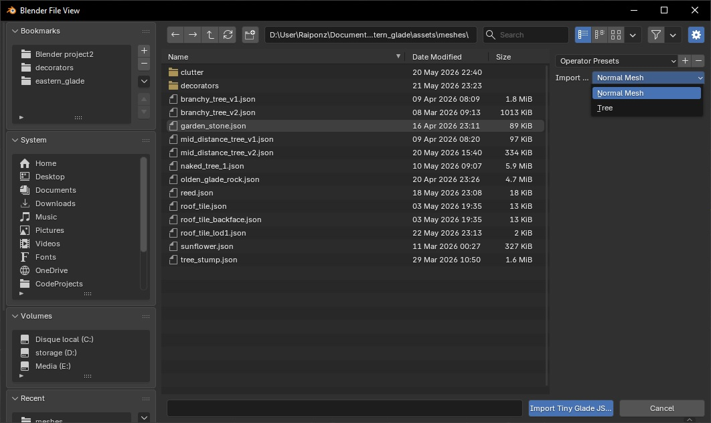
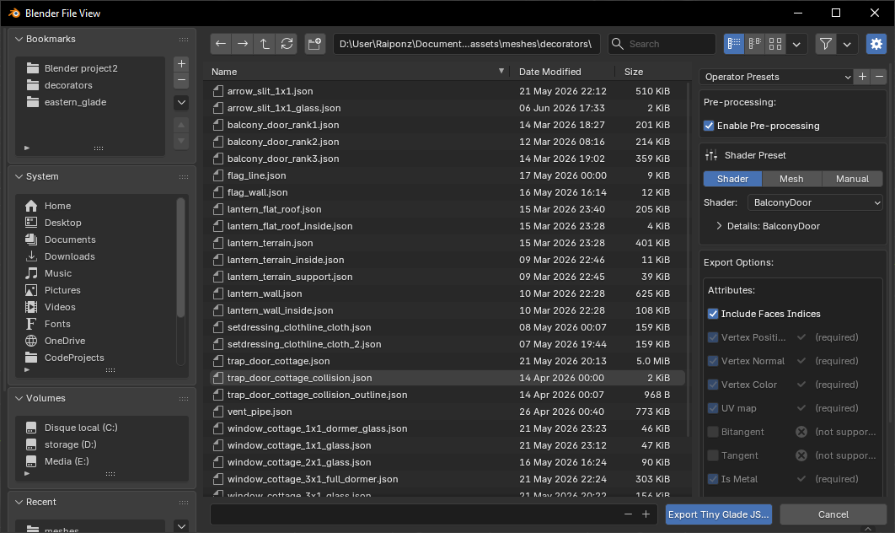
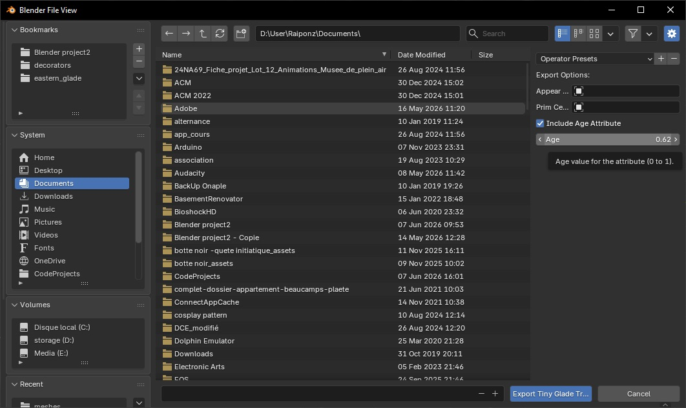
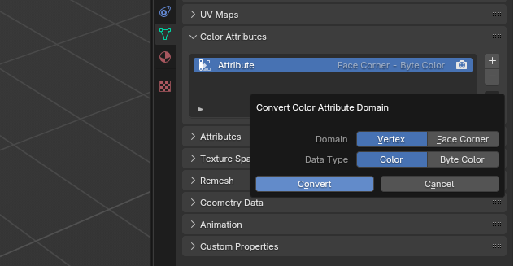
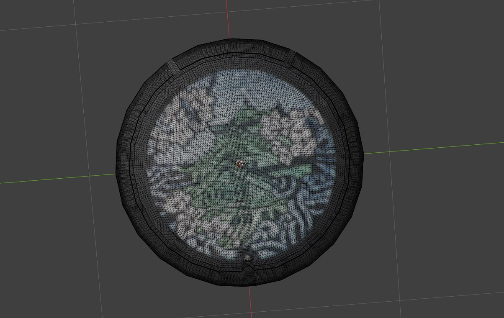
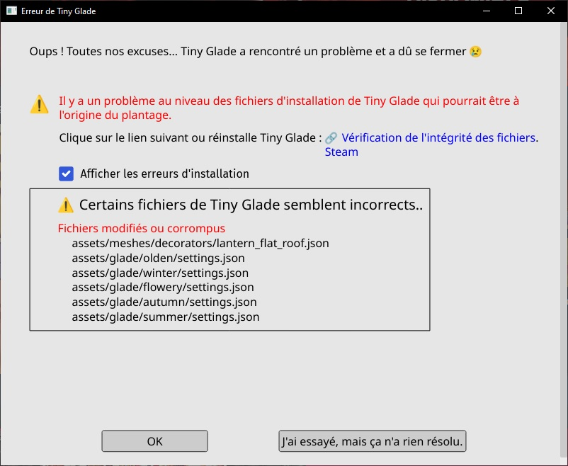
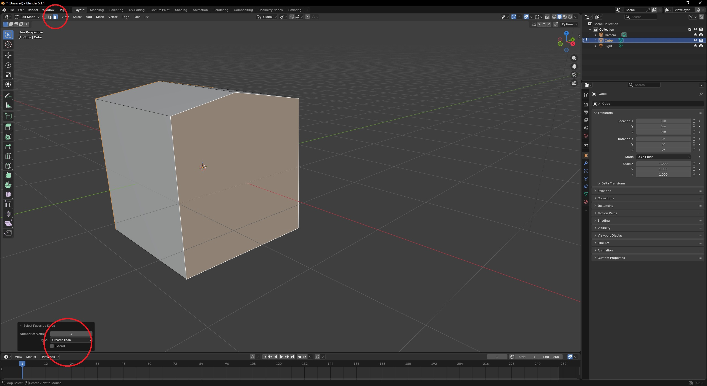

# Mesh Editing with the Blender Add-On

*By Rapunzilla*

The **Tiny Glade Blender Add-On** lets you import and export [Tiny Glade's built-in JSON mesh files](../game-knowledge/meshes.md) for editing in [Blender](https://www.blender.org/).

!!! info "Official clutter modding"

    The Blender Add-On is **not required when creating new clutter items using Tiny Glade's official modding support**.

    New clutter mods use `.glb` files and can be created in Blender, or any other 3D modelling software capable of exporting glTF 2.0-compatible GLB files. These files can be added directly through Tiny Glade's built-in mod editor.

    The workflow described on this page is primarily intended for **asset replacement mods** that modify Tiny Glade's existing JSON meshes, as well as for inspecting or editing the game's built-in mesh assets.

    See the official [Tiny Glade modding guide](https://pouncelight.games/tiny-glade/info/modding/) for information about creating new `.glb` clutter items.

## Installation

### Requirements

- [Blender](https://www.blender.org/download/) — any recent version
- The Tiny Glade Blender Add-On: [Download from GitHub](https://github.com/Hbeau/TinyGlade-Blender-AddOn/releases)

### Installing the Add-On

1. Open Blender.
2. Go to **Edit → Preferences → Add-ons**.
3. Click the **arrow-down button** at the top right and select **Install from Disk**.
4. Choose the downloaded `tiny_glade_blender_addon.zip` file and click **Install from Disk**.
5. **Enable** the add-on by checking its box in the add-ons list.

## Importing Tiny Glade JSON Meshes

1. In Blender, go to **File → Import → Tiny Glade JSON (.json)**.
2. Select your mesh file and click **Import**.
3. If you are importing a tree, select the appropriate tree import option in the top-right of the import window.



Your object will appear in Blender using its original mesh name, for example `lantern_terrain`.

### Supported Features

The standard mesh importer supports most attributes used by Tiny Glade's built-in JSON meshes, including:

- `Vertex_Position`
- `Vertex_Color`
- `Vertex_Normal`
- `UV_Map`
- flags such as `is_metal_part`, `is_glass`, and `is_tip`

This includes built-in decorations, built-in clutter, and many other static JSON meshes.

!!! info

    Birds and ducks are not yet fully supported. They can still be imported, but some features may be missing.

[Tree meshes](../game-knowledge/objects/trees.md) use a different import pipeline. The tree importer handles colour data by separating `UV_Map` from the canopy flag. It also imports `prim_center` and `appear_pos` as separate meshes.

## Exporting Tiny Glade JSON Meshes

### Standard Meshes

The export tool converts a Blender object into a JSON mesh that Tiny Glade can read.

Not every built-in mesh uses the same shader or attributes, so different meshes may require different export settings. The export tool provides presets to help configure these correctly.



To export a mesh:

1. Select your object in **Object Mode**.
2. Go to **File → Export → Tiny Glade JSON (.json)**.
3. Choose a file name matching the asset you want to replace.
4. Configure the export settings in the panel on the right:
    - **Pre-process** performs several operations automatically, including applying modifiers, splitting edges, and triangulating the mesh. Leave this enabled unless you know you need to disable it.
    - Select a shader or specific mesh preset to load the appropriate attributes for export.
    - The **Manual** option can be used to select attributes yourself.
5. Click **Export** to create the JSON file.

!!! info

    Exporting may change the order of vertices and faces. This can cause problems for meshes that depend on a specific vertex order, particularly animated assets such as sheep.

### Tree Meshes

Tree meshes require a separate export pipeline.

Open the tree export window through:

**File → Export → Tiny Glade Tree JSON (.json)**



The tree export window is similar to the standard mesh exporter, but requires two additional meshes for the `appear_pos` and `prim_center` attributes.

The `age` attribute is also required for some trees. Enable this option when needed. By default, the age is set to `0.5`, but this can be changed using the slider.

!!! tip

    Before exporting, make sure the tree is correctly configured with the canopy flag and UV map used for the leaves.

    See [Trees](../game-knowledge/objects/trees.md) for more details.

## Modelling Tips

### Apply Vertex Colours

**Why:** Tiny Glade's built-in JSON meshes can use per-vertex colour data. Painting the final mesh ensures that colours align correctly with the vertices that will be exported.

**How:**

- With the object selected, switch to **Vertex Paint** mode.
- Create or select a colour attribute under **Object Data Properties → Color Attributes**.
- Use the paint tools or **Fill** tool to colour the mesh.
- Verify that the colour attribute is active before exporting.



!!! info

    In recent Blender versions, vertex colours are stored as **Color Attributes**. Make sure the colour attribute is preserved during export.

### Check Normals

**Why:** Normals determine the orientation of surfaces for lighting. Incorrect or inverted normals can cause dark or incorrectly rendered surfaces in-game.

**How:**

- In **Edit Mode**, select all faces with `A`.
- Use **Mesh → Normals → Recalculate Outside** (`Shift+N`).
- To flip specific faces, select them and use **Mesh → Normals → Flip**.
- You can inspect face orientation using **Viewport Overlays → Face Orientation**.

### Split Edges to Preserve Sharp Edges

By default, the export tool can split edges automatically. If you need to do this manually, you can use the following methods.

**Why:** Sharp edges may require duplicated vertices so that normals and vertex colours do not interpolate across a hard seam.

**How:**

- **Option 1 — Edge Split modifier:** In **Object Mode**, add an **Edge Split** modifier, configure the desired sharp edges or angle threshold, and apply it.
- **Option 2 — Mark Sharp:** In **Edit Mode**, select the relevant edges and use **Edge → Mark Sharp**. Configure the mesh's smoothing settings as appropriate for your version of Blender.

<div style="display:flex; gap:1rem;" markdown="1">

<figure markdown="span">
  { width="320" }
</figure>

<figure markdown="span">
  { width="320" }
</figure>

</div>

<p style="text-align:center; font-style:italic; margin-top:0.5rem; font-size:0.7rem;">
Edge splitting preserves hard seams so normals and vertex colours do not interpolate across the edge, helping to prevent colour bleeding and shading artefacts.
</p>

### Paint Every Vertex

**Why:** Missing vertex colour data can cause the game to crash. Every exported vertex must have a corresponding colour value.

**How:**

- After triangulating and splitting edges, enter **Vertex Paint** mode and fill the entire mesh with a base colour.
- Check that the colour attribute exists and covers the complete mesh before export.

!!! tip

    It is also possible to bake a texture into vertex colours using Blender's baking tools.

    This works best on meshes with enough vertices to preserve the colour detail. In the example below, a texture was baked onto a mesh containing approximately 21,000 vertices. The result is not perfect, but works well in-game.

    

    See this [tutorial on baking textures to vertex colours](https://blender.stackexchange.com/questions/271985/how-to-bake-texture-to-vertex-colors) for more information.

## Video Tutorial

JSK created a video tutorial demonstrating how to use the Blender Add-On. The video is somewhat older, but much of the workflow is still relevant for editing Tiny Glade's built-in JSON meshes.

<div align="center">
  <iframe
    width="560"
    height="315"
    src="https://www.youtube.com/embed/0-j9FaxsRGE?si=H5yMLdaPEZ3J2YAw"
    title="Tiny Glade Blender Add-On tutorial"
    frameborder="0"
    allow="accelerometer; autoplay; clipboard-write; encrypted-media; gyroscope; picture-in-picture; web-share"
    referrerpolicy="strict-origin-when-cross-origin"
    allowfullscreen>
  </iframe>
</div>

## Troubleshooting

If you run into problems after importing or exporting JSON meshes, the following are some common issues and solutions.

### 1. Game Crashes at Startup

{ height="360" }

If Tiny Glade crashes, a log file is generated under:

```text
tmp/panics/panic_yyyy-mm-dd hh:mm:ss
```

inside the Tiny Glade folder.

You can also access the log from the crash window by opening **Details**.

Check the bottom of the log for error messages.

Two common causes are:

#### Missing Required Mesh Attributes

Your exported mesh may be missing required data such as normals or colours.

Example error:

```text
2025-03-24T22:27:02.493+01:00 ERROR [tiny_glade::panic_reporter] [frame:0] PANIC: panicked at crates/country-core/src/resources/render/mesh_atlas_library.rs:89:17:
Error adding prefab AtlassedMeshName(NameHash { hash: 13536922265885218580 }) to atlas of shader SolidVertexColor: Mesh attribute mismatch.
    Existing: ["Vertex_Color", "Vertex_Normal", "Vertex_Position", "flags"]
    Incoming: ["Vertex_Color", "Vertex_Position", "flags"]
```

**Solution:** Make sure your mesh contains all of the attributes required by the target asset and shader.

!!! info

    If an attribute is not available in the export window, advanced users may be able to add it manually to the exported JSON file.

#### Unpainted Vertices

If a vertex is missing its corresponding colour data, the game may crash.

Example error:

```text
2025-05-30T18:02:02.238+02:00 ERROR [tiny_glade::panic_reporter] [frame:0] PANIC: panicked at crates/country-core/src/utils/load_json.rs:44:9:
assertion failed: values.array_length() as i32 > max_index
```

**Solution:** In Blender, use **Vertex Paint** mode and make sure every vertex has colour data before exporting.

### 2. N-gons


N-gons are faces with more than four sides. They can appear when modelling operations such as bevels are used or when objects such as cylinders are created.

Leaving N-gons in a mesh can produce unpredictable triangulation and may cause rendering problems in-game. even in other meshes that are not directly affected by the N-gon.

To find N-gons:

1. Enter **Edit Mode**.
2. Switch to **Face Select** mode.
3. Go to **Select → Select All by Trait → Faces by Sides**.
4. Choose **Greater Than 4**.

You can then rebuild the affected faces using triangles or quads.



You do not normally need to triangulate the mesh manually because the export tool will do this automatically when **Pre-process** is enabled.

### 3. Tree Leaves

Trees use [billboards](https://www.opengl-tutorial.org/intermediate-tutorials/billboards-particles/billboards/) to render their leaves so that they face the camera.

Leaf cards appear to behave poorly when their quad faces point directly upward, so give the leaves some angle rather than placing them completely flat.

Avoid edge splitting the leaf cards if it produces worse results. Each leaf card should generally remain a quad, with its UV coordinates mapped to the four corners of the `0–1` UV square.

See [Trees](../game-knowledge/objects/trees.md) for more details.

## Still Stuck?

- Visit the **Tiny Glade Discord** `#modding` channel for help.
- Check the [Mesh Rendering](../game-knowledge/meshes.md) page for more technical information about Tiny Glade's built-in JSON meshes.
- For new clutter mods using `.glb` files, see the official [Tiny Glade modding guide](https://pouncelight.games/tiny-glade/info/modding/).